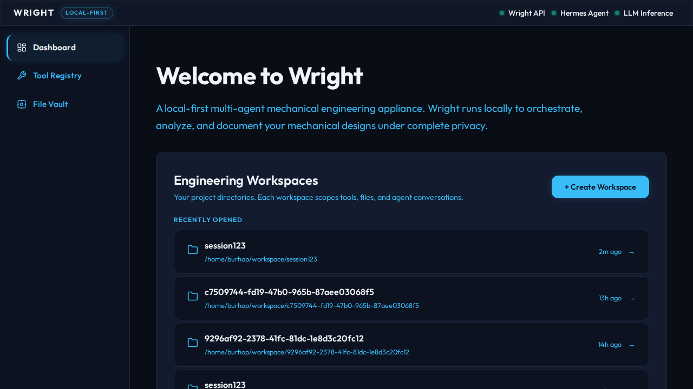
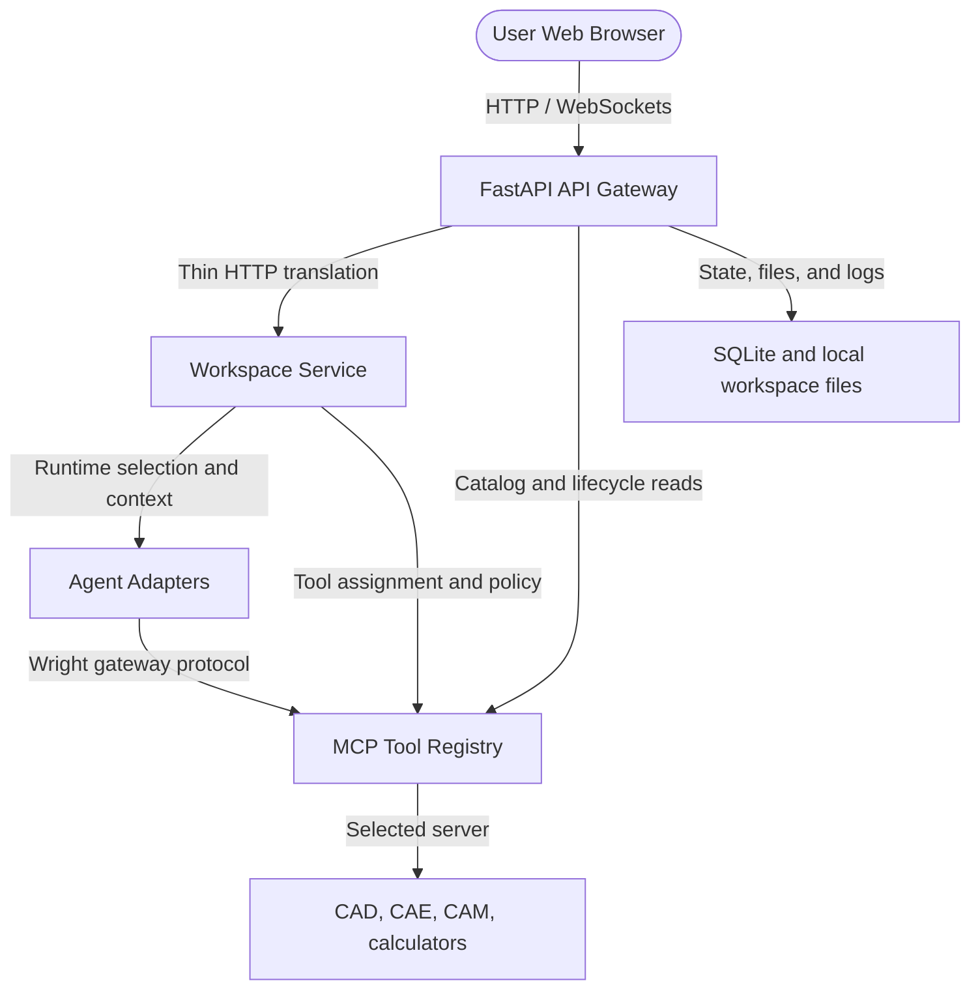

<p align="center">
  
</p>

<h1 align="center">Wright</h1>

<p align="center">
  <strong>Public-alpha, local-first agent orchestration for physical engineering.</strong>
</p>

<p align="center">
  <a href="https://github.com/burhop/wright/actions/workflows/python-quality.yml?query=branch%3Amain"></a>
  <a href="https://github.com/burhop/wright/actions/workflows/frontend-quality.yml?query=branch%3Amain"></a>
  <a href="https://github.com/burhop/wright/actions/workflows/docker-build.yml?query=branch%3Amain"></a>
  <a href="https://github.com/burhop/wright/actions/workflows/docs-deploy.yml?query=branch%3Amain"></a>
  <a href="https://github.com/burhop/wright/actions/workflows/public-alpha-safety.yml?query=branch%3Amain"></a>
  <a href="https://github.com/burhop/wright/actions/workflows/release.yml?query=branch%3Amain"></a>
  <a href="https://opensource.org/licenses/MIT"></a>
  <a href="https://www.python.org/downloads/"></a>
  <a href="https://nodejs.org/"></a>
  <a href="https://github.com/burhop/wright/pkgs/container/wright"></a>
  <a href="https://pypi.org/project/wright-engineering/"></a>
  <a href="https://github.com/burhop/wright/discussions"></a>
  <a href="https://github.com/burhop/wright/stargazers"></a>
</p>

---

## Public Alpha Status

Wright is alpha software for developer testing, MCP porting, demos, and selected
beta feedback. Expect rough edges, incomplete workflows, and changing APIs.

The status badges above are pinned to the production branch, `main`. Integration
work happens on `dev`, so `dev` CI may fail while production remains green; use
the GitHub Actions branch filter when checking a specific branch.

Wright is bring-your-own-AI. The repository and Docker image do not bundle an
LLM, API key, local model, hosted model, or paid engineering backend. Configure
`LLM_API_URL`, `LLM_API_KEY`, and `LLM_API_MODEL` for an OpenAI-compatible
endpoint, a local model server, or a hosted provider.

MCP-specific host software such as FreeCAD, OpenSCAD, CalculiX, Blender, vendor
CAD systems, license managers, or hardware drivers is installed only for the
selected MCP validation or usage case. It is not part of the base Docker image.
Engineering MCP server validation follows
[the clean-container process](docs/mcp-catalog/mcp-server-testing-process.md).

## Why Wright?

Engineering teams need AI-assisted workflows without handing every design to a
single hosted black box. Wright coordinates agents and deterministic tools while
leaving LLM/provider choice, credentials, licenses, and host software under the
operator's control.

The first public alpha is aimed at developers, MCP porters, demo users, and
selected beta feedback. Local and hybrid deployments are supported, but real
engineering toolchains still require explicit configuration.

## What Works Today

- Agent orchestration surfaces for engineering workflows.
- MCP tool registry metadata and selected-server validation paths.
- Deterministic CAD, CAE, CAM, and calculation tool actuation through adapters.
- Docker appliance for the Wright API, static web UI, Hermes profile/bootstrap,
  and general validation tooling.
- BYO-AI configuration for local or hosted OpenAI-compatible endpoints.

The Docker appliance is not a complete CAD/CAE/CAM workstation and does not
silently install every possible backend.

## User Interface

### Agent Chat Interface

Interact with local LLM agents to iterate on designs, request modifications, or
write code.


### Tool Registry

View engineering tools, MCP status, and validation metadata available to agents.


### Workspace Artifacts

Review files, generated artifacts, logs, and viewer panels inside the active
workspace. CAD files, scripts, screenshots, and diagnostics stay local to the
workspace volume or checkout you control.



## Quick Start

### Docker Appliance

Docker is the primary end-user install path for the public alpha. Published
release images use `burhop/wright:<tag>` on Docker Hub and
`ghcr.io/burhop/wright:<tag>` on GHCR.

With a release image and an env file:

```bash
cp docker/.env.example docker/.env
# Edit docker/.env and set LLM_API_URL, LLM_API_KEY, and LLM_API_MODEL
docker run --rm -p 127.0.0.1:8080:8000 --env-file docker/.env burhop/wright:<tag>
```

From a source checkout while developing or before a release image is cut:

```bash
git clone https://github.com/burhop/wright.git
cd wright
cp docker/.env.example docker/.env
# Edit docker/.env and set LLM_API_URL, LLM_API_KEY, and LLM_API_MODEL
docker compose -f docker-compose.minimal.yml up -d --build
```

Then open:

```text
http://localhost:8080
```

The default `docker-compose.yml` also starts Jaeger and maps Wright to
`http://localhost:8000`. See the
[Docker quickstart](docs/getting-started/quickstart-docker.md) and
[Docker deployment guide](docs/user-guide/docker.md) for LAN access, local model
server, persistent volume, and cleanup examples.

For development outside Docker, see [CONTRIBUTING.md](CONTRIBUTING.md).

## Images and Releases

Public release images are published as:

```text
burhop/wright:<tag>
ghcr.io/burhop/wright:<tag>
```

The public-alpha Python helper package is:

```bash
pip install wright-engineering
wright doctor
```

Docker remains the primary end-user install path. `wright-engineering` is a
lightweight helper/discovery package, not the full appliance. Prerelease tags
such as `v0.1.0-alpha.1` do not move `latest`; stable tags may.

## Architecture

Wright is a modular monorepo with a FastAPI gateway, React/Vite web UI,
agent-neutral workspace services, Hermes and future runtime adapters, an MCP
tool registry, and local workspace state.



Hermes remains the default first-class adapter, but `.hermes.md` and
`~/.hermes` profile behavior lives in Hermes adapter/profile code. Generic
workspace lifecycle code delegates context materialization through
`packages/agent_adapters` contracts so OpenClaw and future engines can plug in
without inheriting Hermes file formats.

### Repository Structure

```text
wright/
|-- apps/
|   |-- api/                    # FastAPI gateway
|   `-- web/                    # React + Vite frontend
|-- packages/
|   |-- core/                   # Shared domain models and logging
|   |-- agent_adapters/         # Adapter pattern for agent runtimes
|   |-- workspace_service/      # Workspace lifecycle orchestration facade
|   |-- tool_registry/          # MCP registry and validation logic
|   `-- data_vault/             # Placeholder package for future storage extraction
|-- hermes-plugin-wright/       # Wright Hermes plugin compatibility package
|-- tests/
|   |-- ui-integration/         # Playwright integration tests
|   `-- e2e/                    # Smoke and system tests
|-- docker/                     # Dockerfile and supervisord configuration
|-- docs/                       # Documentation site content and runbooks
|-- specs/                      # Spec Kit feature artifacts
`-- .github/                   # Community templates and CI workflows
```

Refer to [docs/virtual_engineer_architecture.pdf](docs/virtual_engineer_architecture.pdf)
for the formal architecture analysis and [constitution.md](constitution.md) for
core project engineering standards.

## Development

Run the main local quality gates:

```bash
uv run pytest
uv run ruff check apps/api/ packages/
uv run ruff format --check apps/api/ packages/
npm ci
npx -w apps/web eslint .
npx prettier --check apps/web/
npx tsc --noEmit -p apps/web/tsconfig.app.json
npm run test --workspace=apps/web
npm run build --workspace=apps/web
mkdocs build --strict
```

Helper scripts live in [scripts/](scripts), including public-alpha leak scans,
Docker smoke tests, CI failure log fetching, and release checks.

## Spec Kit

Wright uses [spec-kit](https://github.com/github/spec-kit) for design-led
feature work. Most substantive changes should start with a feature spec, plan,
tasks, and implementation checklist under `specs/`.

## Contributing

Contributions are welcome. Please read [CONTRIBUTING.md](CONTRIBUTING.md) for
local setup, branch discipline, testing, pull request expectations, and the
Spec Kit workflow.

Looking for a place to start? Browse issues labeled
[`good-first-issue`](https://github.com/burhop/wright/labels/good-first-issue).

## Community and Support

- Ask usage questions in
  [GitHub Discussions](https://github.com/burhop/wright/discussions).
- Contact maintainers for support, sponsorship, and partner questions at
  `wright@makerengineer.com`.
- Report reproducible bugs with
  [GitHub Issues](https://github.com/burhop/wright/issues/new/choose).
- Report security issues privately using [SECURITY.md](SECURITY.md); do not
  open public security issues.

## Support and Sponsorship

Wright is open source, but integration testing, model evaluation, and engineering
tool adapters require ongoing resources.

- API, token, and compute sponsorships help cover continuous LLM testing.
- Hardware contributions help test local-first and air-gapped deployments.
- Tool ecosystem contributions help expand the MCP catalog safely.
- Code, docs, and Spec Kit contributions help harden the public alpha.

[Sponsor Wright on GitHub](https://github.com/sponsors/burhop)

## License

This project is licensed under the MIT License. See [LICENSE](LICENSE).

## Star History and Contributors

[](https://github.com/burhop/wright)

<a href="https://github.com/burhop/wright/graphs/contributors">
  
</a>
