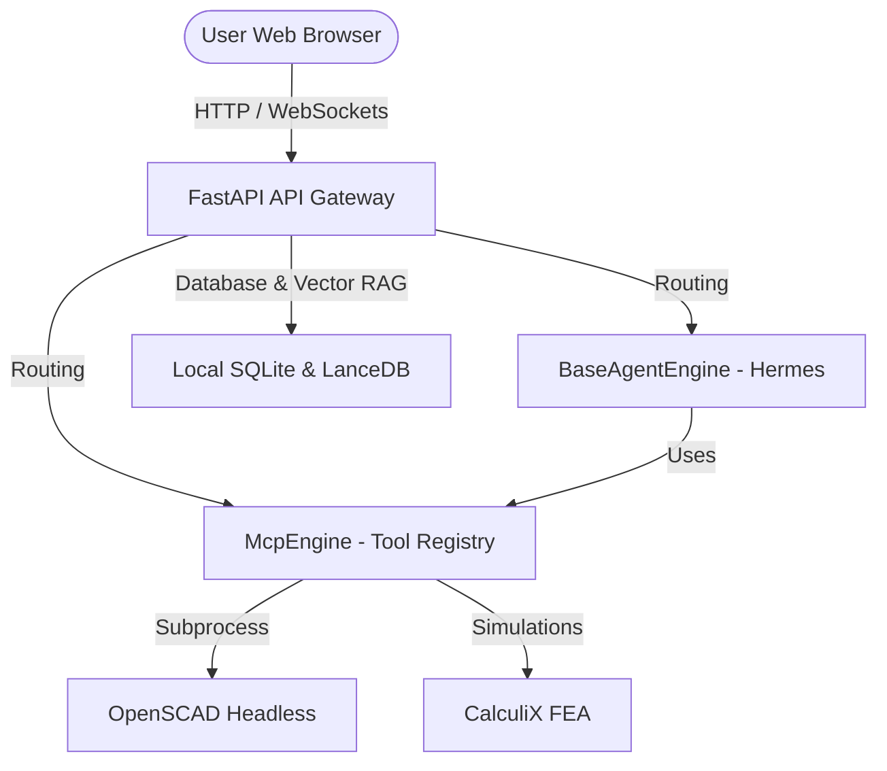

<p align="center">
  
</p>

<h1 align="center">Wright</h1>

<p align="center">
  <strong>An open-source agent orchestrator for physical engineering — actuating deterministic tools for designers, engineers, and product managers.</strong>
</p>

<p align="center">
  <a href="https://github.com/burhop/wright/actions"></a>
  <a href="https://opensource.org/licenses/MIT"></a>
  <a href="https://hub.docker.com/r/burhop/wright"></a>
  <a href="https://discord.gg/2JsdMRxq"></a>
  <a href="https://github.com/burhop/wright/discussions"></a>
  <a href="https://www.python.org/downloads/"></a>
  <a href="https://nodejs.org/"></a>
  <a href="https://github.com/burhop/wright/stargazers"></a>
</p>

---

## Why Wright?

### The Vision
The rise of generative AI has brought unprecedented, compound productivity gains to software developers. Wright is built to bring this same AI-driven engineering velocity to traditional physical engineering roles. 

Our vision is to unlock new, order-of-magnitude levels of productivity for **product designers**, **engineers** (mechanical, structural, thermal, electrical), and **engineering product managers**. By orchestrating specialized, agentic workflows, Wright bridges the gap between high-level engineering design intent and low-level computational execution, enabling the engineer to model, simulate, and manufacture faster than ever before.

### Orchestrating Deterministic Tools
Physical engineering demands absolute mathematical rigor. While LLMs excel at planning, reasoning, and translating natural language into design parameters, they are probabilistic and cannot directly compute physical load vectors or compile error-free CAD geometry. 

Wright bridges this gap. It positions AI agents not as direct geometry creators, but as orchestrators that **actuate, coordinate, and steer deterministic engineering tools**. The AI manages the high-level workflow loops, parameter optimization, and feedback cycles, while industry-standard deterministic kernels guarantee physical validity and mathematical precision:
* **Commercial Vendors**: Coordinate enterprise CAD/CAM suites (like SolidWorks, Creo, Fusion 360) and proprietary cloud simulation APIs.
* **Startups**: Actuate cutting-edge generative design, neural topology optimization, and programmatic geometry platforms (like Zoo/KittyCAD).
* **Universities & Researchers**: Hook into specialized academic solvers, finite element analyses (FEA), and custom engineering calculators.
* **Open Source Developers**: Actuate community-driven tools like FreeCAD, OpenSCAD, CalculiX, and PrusaSlicer via the standardized Model Context Protocol (MCP).

### Secure and Flexible Execution
* **Orchestration Power**: Run any agentic framework or LLM model. Swap commercial cloud models, research APIs, and local models seamlessly.
* **Modular Integrations**: Actuate professional CAD, FEA, and CAM software via extensible, standardized MCP servers.
* **Local or Hybrid Cloud**: Wright's architecture is fully open. While capable of running completely local and air-gapped on enterprise hardware (like the Dell GB10 / NVIDIA DGX Spark) to safeguard proprietary designs, it is equally ready to scale with cloud-based hybrid tools.

### Built on Open Industry Standards
Wright is committed to open, vendor-neutral standards that allow the toolbox to grow alongside the AI and engineering ecosystems. We actively support and plan compatibility with key emerging specs:
* **[Model Context Protocol (MCP)](https://github.com/modelcontextprotocol)**: Developed under the Linux Foundation, MCP serves as our core translation layer, enabling loose coupling so any compliant tool, database, or API can be actuated by any agent runtime.
* **[MCP Apps](https://github.com/modelcontextprotocol/ext-apps)** (the official standardization of the experimental *MCP-UI* proposal): Allows MCP servers to deliver rich, dynamic web interfaces (such as parameter sliders and data visualizations) that render directly in the agent session.
* **[WebMCP](https://github.com/webmachinelearning/webmcp)**: A browser-native standard incubated by the W3C Web Machine Learning Community Group that exposes web forms and imperative JavaScript APIs to agents via `navigator.modelContext`, letting Wright actuate browser-based tooling natively.

---

## Key Features

* 🤖 **Universal Agent Orchestration** — Act as the central coordinator and control loop, coordinating any LLM engine (commercial cloud, startup APIs, or local runtimes) and agentic framework.
* 🔌 **Plug-and-Play Tool Registry** — Load, swap, and manage any compliant engineering tool via standard Model Context Protocol (MCP) servers. The core platform is completely decoupled from the tools themselves.
* 🔧 **Deterministic Tool Actuation** — Actuate and steer rigorous physical engineering engines. Rather than relying on probabilistic models to generate geometry or math, Wright coordinates deterministic external software:
  * *CAD & Geometry kernels* (e.g., FreeCAD, OpenSCAD, PTC Creo, Autodesk Fusion 360) for parametric solid modeling
  * *CAE & Simulation solvers* (e.g., CalculiX FEA, OpenFOAM CFD) for structural stress and thermal analysis
  * *CAM & Manufacturing engines* (e.g., PrusaSlicer, CuraEngine) for automated G-code toolpath slicing
* 🚀 **Software-Level Workflow Automation** — Bring rapid prototyping, versioned rollbacks (via local Git), and test-driven loops of modern software development to physical design tasks.
* 🔒 **Flexible & Secure Deployment** — Run local-first (on on-prem hardware to safeguard IP) or scale using hybrid cloud tools.
* 🎨 **Global Design Tokens & Themes** — Switch color schemes dynamically between premium Space Slate Dark and neomorphic Light themes at runtime via the `UI_THEME` environment configuration.
* 🐳 **Appliance-in-a-Box Setup** — Get started instantly with a bundled Docker stack that includes standard open-source tools (FreeCAD, OpenSCAD, CalculiX) pre-configured.


---

## User Interface

### 1. Agent Chat Interface
Interact with local LLM agents to iterate on designs, request modifications, or write code.


### 2. Tool Registry
View active engineering tools (CAD, simulation, calculators) available to the AI agents.


### 3. File Vault
Browse STEP, STL, and G-code artifacts generated by the agent during design turns.


---

## Themes & Typography

Wright features a robust, configuration-driven UI layout and custom styling engine:

### 1. Global Color Themes
The application supports two harmonious, highly crafted color schemes:
* **Space Slate Dark (Default)**: A premium dark mode designed for high contrast and developer comfort under low light.
* **Neomorphic Light**: A modern light mode with soft shadows and rich color accents for daytime readability.

Both themes are configured as standard CSS variables in [design-tokens.css](file:///home/burhop/repos/wright/apps/web/src/tokens/design-tokens.css) and are applied dynamically at runtime based on the `UI_THEME` environment configuration.

### 2. Standardized Typography Scale
To prevent visual layout overflows, card overlaps, and font sizes that are inconsistent or too large, all typography is controlled using a strict type scale:
* **H1 / Page Titles**: `1.75rem` (`28px`), semi-bold. Used for main context headers.
* **H2 / Section Headers**: `1.25rem` (`20px`), semi-bold. Used for layout sections.
* **H3 / Card Titles**: `1.0rem` (`16px`), semi-bold. Used for tool and file cards.
* **Body / UI Text**: `0.875rem` (`14px`), regular/medium. Used for primary text content.
* **Muted / Caption Text**: `0.75rem` (`12px`), regular. Used for metadata and subtext.

This scale guarantees that bounding boxes align perfectly and UI panels maintain clean, predictable dimensions across standard display sizes.

---

## Quick Start

### Docker (Recommended)

Start the complete local appliance stack with a single command. 

```bash
# 1. Clone the repository
git clone https://github.com/burhop/wright.git && cd wright

# 2. Configure your local LLM API credentials
cp docker/.env.example docker/.env
# Edit docker/.env and set your API keys

# 3. Build and launch the container
make docker-build && docker compose up
# Open http://localhost:8080 in your browser
```

For advanced manual installation (development outside Docker using `uv`), see [CONTRIBUTING.md](CONTRIBUTING.md).

---

## Architecture

Wright is built as a modular monorepo, separating routing endpoints from domain business logic and agent runtimes.



### Repository Structure
```text
wright/
├── apps/
│   ├── api/                    # FastAPI — zero business logic, routing only
│   └── web/                    # Frontend UI (React + Vite, atomic design)
├── packages/
│   ├── core/                   # Shared domain models, structured JSON logging
│   ├── agent_adapters/         # Adapter pattern for LLM agents (Hermes, openclaw, PI)
│   ├── tool_registry/          # BaseTool pattern with online/offline fallback
│   └── data_vault/             # SQLite (WAL) + LanceDB (Arrow) + filesystem vault
├── tests/
│   ├── ui-integration/         # Tier 2 — Playwright UI integration tests
│   └── e2e/                    # Tier 3 — System smoke tests
├── docker/                     # Dockerfile and supervisord process configurations
├── docs/                       # Architecture specifications and documentation
└── .specify/                   # Spec-kit developer workflow configurations
```

Refer to [docs/virtual_engineer_architecture.pdf](docs/virtual_engineer_architecture.pdf) for the formal architecture analysis, and [constitution.md](constitution.md) for core project engineering standards.

---

## Spec-Kit (Spec-Driven Development)

This project uses [spec-kit](https://github.com/github/spec-kit) with the Antigravity (`agy`) integration. Available workflow skills:

| Skill | Purpose |
|---|---|
| `$speckit-constitution` | Establish project principles |
| `$speckit-specify` | Define what to build |
| `$speckit-plan` | Create implementation plans |
| `$speckit-tasks` | Generate actionable task lists |
| `$speckit-implement` | Execute implementation |
| `$speckit-clarify` | Clarify ambiguous areas |
| `$speckit-analyze` | Cross-artifact consistency check |

---

## Contributing

We welcome contributions from the community! Please read our [CONTRIBUTING.md](CONTRIBUTING.md) for details on our code style, specification requirements, and local setup. 

Looking for a place to start? Look for the **Good First Issue** label on our issues tracker!

---

## Community & Support

Join the Wright community to discuss ideas, ask for help, or collaborate:
*   💬 **Discord Server**: Join our [Discord Server](https://discord.gg/2JsdMRxq) for real-time chat, general discussions, support, and showcased designs.
*   🗣️ **GitHub Discussions**: Visit our [GitHub Discussions](https://github.com/burhop/wright/discussions) to ask complex questions, suggest new features, and review RFCs.

---

## Support & Sponsorship

Wright is an open-source project supported by our community and backers. If you find Wright valuable for your product development, manufacturing, or engineering workflows, please consider sponsoring our work. Your support helps accelerate development, maintain our open-source tools, and sustain our infrastructure.

💖 **[Sponsor Wright on GitHub](https://github.com/sponsors/burhop)**

---

## License

This project is licensed under the MIT License - see the [LICENSE](LICENSE) file for details.

---

## Star History & Contributors

[](https://github.com/burhop/wright)

<a href="https://github.com/burhop/wright/graphs/contributors">
  
</a>
