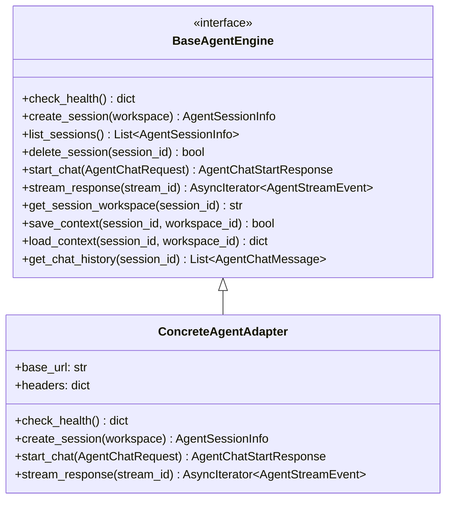

# Agent Adapters & Multi-Agent Orchestration

Wright implements an **Adapter Pattern** (`BaseAgentEngine`) to decouple the API gateway from the underlying LLM serving infrastructure. Hardcoding prompts or model-specific APIs is strictly forbidden. This abstraction allows the platform to support any local or remote inference engine depending on the deployment constraints and hardware capabilities.

## LLM Agnosticism and Configuration

The agent adapter layer bridges the system to any target LLM provider:

*   **Local Inference**: Can connect directly to locally hosted engines via standard local APIs (e.g., Llama.cpp, Ollama, local WebUI backends), ensuring 100% offline security.
*   **Remote / Cloud Inference**: Can connect to remote enterprise cloud LLM endpoints, utilizing API keys and secure tokens.
*   **SSE Streaming**: Natural language tokens, tool call invocations, and progress messages are streamed asynchronously using Server-Sent Events (SSE).
*   **Context Persistence**: Workspace-specific agent configurations and conversation histories are serialized and persisted in the local SQLite database (`agent_contexts`), allowing users to restore previous states instantly.

## Per-Agent Risk Profiles & Guidance

Wright orchestrates three distinct agents, each with a specific operational profile and specialized guidelines:

### Hermes (Coordination & Task Routing)
*   **Risk Level**: Low
*   **Focus**: Reads and writes structured task trees, manages inter-agent message routing, and presents summaries.
*   **Constraints**: Do not install communication libraries system-wide. Write all message queues, logs, and routing tables to `/home/hermes/`. Do not modify `/etc/hosts` or network configuration without explicit operator instruction.

### OpenClaw (System Operations & Tool Execution)
*   **Risk Level**: High
*   **Focus**: Executes shell utilities, interacts with CAD/CAM engines directly, and configures environments.
*   **Constraints**: Treat every system-level action as potentially irreversible. Log before executing, not after. For any change to `/etc`, always create a timestamped backup in `/home/agent/.backups/etc/` first. When in doubt between a system-level and user-space solution, always choose user-space.

### Pi (Analysis & Computation)
*   **Risk Level**: Medium
*   **Focus**: Installs scientific packages and handles heavy calculations, dataset processing, and math/physics solvers.
*   **Constraints**: All package installation via micromamba to `/opt/conda`. Do not use system pip. Write all intermediate computation outputs to `/home/pi/scratch/` rather than `/tmp` (which is ephemeral). Large datasets should go to `/home/pi/data/` to persist across sessions.
