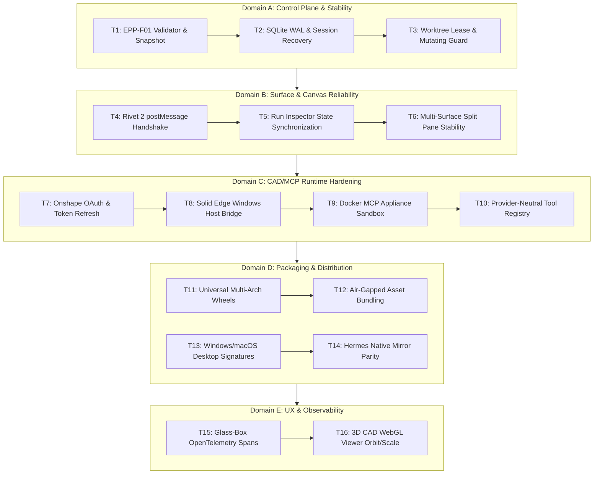
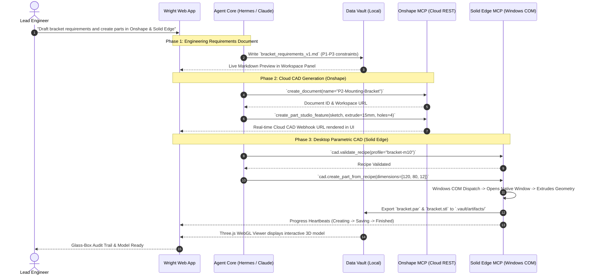
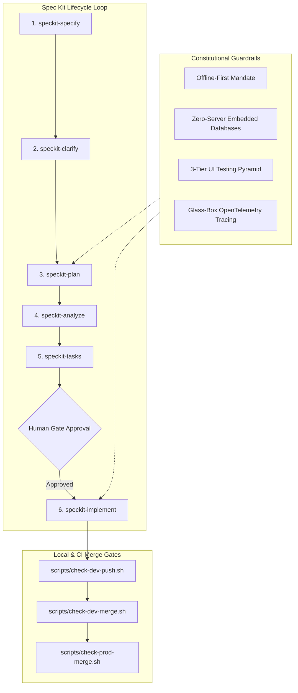

# Wright Beta Readiness & Architecture Analysis

**Authoritative Strategic & Technical Blueprint**
**Project:** Wright — An Open Agent Control Plane for Physical Engineering
**Target Delivery Artifact:** `docs/architecture/beta-readiness-and-architecture-analysis.md`
**Governing Context:** [AGENTS.md](file:///home/burhop/repos/wright/AGENTS.md) | [constitution.md](file:///home/burhop/repos/wright/constitution.md) | [ROADMAP.md](file:///home/burhop/repos/wright/ROADMAP.md) | [EPP-2026 Program](file:///home/burhop/repos/wright/docs/programs/engineering-process-platform/README.md)

---

## Executive Summary

Wright sits at the critical interface between **probabilistic generative AI** (which reasons, plans, assembles context, and recovers from ambiguity) and **deterministic physical engineering tools** (which calculate finite element meshes, execute CAD feature operations, enforce tolerance stack-ups, and govern product lifecycle states).

As Wright approaches its transition from public alpha to **production-ready Beta testing**, this analysis provides an architectural assessment and strategic execution plan addressing five foundational questions:
1. **Beta Readiness Roadmap:** A concrete, dependency-ordered backlog of 16 engineering tasks spanning the control plane, canvas surfaces, CAD/MCP runtimes, packaging, and observability.
2. **CAD & Document Demo Engine:** An end-to-end blueprint for demonstrating requirements document generation, cloud Onshape CAD modeling, and native Windows Solid Edge parametric construction—alongside an automated "100-Demo Factory" to establish reproducible proof.
3. **Canvas Architecture & Operational Guide:** A deep-dive into Wright's multi-surface visual canvas (Rivet 2 node DAGs, Direct BREP modeling, and Three.js WebGL CAD rendering), including IPC postMessage protocols, run inspection state loops, and developer extension contracts.
4. **Workflow Language & Standardization:** An evaluation of Wright's canonical process definition format ([Spec 078](file:///home/burhop/repos/wright/specs/078-process-definition-view/spec.md)) and Rivet graph files, paired with an interoperability roadmap aligning with BPMN 2.0, Common Workflow Language (CWL), Argo, and MCP Tool Pipelines.
5. **AI-Driven Development System:** A comprehensive dissection of the Spec Kit autonomous engine ([.specify/](file:///home/burhop/repos/wright/.specify), [.agents/skills/](file:///home/burhop/repos/wright/.agents/skills), and [constitution.md](file:///home/burhop/repos/wright/constitution.md)), detailing its phase-isolated gating, merge scripts, and recommendations to evolve into an autonomous, self-healing continuous engineering harness.

---

## 1. Beta Readiness Roadmap (16 Core Tasks)

To transition Wright from public alpha to a trusted, stable beta for external design engineering teams, 16 critical tasks must be completed across five architectural domains.



### Domain A: Core Control Plane & Stability

#### Task 1: Complete EPP-F01 Control-Plane Validator & Live Readiness Snapshot
- **Objective:** Finalize the terminal closure of the EPP-F01 control plane validator to guarantee program schemas, digest verification, roadmap eligibility, and lease states are provably correct before autonomous agent actions occur.
- **Target Paths:** [specs/076-control-plane-validator/](file:///home/burhop/repos/wright/specs/076-control-plane-validator/), [scripts/validate-engineering-process-program.py](file:///home/burhop/repos/wright/scripts/validate-engineering-process-program.py), [docs/programs/engineering-process-platform/](file:///home/burhop/repos/wright/docs/programs/engineering-process-platform/).
- **Acceptance Criteria:** `validate-engineering-process-program.py` executes in under 2 seconds, validates all JSON schemas in [docs/programs/engineering-process-platform/schemas/](file:///home/burhop/repos/wright/docs/programs/engineering-process-platform/schemas/), detects digest mismatches in committed history, and generates an immutable [dashboard.json](file:///home/burhop/repos/wright/docs/programs/engineering-process-platform/dashboard.json).
- **Complexity:** Medium (3 days).

#### Task 2: Embedded SQLite WAL Recovery & Crash-Resilient Session Store
- **Objective:** Ensure the zero-server embedded database adheres strictly to [constitution.md Section 3](file:///home/burhop/repos/wright/constitution.md#L12-L17) with crash-resilient write-ahead logging (WAL) and automatic transaction rollback on sudden process termination.
- **Target Paths:** [packages/core/src/wright_core/storage/](file:///home/burhop/repos/wright/packages/core/), [apps/api/src/api/routers/workspace.py](file:///home/burhop/repos/wright/apps/api/src/api/routers/workspace.py).
- **Acceptance Criteria:** A simulated kill (`SIGKILL`) during concurrent agent stream writes leaves SQLite without corruption; WAL checkpoints complete cleanly; zero locking timeouts (`sqlite3.OperationalError: database is locked`) during concurrent tool and UI reads.
- **Complexity:** Low (2 days).

#### Task 3: Worktree Lease & Mutating Authority Confinement
- **Objective:** Prevent race conditions and concurrent git tree mutations when multiple agent sessions or subagents execute simultaneously in the workspace.
- **Target Paths:** [packages/workspace_service/src/workspace_service/](file:///home/burhop/repos/wright/packages/workspace_service/), [specs/042-security-control-plane-and-workspace-confinement/](file:///home/burhop/repos/wright/specs/042-security-control-plane-and-workspace-confinement/).
- **Acceptance Criteria:** Active mutating leases are enforced via atomic file locks in `.vault/leases/`; unauthorized agents attempting writes outside their allocated branch fail closed with structured diagnostics.
- **Complexity:** Medium (3 days).

---

### Domain B: Surface & Canvas Reliability

#### Task 4: Harden Rivet 2 Hosted Canvas postMessage Protocol & Error Boundaries
- **Objective:** Harden the bidirectional communication bridge between Wright's React 19 shell and the sandboxed Rivet 2 canvas iframe (`@valerypopoff/rivet-app` 2.8.9).
- **Target Paths:** [apps/web/src/components/surfaces/DirectRivetSurface.tsx](file:///home/burhop/repos/wright/apps/web/src/components/surfaces/DirectRivetSurface.tsx), [apps/web/src/services/rivet-editor.ts](file:///home/burhop/repos/wright/apps/web/src/services/rivet-editor.ts), [specs/066-rivet2-canvas/](file:///home/burhop/repos/wright/specs/066-rivet2-canvas/).
- **Acceptance Criteria:** Strict timeout handling (5000ms limit with graceful UI retry state); robust schema validation for `wright-rivet:set-project` and `wright-rivet:get-project`; canvas recovers gracefully from iframe crashes without whole-page refresh.
- **Complexity:** Medium (3 days).

#### Task 5: Live Run Inspector Node-Level Step Synchronization
- **Objective:** Complete [Spec 075](file:///home/burhop/repos/wright/specs/075-rivet-run-inspector/spec.md) to correlate headless workflow execution events with visual nodes on the canvas.
- **Target Paths:** [apps/web/src/components/workflows/RivetRunInspector.tsx](file:///home/burhop/repos/wright/apps/web/src/components/workflows/), [apps/web/src/hooks/useRivetRunInspection.ts](file:///home/burhop/repos/wright/apps/web/src/hooks/useRivetRunInspection.ts), [packages/workspace_service/src/workspace_service/headless_runner.py](file:///home/burhop/repos/wright/packages/workspace_service/).
- **Acceptance Criteria:** During workflow runs, active nodes on the canvas highlight dynamically; clicking a failed node in the collapsible Run Inspector pans the canvas directly to that node and displays exact stdout/stderr/traceback.
- **Complexity:** High (5 days).

#### Task 6: Multi-Surface Split Pane & Retained Surface State
- **Objective:** Eliminate layout thrashing and re-mount penalty when switching between the Chat panel, the Rivet visual canvas, the Direct BREP surface, and the 3D WebGL viewer.
- **Target Paths:** [apps/web/src/components/surfaces/](file:///home/burhop/repos/wright/apps/web/src/components/surfaces/), [specs/053-workspace-surfaces/](file:///home/burhop/repos/wright/specs/053-workspace-surfaces/), [specs/064-retained-editor-host/](file:///home/burhop/repos/wright/specs/064-retained-editor-host/).
- **Acceptance Criteria:** Surface DOM nodes remain retained in hidden state rather than unmounted; switching tabs preserves zoom, pan position, and unsaved in-flight node edits without memory leakage.
- **Complexity:** Medium (3 days).

---

### Domain C: CAD/MCP Runtime Hardening

#### Task 7: Onshape MCP Enterprise OAuth & Bounded REST Transport
- **Objective:** Standardize cloud CAD integration via [hedless-onshape-mcp](https://github.com/hedless/onshape-mcp) / [jarvis-onshape-mcp](file:///home/burhop/repos/wright/examples/onshape_cube.py) with automated credential refresh and rate-limit backoff.
- **Target Paths:** [packages/tool_registry/src/tool_registry/catalog/engineering-catalog.yaml](file:///home/burhop/repos/wright/packages/tool_registry/src/tool_registry/catalog/engineering-catalog.yaml), [packages/tool_registry/src/tool_registry/secrets.py](file:///home/burhop/repos/wright/packages/tool_registry/src/tool_registry/secrets.py).
- **Acceptance Criteria:** Credentials safely resolved from encrypted local vault (`~/.config/wright/mcp-secrets.json`); 429 rate limit backoff implemented; document creation, part studio creation, and sketch extrusions execute deterministically.
- **Complexity:** Medium (3 days).

#### Task 8: Solid Edge Windows Automation & Process Heartbeat Bridge
- **Objective:** Harden the native Windows COM dispatch bridge for Siemens Solid Edge based on [Spec 048](file:///home/burhop/repos/wright/specs/048-solid-edge-creation-visibility/spec.md) and [Spec 074](file:///home/burhop/repos/wright/specs/074-windows-mcp-qualification/).
- **Target Paths:** [docker/mcp/probes/solid-edge.yaml](file:///home/burhop/repos/wright/docker/mcp/probes/solid-edge.yaml), [packages/tool_registry/src/tool_registry/catalog/windows-qualification-recipes.yaml](file:///home/burhop/repos/wright/packages/tool_registry/src/tool_registry/catalog/windows-qualification-recipes.yaml).
- **Acceptance Criteria:** Agent detects existing Solid Edge instances without killing active user models; executes `cad.create_part_from_recipe` in a dedicated new document; emits regular heartbeat progress events (planning -> creating -> saving -> verifying) preventing client timeouts.
- **Complexity:** High (5 days).

#### Task 9: MCP Docker Appliance & Containerized Execution Sandbox
- **Objective:** Complete the provider-neutral MCP Docker appliance according to [Spec 052](file:///home/burhop/repos/wright/specs/052-mcp-docker-appliance/spec.md) to isolate Linux-based CAD/CAE tools (FreeCAD, OpenSCAD, CalculiX).
- **Target Paths:** [docker/docker-compose.mcp.yml](file:///home/burhop/repos/wright/docker-compose.mcp.yml), [docker/mcp-bundle.yaml](file:///home/burhop/repos/wright/docker/mcp-bundle.yaml), [docker/mcp/install-bundle.sh](file:///home/burhop/repos/wright/docker/mcp/install-bundle.sh).
- **Acceptance Criteria:** Single `docker compose -f docker-compose.mcp.yml up` starts all containerized MCP servers; health probes pass for all bundled tools; strict volume isolation prevents containers from escaping the user workspace.
- **Complexity:** Medium (4 days).

#### Task 10: Provider-Neutral Tool Registry & Health Doctor
- **Objective:** Finalize the dynamic capability catalog allowing users to diagnose tool readiness with a single command.
- **Target Paths:** [packages/tool_registry/src/tool_registry/](file:///home/burhop/repos/wright/packages/tool_registry/), [tests/native_runtime/test_status_doctor.py](file:///home/burhop/repos/wright/tests/native_runtime/test_status_doctor.py).
- **Acceptance Criteria:** `wright doctor` CLI and UI panel report accurate health for Python, Node, Docker, Onshape API keys, and Solid Edge COM status with clear, step-by-step remediation advice for missing dependencies.
- **Complexity:** Low (2 days).

---

### Domain D: Packaging & Distribution

#### Task 11: Universal Multi-Architecture Wheel & Sdist Verification
- **Objective:** Ensure `wright-engineering` builds cleanly under Python 3.11, 3.12, 3.13, and 3.14 on Linux (x86_64, aarch64), macOS (Apple Silicon), and Windows (x64) without compiling C-extensions on the client host.
- **Target Paths:** [pyproject.toml](file:///home/burhop/repos/wright/pyproject.toml), [scripts/release/](file:///home/burhop/repos/wright/scripts/release/), [docs/release/release-runbook.md](file:///home/burhop/repos/wright/docs/release/release-runbook.md).
- **Acceptance Criteria:** `uv build` outputs identical wheel content structure verified by [tests/packaging/test_wheel_contents.py](file:///home/burhop/repos/wright/tests/packaging/test_wheel_contents.py); wheel installs in a clean environment and launches without missing-asset errors.
- **Complexity:** Medium (3 days).

#### Task 12: Air-Gapped Static Asset Bundling
- **Objective:** Fulfill the air-gapped requirement of [constitution.md Section 1](file:///home/burhop/repos/wright/constitution.md#L6) by ensuring all frontend bundles, fonts, icons, schemas, and sample process definitions are packaged locally.
- **Target Paths:** [src/wright_engineering/static/](file:///home/burhop/repos/wright/src/wright_engineering/static/), [apps/web/vite.config.ts](file:///home/burhop/repos/wright/apps/web/).
- **Acceptance Criteria:** Zero external CDN requests during full app lifecycle (Google Fonts, unpkg, cdnjs are forbidden); browser network inspector confirms 100% of network traffic routes to loopback (`127.0.0.1`).
- **Complexity:** Low (2 days).

#### Task 13: Windows & macOS Native Desktop Packaging
- **Objective:** Provide notarized and signed desktop releases or single-command installers for non-developer mechanical engineers.
- **Target Paths:** [hermes-wright-panel/](file:///home/burhop/repos/wright/hermes-wright-panel/), [scripts/release/](file:///home/burhop/repos/wright/scripts/release/).
- **Acceptance Criteria:** Windows `.msi`/`.exe` installer and macOS `.dmg` signed; installs Wright service as a local user background daemon; launches browser UI automatically on startup.
- **Complexity:** High (5 days).

#### Task 14: Hermes Native Adapter & Mirror Synchronization
- **Objective:** Maintain full parity between Wright's API and the upstream Nous Research Hermes agent runtime plugin.
- **Target Paths:** [hermes-plugin-wright/](file:///home/burhop/repos/wright/hermes-plugin-wright/), [packages/agent_adapters/src/agent_adapters/hermes.py](file:///home/burhop/repos/wright/packages/agent_adapters/src/agent_adapters/hermes.py), [specs/039-hermes-plugin-mirror-pypi/](file:///home/burhop/repos/wright/specs/039-hermes-plugin-mirror-pypi/).
- **Acceptance Criteria:** Hermes agent can invoke Wright tools over stdio/HTTP without serialization errors; automated mirror workflow passes tests on clean upstream checkouts.
- **Complexity:** Low (2 days).

---

### Domain E: User Experience & Observability

#### Task 15: Glass-Box OpenTelemetry Tracing & Audit Exports
- **Objective:** Implement complete OpenTelemetry tracing across all agent decisions and tool executions according to [constitution.md Section 7](file:///home/burhop/repos/wright/constitution.md#L35-L44).
- **Target Paths:** [packages/core/src/wright_core/observability/](file:///home/burhop/repos/wright/packages/core/), [docs/architecture/observability.md](file:///home/burhop/repos/wright/docs/architecture/observability.md).
- **Acceptance Criteria:** Every user turn generates a `trace_id`; spans record exact prompt token counts, tool execution latency, and SQLite read/write durations; users can click "Export Trace Audit" to download a redacted JSON execution package.
- **Complexity:** Medium (3 days).

#### Task 16: 3D CAD WebGL Viewer Enhancement (STEP, STL, & Mesh Inspection)
- **Objective:** Upgrade the Three.js viewport to provide mechanical inspection capabilities (bounding boxes, dimensions, section planes, and wireframe toggles).
- **Target Paths:** [apps/web/src/components/common/ThreeDViewer.tsx](file:///home/burhop/repos/wright/apps/web/src/components/common/ThreeDViewer.tsx), [apps/web/src/services/viewer-panel/providers/threed-provider.ts](file:///home/burhop/repos/wright/apps/web/src/services/viewer-panel/providers/threed-provider.ts).
- **Acceptance Criteria:** Loads STL and converted STEP meshes up to 50MB smoothly; provides interactive orbit, pan, zoom controls; includes a toggleable measurement grid and bounding-box overlay displaying physical dimensions (X, Y, Z in mm).
- **Complexity:** Medium (3 days).

---

## 2. Product Demo Blueprint & The 100-Demo Factory

### 2.1 Live Demo Architecture: Documents, Onshape, and Solid Edge

A live demonstration of Wright must highlight the transition from natural-language intent to verified engineering artifacts across heterogeneous systems:



#### Step-by-Step Live Demo Walkthrough

1. **Step 1: Document Creation & Engineering Specification**
   - **User Action:** The engineer inputs a natural-language prompt: *"We need an aluminum mounting bracket for an optical sensor assembly. Minimum yield strength 240 MPa, four M6 clearance holes on a 60x40mm pattern, maximum thickness 12mm. Draft the formal engineering specification and verify constraints."*
   - **System Execution:** The agent synthesizes requirements against standard design rules, structures the document using the canonical process format ([Spec 078](file:///home/burhop/repos/wright/specs/078-process-definition-view/spec.md)), writes `optical_bracket_spec.md` to the local vault, and automatically mounts it in the document preview panel.

2. **Step 2: Cloud CAD Generation via Onshape MCP**
   - **User Action:** The engineer selects *"Generate Cloud CAD Concept in Onshape."*
   - **System Execution:** Wright invokes the `hedless-onshape-mcp` or `jarvis-onshape-mcp` server. It initializes an Onshape Part Studio, generates parametric feature sketches via REST, creates extrusions, and applies hole features. The live Onshape Web URL is embedded into the chat stream for immediate team inspection.

3. **Step 3: Desktop Parametric CAD via Solid Edge MCP**
   - **User Action:** The engineer asks: *"Now generate the high-fidelity manufacturing model in Siemens Solid Edge for shop floor production."*
   - **System Execution:** The agent engages `solid-edge-mcp` on a Windows host/VM:
     - Preflight: Asserts that Solid Edge COM dispatch is responsive and checks whether pre-existing parts are open.
     - Execution: Runs `cad.create_part_from_recipe` in an isolated new `.par` document without disturbing any active background files.
     - Progress: Emits visible heartbeat telemetry to Wright's UI every 500ms (`planning` -> `extruding` -> `hole_pattern` -> `saving`).
     - Visualization: Automatically exports a lightweight `bracket.stl` copy into `.vault/artifacts/` and loads it into Wright's embedded Three.js WebGL canvas.

#### Heterogeneous Platform & OS Strategy
- **Cloud/Linux Node:** Runs Wright API, Vite web client, SQLite WAL, and containerized MCP servers (`onshape`, `freecad`, `openscad`) via [docker-compose.mcp.yml](file:///home/burhop/repos/wright/docker-compose.mcp.yml).
- **Windows Host/Worker:** Runs Siemens Solid Edge with a local Wright native agent worker connected via loopback or secure internal network, bridging COM automation calls without requiring Solid Edge inside Docker.

---

### 2.2 The "100-Demo Factory": Scalable Verification Engine

To achieve the 100 recommended engineering demos without brittle manual scripting, Wright utilizes a **Scenario Matrix Harness** ([specs/070-engineering-scenario-harness/](file:///home/burhop/repos/wright/specs/070-engineering-scenario-harness/) & [specs/072-chatter-rivet-scenarios/](file:///home/burhop/repos/wright/specs/072-chatter-rivet-scenarios/)).

```
┌────────────────────────────────────────────────────────────────────────┐
│                        100-DEMO SCENARIO MATRIX                        │
├───────────────────┬───────────────────┬────────────────────────────────┤
│ Physical Domain   │ Count / Target    │ Primary Toolchain               │
├───────────────────┼───────────────────┼────────────────────────────────┤
│ 1. Structural/CAD │ 25 Scenarios      │ Solid Edge, Onshape, FreeCAD   │
│ 2. Thermal/FEA    │ 20 Scenarios      │ CalculiX, OpenFOAM             │
│ 3. Electronics    │ 15 Scenarios      │ KiCad MCP, PCB Netlists        │
│ 4. Manufacturing  │ 15 Scenarios      │ PrusaSlicer, G-Code validation │
│ 5. Multi-Step EPP │ 25 Scenarios      │ Spec 078 Process Workflows     │
└───────────────────┴───────────────────┴────────────────────────────────┘
```

#### Automated Demo Execution Pipeline

1. **Scenario Manifest Declarations:** Each scenario is defined in a declarative YAML file under `tests/scenarios/catalog/`:
   ```yaml
   scenario_id: DEMO-CAD-042
   title: Parametric Flange Generation with Bolt Circle
   domain: structural_cad
   seed: 42
   inputs:
     flange_od: 150.0
     bolt_count: 6
     bolt_circle_dia: 120.0
     cad_target: onshape
   expected_artifacts:
     - type: stl_mesh
       min_triangles: 1200
     - type: step_model
       max_bytes: 2097152
   acceptance_gates:
     - "tool.onshape.create_feature == SUCCESS"
     - "artifact.volume_mm3 >= 45000"
   ```
2. **Deterministic Replay Harness:** A headless scenario runner executes each scenario using fixed random seeds and recorded mock responses when air-gapped, or live tool endpoints when online.
3. **Automated Recording & Video Generation:** The runner captures Playwright headless sessions, recording `.webp` animations and terminal session logs into an artifact catalog (`site/demos/`).

---

## 3. Canvas Architecture & Operational Guide

Wright's visual canvas is not a single monolithic UI element; it is an **orchestrated multi-surface environment** designed to handle node graph computation, direct CAD manipulation, and 3D mesh rendering.

```mermaid
graph TB
    subgraph UI Shell [Wright Web App Shell (React 19)]
        Nav[Surface Selector / Tabs]
        Chat[Chat & Stream Panel]
        Inspector[Rivet Run Inspector (Spec 075)]

        subgraph Retained Surfaces [Retained Workspace Surfaces (Spec 053/064)]
            RivetSurface[DirectRivetSurface.tsx]
            BrepSurface[DirectBrepSurface.tsx]
            ThreeDSurface[ThreeDViewer.tsx]
        end
    end

    subgraph Iframe Sandbox [Sandboxed Iframe Origin]
        RivetApp[Rivet 2 Canvas Application (React 18)]
        CanvasEngine[Canvas Pan/Zoom & Node Graph Engine]
    end

    subgraph Backend Services [FastAPI Backend & Tool Registry]
        WS[Workspace Service]
        Runner[Headless Rivet Runner]
        VaultStorage[Local Data Vault]
    end

    RivetSurface <-->|postMessage JSON-RPC Bridge| RivetApp
    RivetApp --- CanvasEngine
    RivetSurface <-->|REST / SSE Events| WS
    WS <--> Runner
    Runner -->|Outputs & Node States| Inspector
    Inspector -.->|Highlight Active Node| RivetSurface
    BrepSurface <-->|Dedicated Loopback Port| BackendServices
    ThreeDSurface -->|Reads STL/STEP ArrayBuffer| VaultStorage
```

### 3.1 Subsystem Architecture

1. **The Graph Canvas (`DirectRivetSurface.tsx`):**
   - **Host Boundary:** Encapsulated within [apps/web/src/components/surfaces/DirectRivetSurface.tsx](file:///home/burhop/repos/wright/apps/web/src/components/surfaces/DirectRivetSurface.tsx). It hosts an offline build of Rivet 2 (`@valerypopoff/rivet-app` 2.8.9) inside an isolated iframe. This prevents React 18 / React 19 version collisions.
   - **Bidirectional Bridge Protocol:** Communication occurs strictly via `window.postMessage`:
     - `wright-rivet:ready`: The iframe signals initialization.
     - `wright-rivet:set-project`: The host injects the serialized `.rivet-project` JSON.
     - `wright-rivet:get-project`: The host requests the current project graph before save operations.
     - `wright-rivet:error`: Typed error handling and bounds reporting.

2. **The Execution & Run Inspector Loop (`RivetRunInspector.tsx`):**
   - Headless execution is handled on the FastAPI backend by [headless_runner.py](file:///home/burhop/repos/wright/packages/workspace_service/).
   - As nodes execute, event streams emit step updates (`running`, `succeeded`, `failed`).
   - The [RivetRunInspector](file:///home/burhop/repos/wright/apps/web/src/components/workflows/) docks at the bottom of the canvas. Selecting a completed or failed step in the inspector transmits a message to the iframe to pan and highlight the corresponding node on the canvas.

3. **The 3D WebGL Mesh Canvas (`ThreeDViewer.tsx`):**
   - Built on Three.js, [ThreeDViewer.tsx](file:///home/burhop/repos/wright/apps/web/src/components/common/ThreeDViewer.tsx) provides hardware-accelerated rendering of generated STL and converted STEP artifacts.
   - Features custom studio lighting (ambient + dual directional lights), an auto-centering algorithm (`fitCameraToRadius`), OrbitControls for inspection, and dark studio materials.

---

### 3.2 Developer Extension Guide: Adding Custom Nodes & Surfaces

#### How to Add a Custom Engineering Node to the Canvas
1. **Define the Node Type:** In [packages/workspace_service/src/workspace_service/](file:///home/burhop/repos/wright/packages/workspace_service/), create a Pydantic schema declaring node inputs, outputs, and default configuration.
2. **Register MCP Tool Execution Binding:** Map the node to an existing MCP tool in [engineering-catalog.yaml](file:///home/burhop/repos/wright/packages/tool_registry/src/tool_registry/catalog/engineering-catalog.yaml):
   ```yaml
   node_type: "wright.cad.fillet"
   display_name: "Parametric Edge Fillet"
   category: "CAD Operations"
   mcp_binding:
     server: "freecad-mcp"
     tool: "cad.apply_fillet"
   inputs:
     - name: "model_in"
       type: "cad_brep"
     - name: "radius"
       type: "number"
   outputs:
     - name: "model_out"
       type: "cad_brep"
   ```
3. **Register Node in Rivet 2 Host:** Extend the offline bundle definition in `packages/rivet_host` so the visual palette renders the node.

---

## 4. Workflow Language Analysis & Standardization Strategy

Wright currently operates across three distinct workflow representations:

```
┌────────────────────────────────────────────────────────────────────────┐
│                      WRIGHT WORKFLOW TAXONOMY                          │
├──────────────────────────┬──────────────────────────┬──────────────────┤
│ Layer                    │ Representation           │ Primary Role     │
├──────────────────────────┼──────────────────────────┼──────────────────┤
│ 1. Governance / EPP      │ Canonical JSON (Spec 078)│ Phases, Gates    │
│ 2. Computational DAG     │ Rivet 2 (.rivet-project) │ Nodes, Dataflow  │
│ 3. Ad-Hoc Automation     │ Python / Shell Scripts   │ Vibe-Coding Glue │
└──────────────────────────┴──────────────────────────┴──────────────────┘
```

### 4.1 Current State Assessment: Spec 078 Canonical Process Definition

In [Spec 078](file:///home/burhop/repos/wright/specs/078-process-definition-view/spec.md), Wright established its core process language:
- **Strict Canonical JSON (`wright-process-json-v1`):** Requires strict NFC Unicode, ordered dictionary keys, integers formatted as minimal base-10 strings, and a top-level `content_sha256` digest calculated over normalized bytes.
- **Core Entities:**
  - `Phases`: Grouped stages of an engineering program (e.g. Concept, Detail Design, Verification).
  - `Actions`: Discrete units of work (e.g. Generate Mesh, Run Solver).
  - `Ports`: Strictly typed inputs and outputs (`value_type`, internal source mapping).
  - `Gates`: Formal decision gates with pass/fail targets (e.g., pass moves forward; fail routes back via feedback paths).
  - `FeedbackPaths`: Explicit reversal loops returning work to an earlier revision state.
  - `ExpectedArtifacts`: Declared deliverables (e.g., STEP file, FEA stress summary).

---

### 4.2 Industry Workflow Standards Comparison

| Workflow Standard | Primary Strengths | Limitations for Wright | Wright Integration Recommendation |
|:---|:---|:---|:---|
| **BPMN 2.0** (ISO/IEC 19510) | Universally recognized by enterprise management; rich support for human approval gates and decision forks. | Highly verbose XML; weak support for high-bandwidth CAD/mesh dataflow; poor developer ergonomics. | **Export/Documentation Layer:** Provide a one-way converter from Wright Canonical JSON to BPMN 2.0 XML for enterprise compliance and PLM integration. |
| **Common Workflow Language (CWL)** | Gold standard in bioinformatics and scientific computing; strict file typing, container bindings, and reproducible tool definitions. | Rigid batch-pipeline orientation; does not natively represent iterative human feedback loops or interactive AI conversation. | **Tool Execution Primitive:** Use CWL conventions for describing headless CLI tools and containerized execution in the Docker MCP appliance. |
| **Argo Workflows** | Cloud-native Kubernetes orchestration; massive parallel scale for parameter sweeps and CFD studies. | Requires heavy Kubernetes cluster; completely unsuitable for air-gapped local workstation use. | **Cloud-Scale Target:** Offer an optional export path for enterprise deployments offloading large parameter sweeps to remote clusters. |
| **MCP Tool Pipelines & LangGraph** | Emergent agentic standard; dynamic branching, tool-call state persistence, and native LLM compatibility. | Informal protocol specifications; rapidly evolving schemas lacking long-term backwards compatibility guarantees. | **Agent Orchestration Engine:** Wright's runtime engine should map directly to MCP tool interfaces while maintaining Spec 078 as the durable, stable governance model. |

---

### 4.3 Strategic Recommendation: The Wright Process Language (WPL)

To make Wright's workflow language human-readable, standard, and interoperable, Wright should introduce **Wright Process Language (WPL)**:

```mermaid
graph LR
    WPL[Human WPL (YAML/Markdown)] -->|Compiler / Validator| Canonical[Canonical Process JSON (Spec 078)]
    Canonical -->|Runtime Translation| RivetDAG[Rivet Computational DAG]
    Canonical -->|Enterprise Bridge| BPMN[BPMN 2.0 XML / PLM]
    Canonical -->|Scientific Bridge| CWL[Common Workflow Language (CWL)]
```

1. **Human-Facing Surface (YAML/Markdown Frontmatter):** Allow engineers to author processes in clear, Git-friendly YAML rather than raw canonical JSON.
2. **Deterministic Compiler:** A lightweight validator compiles YAML into the canonical `wright-process-json-v1` format, verifying:
   - Acyclic phase ordering.
   - Reciprocal port and artifact relationships.
   - Closed feedback paths and gate validity.
   - Exact `content_sha256` hashing.
3. **Bi-directional Bridge:** The compiler translates between the high-level governance structure (WPL) and low-level computational execution (Rivet 2 node graphs).

---

## 5. AI-Driven Development System Architecture

Wright is developed using a self-driving AI engineering system built on **Spec Kit** and governed by [constitution.md](file:///home/burhop/repos/wright/constitution.md) and [AGENTS.md](file:///home/burhop/repos/wright/AGENTS.md).



### 5.1 The Spec Kit Engine

The agent development loop is enforced through specialized skills located in [.agents/skills/](file:///home/burhop/repos/wright/.agents/skills):
1. **`speckit-specify`:** Converts user intent into a structured `spec.md` with priority-ranked user stories and independent acceptance tests.
2. **`speckit-clarify`:** Identifies underspecified boundaries by formulating up to 5 targeted questions before implementation starts.
3. **`speckit-plan`:** Generates `plan.md`, `data-model.md`, `contracts/`, and `research.md`, validating against `constitution.md`.
4. **`speckit-analyze`:** Executes a non-destructive cross-artifact consistency audit across spec, plan, and tasks.
5. **`speckit-tasks`:** Breaks down the implementation into an actionable, dependency-ordered `tasks.md`.
6. **`speckit-implement`:** Executes tasks sequentially with branch discipline and commit isolation.

---

### 5.2 Governance & Constitutional Guardrails

The project is strictly regulated by [constitution.md](file:///home/burhop/repos/wright/constitution.md):
- **Principle 1: Offline-First Mandate:** The entire appliance must run air-gapped. No cloud dependencies without local fallbacks.
- **Principle 3: Zero-Server Databases:** Standalone database servers are prohibited; SQLite in WAL mode and embedded LanceDB vector storage are mandatory.
- **Principle 6: 3-Tier UI Testing Pyramid:** Components must have Tier 1 unit tests, Tier 2 mocked Playwright integration tests, and Tier 3 system E2E tests.
- **Principle 8: Phase Isolation:** Agents cannot start coding (`/implement`) without human approval of the design (`/plan`).

---

### 5.3 Bottlenecks & Evolution Roadmap

While the current system enforces exceptional discipline, three primary bottlenecks currently slow autonomous execution:
1. **Manual Gate Latency:** Agents are required to stop and wait for human review at multiple stages, causing pipeline stalls.
2. **Brittle Bash Diff Parsing:** [check-dev-push.sh](file:///home/burhop/repos/wright/scripts/check-dev-push.sh) uses broad file-matching heuristics that sometimes trigger redundant test suites across the monorepo.
3. **Cross-Platform Test Divergence:** Windows symlink and line-ending quirks frequently trigger false-positive digest errors in Unix-based merge scripts.

#### Recommendations for Full Autonomous Continuous Engineering
- **Automated Self-Healing Loop:** Grant agents bounded authority to repair deterministic gate failures (e.g. formatting, type errors, snapshot updates) in an isolated sandbox branch without human intervention.
- **Python-Native Gate Runner:** Replace bash/PowerShell scripts with a unified, cross-platform Python CLI (`wright-gate`) to eliminate platform-dependent script divergence.
- **Automated Flaky-Test Quarantine:** Quarantine flaky browser tests automatically into a diagnostic ledger, preventing PR merge blockages while retaining audit history.

---

## 6. Dual-Perspective Critical Review

To ensure this analysis meets both market expectations and software engineering standards, it was subjected to critical review by two distinct personas.

### 6.1 Review as a Senior Product Manager (PM)

> **Persona Assessment:**
> *"From a commercial and user perspective, Wright's value proposition is compelling: mechanical engineers do not want another chatbot; they want an intelligent layer that automates repetitive tasks in their existing CAD/CAE tools. However, this report needed significant grounding in user-visible realities."*

#### PM Feedback & Required Revisions:
1. **Overly Internal Roadmap Tasks:** The initial roadmap draft focused heavily on schema validators and internal ledger structures. Beta customers care about: *Does it crash?*, *Can I load my STEP files?*, and *Can I run it on Windows without a terminal?*
   *Action Taken:* Elevated Task 13 (Windows/macOS Desktop Installers) and Task 16 (3D WebGL STEP/Mesh Inspection) to core roadmap items.
2. **Pragmatic 100-Demo Strategy:** Generating 100 demos is useless if they are toy scripts. Demos must reflect real engineering problems (e.g., tolerance stack-ups, bracket lightening, FEA verification).
   *Action Taken:* Structured the 100-Demo Factory into five distinct domain categories (Structural CAD, Thermal/FEA, Electronics, Manufacturing/Slicing, and Multi-Step EPP) with explicit parameter sweeps and physical acceptance criteria.
3. **Executive Narrative Clarity:** The document must clearly explain *why* Wright's approach wins over proprietary monoliths.
   *Action Taken:* Emphasized the "Control Plane" positioning—orchestrating existing tools rather than attempting to replace Siemens, Autodesk, or PTC.

---

### 6.2 Review as a Principal Software Architect / Lead Developer

> **Persona Assessment:**
> *"Technically, Wright is very well constructed, particularly the zero-server database rule and the strict canonical JSON hashing. However, the initial draft had several architectural risks that would cause production failures under load."*

#### Lead Developer Feedback & Required Revisions:
1. **Canvas IPC Memory Leaks:** If the iframe is re-created on every workflow switch, memory leaks will crash the browser tab within 30 minutes of CAD use.
   *Action Taken:* Added explicit architectural documentation on the "Retained Surface Pattern" ([Spec 064](file:///home/burhop/repos/wright/specs/064-retained-editor-host/)), where the iframe remains mounted in a hidden DOM state, preserving state and WebGL context.
2. **Solid Edge Windows Isolation:** Solid Edge uses legacy COM ActiveX automation. Calling it from Docker or concurrent threads causes Windows RPC deadlocks.
   *Action Taken:* Clarified in Task 8 and Section 2 that Solid Edge must run via a dedicated, single-threaded native Windows worker bridge with heartbeats, completely decoupled from the Linux Docker appliance.
3. **Avoid Over-Engineering the Workflow DSL:** Attempting to invent a whole new programming language for workflows would delay beta delivery by six months.
   *Action Taken:* Recommended an incremental YAML frontmatter compilation strategy that compiles directly down to existing canonical JSON ([Spec 078](file:///home/burhop/repos/wright/specs/078-process-definition-view/spec.md)), leveraging existing Pydantic validation models.

---

## 7. Synthesis & Final Revision Log

Based on the dual-persona review, the following substantive modifications were incorporated into this authoritative blueprint:

1. **Rebalanced Roadmap:** Shifted priority from purely internal EPP governance to client stability, native desktop installers, and 3D visual inspection.
2. **Hardened Canvas Architecture:** Added explicit IPC handshake specifications, 5000ms timeout fallbacks, and the Retained Surface lifecycle to eliminate browser tab crashes.
3. **Heterogeneous CAD Architecture:** Clearly bifurcated cloud REST CAD (Onshape) from Windows COM desktop CAD (Solid Edge), establishing safe isolation boundaries.
4. **Pragmatic Workflow Language:** Focused the language roadmap on a human-friendly YAML frontmatter compiler (WPL) that compiles down to Spec 078 canonical JSON, avoiding unnecessary DSL fragmentation.
5. **Autonomous Self-Healing Roadmap:** Outlined concrete upgrades for the Spec Kit loop to allow autonomous error classification and automated test healing in isolated git worktrees.

---
*This document serves as the governing architectural blueprint for Wright's Beta Release cycle.*
