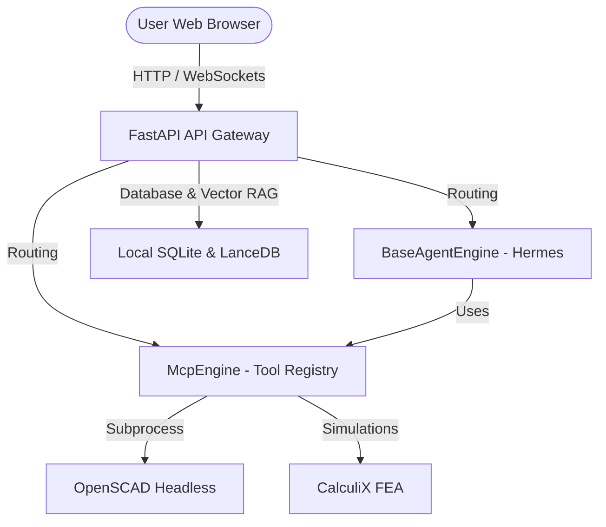

# Introducing Wright: Your Local-First AI Mechanical Engineer

Product designers, mechanical engineers, and structural analysts are facing an engineering velocity bottleneck. While software developers enjoy order-of-magnitude productivity increases through generative AI, physical engineering has remained largely untouched by the AI revolution. 

Today, we are excited to introduce **Wright**: an open-source, local-first agent orchestrator designed to bring generative AI velocity to physical engineering. Wright bridges the gap between natural language design intent and mathematically rigorous computational execution, helping engineers design, simulate, and manufacture physical products faster than ever before.

---

## The Bottleneck in Physical Engineering

Software development is inherently probabilistic and digital; code can be parsed, tested, and rolled back instantly. In contrast, physical engineering is bound by the laws of physics and demanding safety margins. If a software agent generates code with a minor syntax bug, a linter or test run catches it. If an AI generates a mechanical load bearing bracket with a mathematical error, the physical structure fails.

Furthermore, traditional engineering workflows present unique challenges:
1.  **IP Protection and Data Privacy**: CAD designs and aerospace simulations are highly sensitive corporate IP. Uploading these models to public cloud LLM APIs is often prohibited by enterprise security policies.
2.  **Air-Gapped Workstations**: Many mechanical engineers work in highly secure, air-gapped facilities or isolated local networks where external API connections are unavailable.
3.  **Probabilistic Hallucinations**: Standard LLMs are poor at directly compiling solid geometry (STEP/IGES) or computing finite element load vectors. They generate approximate geometry that fails compilation or breaks solver constraints.

Wright was designed from the ground up to solve these three critical problems.

---

## How Wright Works: Deterministic Tool Actuation

Instead of expecting a probabilistic LLM to write raw CAD code or run stress calculations directly, Wright positions the AI agent as a high-level **orchestrator of deterministic engineering tools**. 

The AI manages the design logic, iterates on parameters, and analyzes failure logs. Meanwhile, standard, mathematically rigorous engineering software handles the execution:
*   **CAD and Solid Modeling**: The agent interacts with programmatic CAD kernels like **FreeCAD** and **OpenSCAD** to build solid geometry using code.
*   **FEA and CAE Simulation**: The agent runs structural simulations and computational fluid dynamics (CFD) using open-source solvers like **CalculiX** and **OpenFOAM**.
*   **CAM and Slicing**: The agent configures slicers (like **PrusaSlicer**) to generate G-code toolpaths for 3D printers and manufacturing equipment.

By relying on deterministic solvers for the physical calculations, Wright guarantees that the generated artifacts are mathematically sound and compile correctly, while the AI manages the iteration loops.

---

## Architectural Deep-Dive: A Local-First Monorepo

Wright is built as a highly structured, modular monorepo designed to run fully locally, even on completely air-gapped hardware.



### 1. The API Gateway (FastAPI)
The entry point is a strictly-typed FastAPI server that serves as a thin routing layer. It exposes endpoints for workspace management, chat turns, and tool registry configurations. The API itself contains zero business logic, ensuring strict boundary isolation.

### 2. Embedded Databases and Zero-Server Storage
To run locally without consuming precious GPU/CPU resources on external database servers, Wright uses embedded databases:
*   **SQLite (WAL Mode)**: Relational state, chat sessions, task trees, and configuration options are saved in a local SQLite file using Write-Ahead Logging for concurrency.
*   **LanceDB (Apache Arrow)**: All semantic engineering data (standard specs, fastener dimensions) is stored in-process via LanceDB, enabling fast local RAG queries.
*   **Local File Vault**: Generated physical artifacts (STEP, STL, G-code) are saved directly to the host's filesystem and indexed in SQLite.

### 3. Tool Registry & Model Context Protocol (MCP)
Engineering tools are integrated as independent processes using the **Model Context Protocol (MCP)**. This separates the tools from the core orchestration code. Wright can actuate any tool that exposes an MCP server wrapper, making it simple to add custom local or commercial cloud tools.

---

## Quick Start: Getting Started with Docker

You can spin up the full Wright stack locally using our pre-configured Docker Compose profile:

```bash
# 1. Clone the repository
git clone https://github.com/burhop/wright.git && cd wright

# 2. Configure credentials
cp docker/.env.example docker/.env
# Edit docker/.env and set your API keys

# 3. Build and launch the appliance
make docker-build && docker compose up
```

Once started, open `http://localhost:8080` in your browser to access the web console.

---

## Roadmap: What's Next?

We are just beginning to scratch the surface of AI-driven physical design. Our upcoming roadmap milestones include:
*   **Enterprise CAD Connectors**: Standard MCP servers to bridge local agents with commercial CAD tools like SolidWorks and Autodesk Fusion 360.
*   **Multi-Agent Topology Optimization**: Dedicated agent sub-loops where design agents and analysis agents collaborate autonomously to optimize weight and structural safety.
*   **Full WebMCP Integration**: Supporting standard browser forms and controls to actuate cloud design interfaces.

---

## Get Involved!

Wright is fully open-source under the MIT license, and we welcome developers, mechanical engineers, and designers to join us in shaping the future of physical engineering.

*   Join our **[Discord Server](https://discord.gg/wright)** to chat, ask questions, and showcase your designs.
*   Visit **[GitHub Discussions](https://github.com/burhop/wright/discussions)** to share RFC ideas and collaborate on architecture.
*   Check out our **[Contributing Guide](CONTRIBUTING.md)** and look for the `good first issue` label to make your first contribution!
