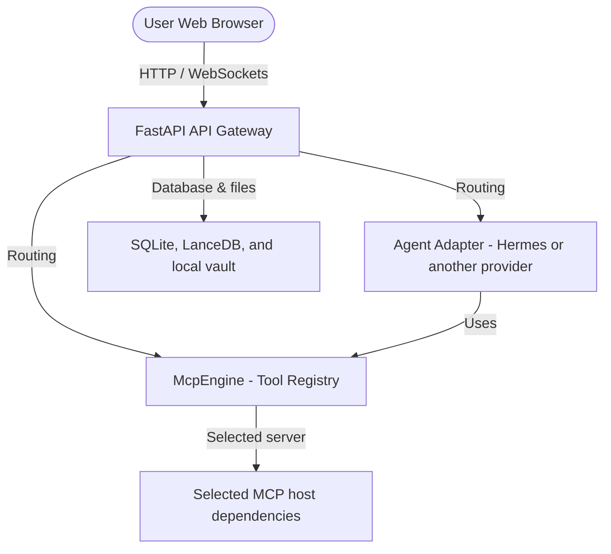

# Introducing Wright: A Local-First AI Mechanical Engineering Workbench

Product designers, mechanical engineers, and structural analysts are facing an
engineering velocity bottleneck. Software teams already use AI to speed up
drafting, review, and test loops; physical engineering needs the same leverage
without pretending that a model can ignore physics, safety margins, or toolchain
constraints.

Wright is an open-source, local-first agent orchestrator for AI-assisted
physical engineering. It is public-alpha software and bring-your-own-AI: Wright
does not bundle an LLM, model weights, hosted provider account, API key, paid
engineering backend, or MCP-specific host software.

## The Bottleneck in Physical Engineering

Software development is inherently digital; code can be parsed, tested, and
rolled back quickly. Physical engineering is bound by materials, geometry,
manufacturing tolerances, and safety-critical failure modes. If an AI generates
a mechanical load-bearing bracket with a mathematical error, the fix is not just
a lint pass.

Traditional engineering workflows also carry hard constraints:

1. **IP protection and data privacy**: CAD designs and simulations are sensitive
   corporate or research assets.
2. **Local and air-gapped workstations**: Many teams work on isolated networks
   where external API access is limited or unavailable.
3. **Toolchain reality**: CAD, CAE, CAM, and vendor systems require explicit
   installation, licensing, validation, and safety controls.

Wright is designed to make those constraints visible instead of hiding them.

## How Wright Works

Wright positions the AI agent as an orchestrator around deterministic tools. The
agent manages design intent, parameters, and error interpretation; selected MCP
servers connect that reasoning loop to engineering software that operators have
installed and validated for the workflow.

- **CAD and solid modeling**: MCP servers can connect to tools such as FreeCAD
  or OpenSCAD when those host dependencies are installed for the selected
  workflow.
- **FEA and CAE simulation**: MCP servers can expose solvers such as CalculiX or
  OpenFOAM when their setup, platform, and safety boundaries are understood.
- **CAM and slicing**: MCP servers can wrap slicers and manufacturing tools, but
  destructive or hardware-bound actions must remain explicitly gated.

This approach does not guarantee a correct design. It gives engineers a local
orchestration layer where generated artifacts can be inspected, tested, and
iterated with traceable tool calls.

## Architectural Deep Dive

Wright is a modular monorepo built around a FastAPI backend, React frontend,
Hermes integration, and an MCP tool registry.



### API Gateway

The FastAPI server is a routing layer for workspace management, chat turns,
setup state, logs, file vault access, and MCP registry operations.

### Embedded Storage

Wright is local-first. Runtime state is stored in embedded SQLite, semantic data
can be stored through LanceDB, and generated artifacts live in the local file
vault.

### Tool Registry and MCP

Engineering tools are integrated as independent MCP servers. The public-alpha
Docker appliance does not preload every possible CAD, CAE, CAM, vendor backend,
license manager, or GPU driver. Selected MCP servers are validated with the
clean-container process in `docs/mcp-catalog/mcp-server-testing-process.md`.

## Quick Start

The fastest public-alpha path is the Docker appliance:

```bash
git clone https://github.com/burhop/wright.git
cd wright
cp docker/.env.example docker/.env
# Set LLM_API_URL, LLM_API_KEY, and LLM_API_MODEL for your provider or local model server.
docker compose -f docker-compose.minimal.yml up -d --build
```

Open:

```text
http://localhost:8080
```

For a local OpenAI-compatible model server running on the host, use a value such
as:

```env
LLM_API_URL=http://host.docker.internal:8000/v1
LLM_API_KEY=not-needed
LLM_API_MODEL=local-model-name
```

For all supported install paths, see
`docs/getting-started/overview.md`.

## Roadmap

Wright is still early. Near-term work focuses on better setup guidance, safer
MCP validation, WebMCP workflows, local model ergonomics, viewer polish, and
clearer release gates.

## Get Involved

Wright is open source under the MIT license. Developers, mechanical engineers,
MCP porters, and local-AI experimenters are welcome.

- Join the Discord community to chat, ask questions, and share experiments.
- Visit GitHub Discussions to propose architecture and workflow ideas.
- Check the
  [Contributing Guide](https://github.com/burhop/wright/blob/main/CONTRIBUTING.md)
  and look for issues labeled `good-first-issue`.
