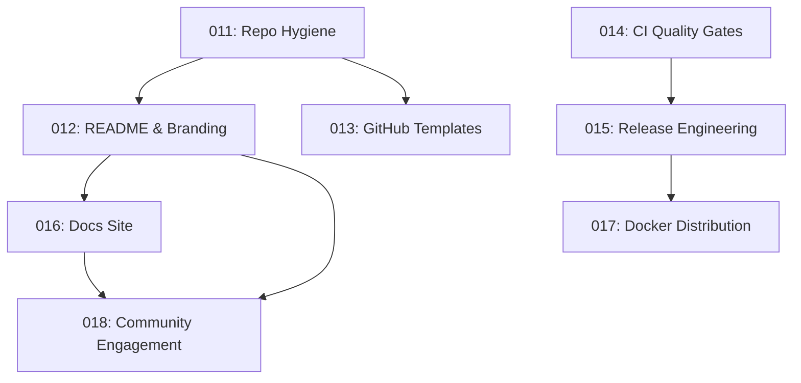

# Community Readiness Roadmap

> Making the Wright GitHub repository popular, professional, and contributor-friendly.

This roadmap breaks the full community readiness audit into **8 discrete features**, each scoped for a single `/speckit-specify` call. Features are ordered by dependency and impact — complete them in sequence or cherry-pick by priority.

## Feature Index

| Seq | Feature ID | Name | Est. Effort | Dependencies |
|-----|-----------|------|-------------|--------------|
| 1 | 011 | [Repo Hygiene & Legal Foundation](community-features/011-repo-hygiene.md) | 2–3 hr | None |
| 2 | 012 | [README Overhaul & Branding](community-features/012-readme-branding.md) | 4–6 hr | 011 |
| 3 | 013 | [GitHub Templates & Issue Automation](community-features/013-github-templates.md) | 2–3 hr | 011 |
| 4 | 014 | [CI/CD Quality Gates](community-features/014-ci-quality-gates.md) | 4–6 hr | None |
| 5 | 015 | [Release Engineering & Versioning](community-features/015-release-engineering.md) | 3–4 hr | 014 |
| 6 | 016 | [Documentation Site](community-features/016-docs-site.md) | 6–8 hr | 012 |
| 7 | 017 | [Docker Distribution Polish](community-features/017-docker-distribution.md) | 3–4 hr | 015 |
| 8 | 018 | [Community Engagement Infrastructure](community-features/018-community-engagement.md) | 4–6 hr | 012, 016 |

## Dependency Graph



## How to Use

For each feature, run:

```
/speckit-specify <paste the feature brief content>
```

Each document below is written as a **self-contained natural language feature description** — the exact input format that `/speckit-specify` expects. The speckit workflow will then:

1. Create the spec directory (e.g., `specs/011-repo-hygiene/`)
2. Generate the full `spec.md` with user stories, requirements, and success criteria
3. Optionally run `/speckit-plan` → `/speckit-tasks` → `/speckit-implement`

## Scoping Principles

Each feature was scoped to satisfy these constraints:

- **Single coherent deliverable** — one theme, one PR
- **Independently testable** — can be verified without other features
- **Right-sized for speckit** — produces 3–8 user stories (not 15+)
- **Clear boundaries** — no overlap between features
- **Ordered by impact** — highest-value, lowest-effort features first
