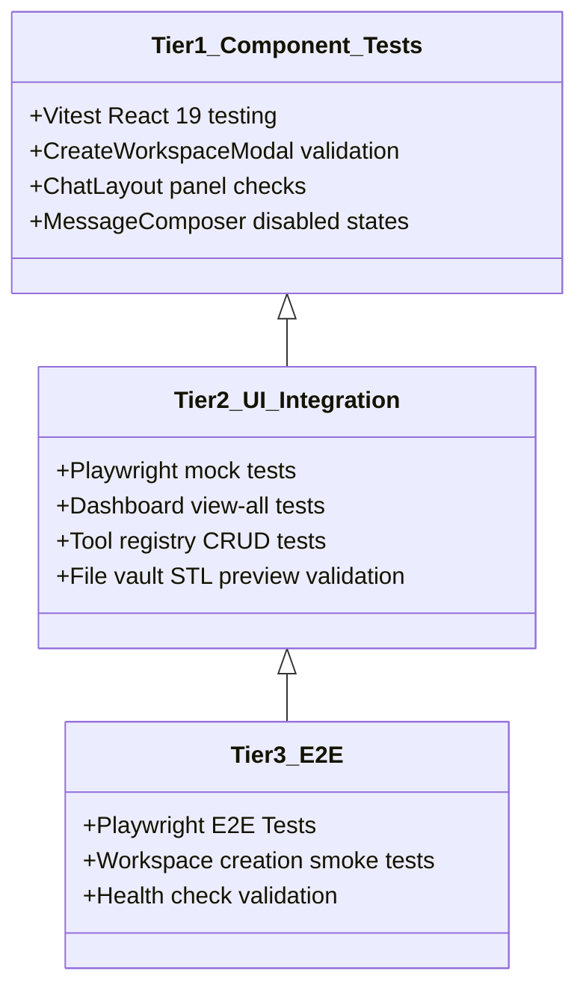

# Testing Guidelines

Wright utilizes a rigorous, three-tier testing pyramid to guarantee 100% reliability in fully offline environments. All verification processes run locally without external service requirements.

---

## 1. The Three-Tier Testing Pyramid



---

## 2. Test Execution Details

### Tier 1: Component Validation (Vitest)
Tests individual React components in isolation. Verifies layout rendering, event handlers, and loading indicators under mocked API conditions.
*   **Command**: `npm run test --workspace=apps/web`

### Tier 2: UI Integration (Playwright Mocked)
Validates complete page-level workflows (e.g., tool installation tabs, Git commits, file browser navigation) against a fully mocked backend API.
*   **Command**: `npx playwright test`

### Tier 3: E2E System Tests (Pytest & Playwright Live)
Executes happy-path end-to-end smoke tests against a live local server, validating SQLite database migrations, SSE websocket streams, and geometry creation.
*   **Command**: `pytest` or `make docker-test-e2e`

---

## 3. Running All Quality Gates

To run lint check, typecheck, pytest, and vitest suites sequentially on your host before committing:

```bash
make check
```
