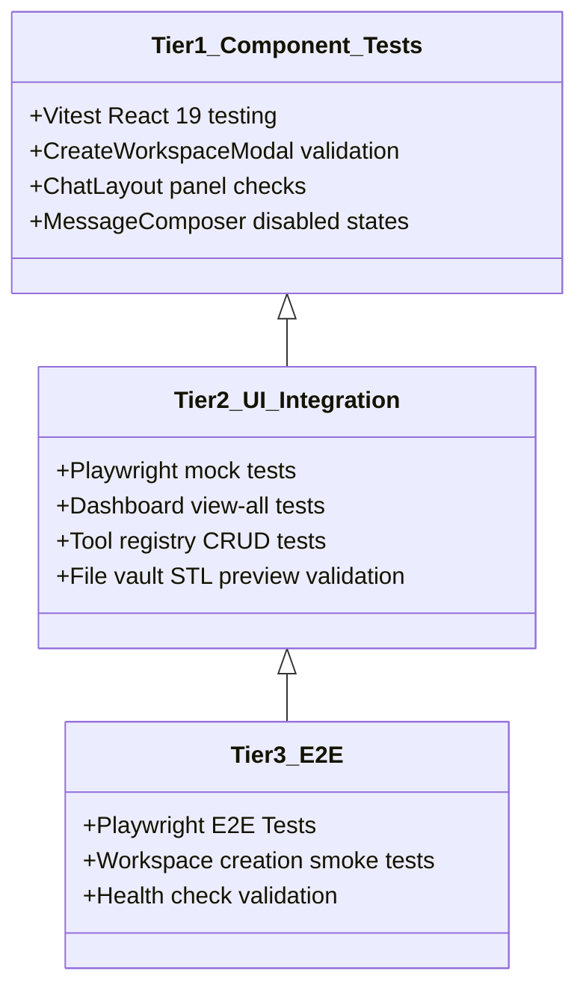

# Testing Guidelines

Wright utilizes a rigorous, three-tier testing pyramid to guarantee 100% reliability in fully offline environments. All verification processes run locally without external service requirements.

---

## 1. The Three-Tier Testing Pyramid



---

## 2. Test Execution Details

### Tier 1: Component Validation (Vitest)
Tests individual React components in isolation. Verifies layout rendering, event handlers, and loading indicators under mocked API conditions.
*   **Command**: `npm run test --workspace=apps/web`

### Tier 2: UI Integration (Playwright Mocked)
Validates complete page-level workflows (e.g., tool installation tabs, Git commits, file browser navigation) against a fully mocked backend API.
*   **Command**: `npx playwright test`

### Tier 3: E2E System Tests (Pytest & Playwright Live)
Executes happy-path end-to-end smoke tests against a live local server, validating SQLite database migrations, SSE websocket streams, and geometry creation.
*   **Command**: `pytest` or `make docker-test-e2e`

---

## 3. Running All Quality Gates

To run lint check, typecheck, pytest, and vitest suites sequentially on your host before committing:

```bash
make check
```

---

## 4. Public Alpha Release Gate

Before tagging or publishing an alpha image, run the strongest practical local
gate for the slice being released:

```bash
# Python packages, API routes, and registry logic
uv run pytest

# Frontend component/state tests
npm run test --workspace=apps/web

# Frontend production build
npm run build --workspace=apps/web

# Documentation site build and link validation
uv run --with mkdocs-material mkdocs build --strict

# Public-alpha leak scan
python scripts/check-public-alpha-leaks.py --include-untracked

# Mocked Playwright UI workflows when browser dependencies are available
npx playwright test

# Docker appliance smoke path
docker compose -f docker-compose.minimal.yml up -d --build
curl http://localhost:8080/api/health
curl http://localhost:8080/api/agent/health
docker compose -f docker-compose.minimal.yml down
```

For engineering MCP catalog validation, follow the clean-container workflow in
[`docs/mcp-catalog/mcp-server-testing-process.md`](../mcp-catalog/mcp-server-testing-process.md).
Do not add MCP-specific host software to the base Docker image just to make a
catalog entry pass.
