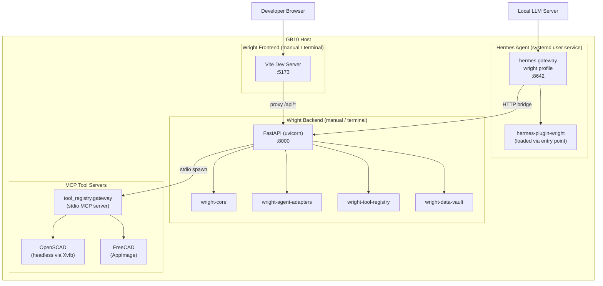
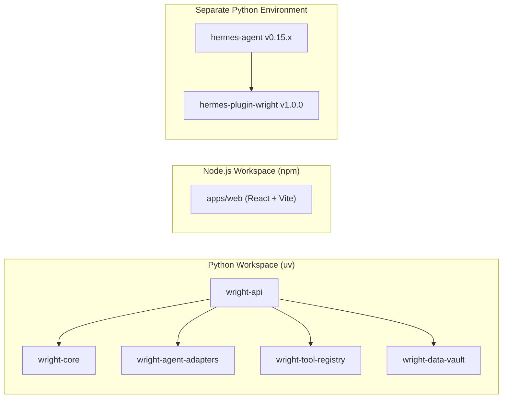
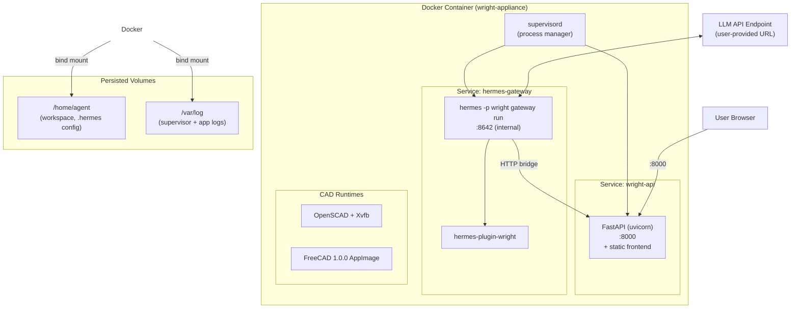
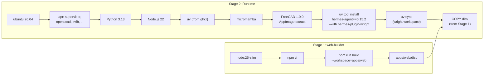
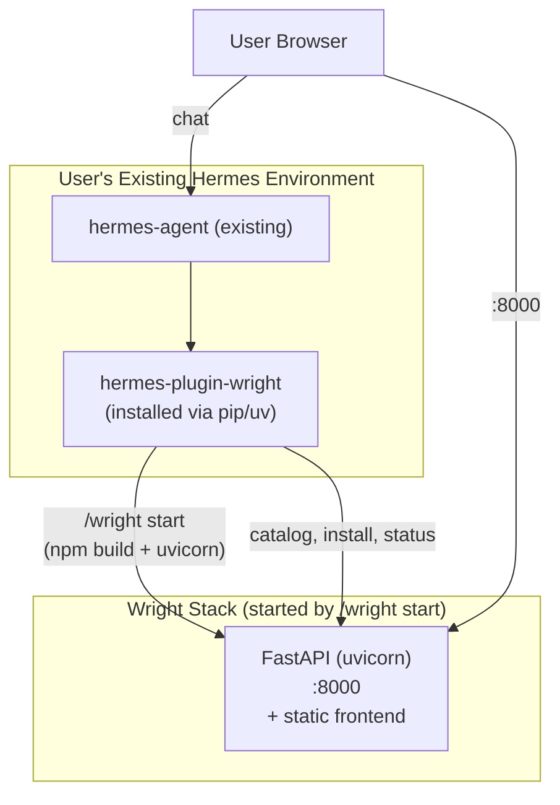
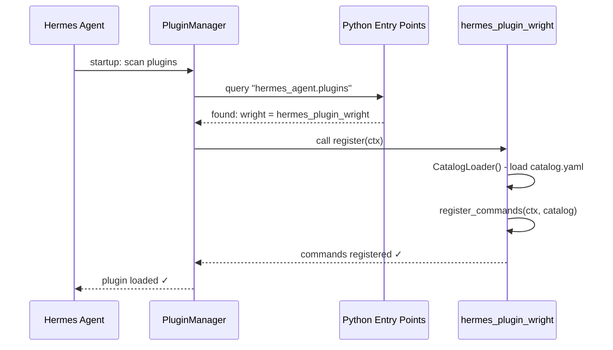
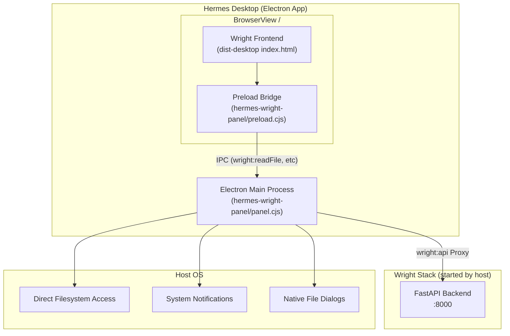
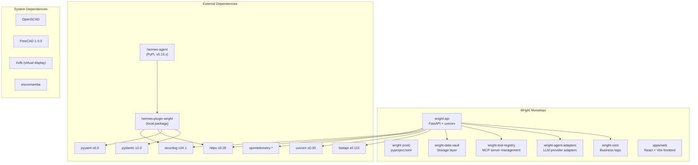

# Wright Deployment Configurations

> A complete guide to the three ways Wright can be deployed, their architectures, dependencies, and upgrade paths.

---

## Overview

Wright has four deployment configurations, each targeting a different user profile:

| Configuration | Target Audience | Host | Managed By |
|:---|:---|:---|:---|
| **Development** | Core developers | Bare-metal GB10 | Manual / systemd user services |
| **Docker Appliance** | New / simple users | Any Docker host | supervisord inside container |
| **Plugin Install** | Existing Hermes users | Any Hermes host | `uv tool install --with` or `pip install` |
| **Embedded Desktop** | Hermes Desktop users | Electron Desktop shell | `hermes-wright-panel` container / preload |

---

## 1. Development Configuration (Direct on GB10)

This is how the core team runs Wright during active development. All services run directly on the host machine, orchestrated by a mix of systemd user services and manual processes.

### Architecture Diagram



### Component Details

| Component | Version | Port | How It's Started |
|:---|:---|:---|:---|
| Hermes Agent | v0.15.x | 8642 (gateway API) | `systemctl --user start hermes-gateway-wright` |
| Wright FastAPI | 0.1.0 | 8000 | `uv run uvicorn api.main:app --host 0.0.0.0 --port 8000` |
| Vite Dev Server | 8.x | 5173 | `npm run dev --workspace=apps/web -- --host` |
| Python | 3.13.x | — | System / uv managed |
| Node.js | 22.x | — | System install |
| uv | 0.9.x | — | System install |
| OpenSCAD | system pkg | — | Spawned on-demand by tool_registry |
| FreeCAD | 1.0.0 AppImage | — | Spawned on-demand by tool_registry |

### Hermes Profile System

Wright uses Hermes **profiles** to isolate its configuration from other Hermes instances:

```
~/.hermes/
├── config.yaml                    # Global Hermes config
└── profiles/
    └── wright/
        ├── config.yaml            # Wright-specific overrides
        ├── SOUL.md                # Agent persona / instructions
        ├── sessions/              # Chat session storage
        └── skills/                # Installed skills
```

Key settings in the wright profile (`~/.hermes/profiles/wright/config.yaml`):

```yaml
API_SERVER_ENABLED: true
API_SERVER_KEY: wright-dev-key
API_SERVER_PORT: 8642
model:
  base_url: http://your-llm-host:8000/v1
  default: your-model-name
  provider: custom
mcp_servers:
  wrightgateway:
    command: uv
    args: [run, --project, /path/to/wright, python, -m, tool_registry.gateway]
```

### Dependencies



### Startup Sequence (Development)

```bash
# 1. Start the Hermes gateway for the wright profile
systemctl --user start hermes-gateway-wright

# 2. Start the FastAPI backend
cd ~/repos/wright
uv run uvicorn api.main:app --host 0.0.0.0 --port 8000

# 3. Start the Vite frontend dev server
npm run dev --workspace=apps/web -- --host

# Verify:
curl http://127.0.0.1:8000/api/health   # API health check
open http://127.0.0.1:5173/              # Frontend UI
```

### Known Issues

> [!WARNING]
> **Discord Token Conflict**: If another Hermes profile (e.g. `default`) is also running a gateway, the Discord bot token will be "already in use." Only one gateway profile should be active at a time.

> [!TIP]
> **Port Contention**: If port 8642 is already bound by another gateway instance, kill the conflicting process first: `pkill -f "hermes.*gateway"` then restart.

---

## 2. Docker Appliance (Simple Users)

For users who don't have Hermes or Wright installed, the Docker image bundles **everything** into a single container. Users just `docker run` and point it at their LLM endpoint.

> [!NOTE]
> **No Vite at runtime.** The frontend is pre-built during the Docker image build (Stage 1) using `npm run build`. At runtime, FastAPI serves the resulting static files directly via its `StaticFiles` mount. There is no Node.js or Vite process running inside the container.

### Architecture Diagram



### What's Inside the Image

The image is built in two stages from [`docker/Dockerfile`](../docker/Dockerfile):

| Layer | Component | Version |
|:---|:---|:---|
| **Base** | Ubuntu | 26.04 |
| **Python** | Python (deadsnakes PPA) | 3.13 |
| **Node** | Node.js (nodesource) | 22.x |
| **Package Manager** | uv (Astral) | latest |
| **Conda** | micromamba | latest |
| **CAD** | OpenSCAD | system package |
| **CAD** | FreeCAD AppImage | 1.0.0 |
| **AI Agent** | hermes-agent (PyPI) | 0.15.2 |
| **Plugin** | hermes-plugin-wright | 1.0.0 (baked in) |
| **Process Mgr** | supervisord | system package |
| **Frontend** | Pre-built static assets | (built in Stage 1, served by FastAPI) |

### Build Process



### How FastAPI Serves the Frontend

In production (Docker and plugin install), FastAPI detects the `dist/` directory and serves it directly. The relevant code in [`apps/api/src/api/main.py`](../apps/api/src/api/main.py):

```python
dist_dir = os.environ.get("FRONTEND_DIST_DIR", "/workspace/apps/web/dist")
if os.path.exists(dist_dir):
    # Mount static assets (js, css, images) under /assets
    app.mount("/assets", StaticFiles(directory=assets_dir), name="static-assets")

    # SPA catch-all: serve index.html for any non-API route
    @app.get("/{full_path:path}")
    async def serve_spa(full_path: str):
        file_path = os.path.realpath(os.path.join(dist_dir, full_path))
        if full_path and os.path.isfile(file_path) and file_path.startswith(real_dist + os.sep):
            return FileResponse(file_path)
        return FileResponse(index_html)
```

This means:
- **API routes** (`/api/*`) are handled by FastAPI routers
- **Static assets** (`/assets/*`) are served directly from the built `dist/assets/` directory
- **All other routes** return `index.html` for client-side SPA routing

### First Boot Sequence

On first container start, the [`docker/entrypoint.sh`](../docker/entrypoint.sh) runs a bootstrap:

1. **Validate** `LLM_API_URL` environment variable
2. **Export** the container manifest (`/container-manifest.md`)
3. **Create** backup directories
4. **Bootstrap Hermes** (first-run only):
   - Creates `~/.hermes/profiles/wright/` directory tree
   - Writes `config.yaml` using `LLM_API_URL`, `LLM_API_KEY`, `LLM_API_MODEL` env vars
   - Enables API server on port 8642
   - Writes `SOUL.md` with Wright agent persona
5. **Start supervisord** → launches `wright-api` and `hermes-gateway` services

### Running the Docker Appliance

```bash
# Build
docker build -t wright-appliance:latest -f docker/Dockerfile .

# Run (minimal)
docker run -d \
  -p 8000:8000 \
  -e LLM_API_URL=http://your-llm-host:8000/v1 \
  --name wright \
  wright-appliance:latest

# Run (with persistent storage + API key)
docker run -d \
  -p 8000:8000 \
  -e LLM_API_URL=http://your-llm-host:8000/v1 \
  -e LLM_API_KEY=your-key \
  -e LLM_API_MODEL=your-model \
  -v wright-home:/home/agent \
  -v wright-logs:/var/log \
  --name wright \
  wright-appliance:latest
```

### Exposed Ports

| Port | Service | Accessible? |
|:---|:---|:---|
| **8000** | Wright API + Frontend | ✅ Exposed (EXPOSE 8000) |
| 8642 | Hermes Gateway API | 🔒 Internal only |

### Filesystem Persistence

| Path | Persists? | Contents |
|:---|:---|:---|
| `/home/agent` | ✅ (with volume) | Workspace, `.hermes/` config, sessions |
| `/var/log` | ✅ (with volume) | Supervisor + app logs |
| `/workspace` | ✅ (built into image) | Wright source code |
| `/tmp`, `/bin`, `/usr/bin` | ❌ Ephemeral | Resets on container restart |

---

## 3. Plugin Install (Existing Hermes Users)

For users who already have Hermes Agent running on their system, they only need to install the Wright plugin package. This registers Wright's commands and MCP catalog into their existing Hermes environment.

> [!NOTE]
> **No Vite at runtime.** When users run `/wright start`, the plugin executes `npm run build` (production build), then starts FastAPI with `FRONTEND_DIST_DIR` pointing at the built assets. FastAPI serves the static files directly — no Vite process runs.

### Architecture Diagram



### Installation Methods

#### Method A: `uv tool install --with` (Recommended)

If Hermes was installed via `uv tool`, inject the plugin into its environment:

```bash
# Add the plugin to the existing hermes-agent tool environment
uv tool install hermes-agent --with hermes-plugin-wright

# Or if installing from a local checkout:
uv tool install hermes-agent --with ./hermes-plugin-wright/
```

#### Method B: `pip install` (editable dev install)

```bash
pip install -e ./hermes-plugin-wright
```

#### Method C: Copy to plugins directory

```bash
cp -r hermes-plugin-wright/ ~/.hermes/plugins/wright
```

### How Plugin Discovery Works

The plugin uses Python's **entry point** mechanism for automatic discovery:



The key entry point is defined in [`hermes-plugin-wright/pyproject.toml`](../hermes-plugin-wright/pyproject.toml):

```toml
[project.entry-points."hermes_agent.plugins"]
wright = "hermes_plugin_wright"
```

When Hermes starts, its `PluginManager` scans for all packages that declare `hermes_agent.plugins` entry points, imports each module, and calls its `register(ctx)` function.

### What `/wright start` Does

The [`hermes-plugin-wright/commands.py`](../hermes-plugin-wright/commands.py) `handle_start()` function:

1. Checks if the API is already running (skips if healthy)
2. Detects the Wright repo path
3. Runs `npm run build` in `apps/web/` (skips if `dist/` is fresh)
4. Starts `uvicorn` with `FRONTEND_DIST_DIR` set to the built `dist/` directory
5. Waits for the health check to pass
6. Opens the browser to `http://localhost:8000`

This is a **production-style** startup — no Vite dev server, no HMR.

### Post-Install Setup

After installing the plugin, users need to:

1. **Clone the Wright repo** (for the backend + frontend source):
   ```bash
   git clone https://github.com/burhop/wright.git
   cd wright
   ```

2. **Start Wright via the plugin's slash command**:
   ```bash
   # Inside Hermes chat:
   /wright start
   ```
   This builds the frontend (production), starts uvicorn, and opens the browser.

3. **Configure LLM endpoint** in their Hermes wright profile:
   ```bash
   hermes -p wright config set model.base_url http://your-llm:8000/v1
   ```

---

## 4. Embedded Desktop Configuration (Hermes Desktop Integration)

For users running Hermes Desktop (Electron app), Wright can be embedded directly as a sidebar panel or separate tab. The UI is built specifically for Electron, using a custom preload script for native IPC capabilities.

### Architecture Diagram



### Component Details

| Component | Version | Port | How It's Started |
|:---|:---|:---|:---|
| Hermes Desktop | v0.15.x | — | Launched by user (Electron App) |
| Wright Panel Manager | `hermes-wright-panel` | — | Loaded by Electron as a BrowserView panel |
| Wright FastAPI | 0.1.0 | 8000 | Started by plugin / supervisor |
| Electron Shell | 32.x / 33.x | — | Managed by Hermes Desktop |

### Native Electron Integration

Unlike standard browser-based deployments, the Embedded Desktop configuration enables several native features:
1. **Direct Filesystem Access**: Reading and writing workspace files bypasses HTTP. It uses direct Node.js `fs` calls proxied through IPC.
2. **Native File Dialogs**: File selection triggers the OS-native file dialog (via Electron's `dialog.showOpenDialog`) instead of a browser upload input.
3. **OS Notifications**: Emits native desktop notifications on long-running task completions.
4. **Theme Live-Sync**: Listens to theme changes on the host Hermes Desktop app and automatically updates colors and layout spacing (including a 34px titlebar padding offset).

### Build Process for Desktop

To run in Electron, the React frontend must be compiled with relative asset paths to support the `file://` protocol.
```bash
npm run build:desktop
```
This produces `apps/web/dist-desktop/` containing `index.html` with relative asset links (e.g. `./assets/...`).

---

## Comparison Matrix

| Feature | Development | Docker Appliance | Plugin Install | Embedded Desktop |
|:---|:---|:---|:---|:---|
| **Target user** | Core devs | New users | Hermes power users | Desktop app users |
| **Hermes version** | v0.15.x (local) | v0.15.2 (pinned in image) | User's existing version | User's desktop app version |
| **Python** | 3.13.x | 3.13 | User's existing | Host system Python |
| **Node.js** | 22.x | 22.x | User's existing | Managed by Electron |
| **Frontend** | Vite dev server (`:5173`, HMR) | Pre-built static → **FastAPI serves** | `npm run build` → **FastAPI serves** | Embedded panel (`file://` or dev server) |
| **Process manager** | systemd + manual | supervisord | Manual | Managed by Electron/Host |
| **OpenSCAD** | System install | Bundled in image | User installs separately | User installs separately |
| **FreeCAD** | AppImage on host | AppImage in image | User installs separately | User installs separately |
| **CAD tools included?** | ✅ Pre-installed | ✅ Bundled | ❌ Install separately | ❌ Install separately |
| **Hot reload?** | ✅ Yes | ❌ No | ❌ No | Optional (via dev server link) |
| **Wright API port** | 8000 | 8000 | 8000 | 8000 |
| **Hermes gateway port** | 8642 | 8642 (internal) | User's config | User's config / Internal |
| **Frontend port** | 5173 (Vite proxy → API) | 8000 (FastAPI `StaticFiles`) | 8000 (FastAPI `StaticFiles`) | N/A (`file://` protocol) |
| **Vite at runtime?** | ✅ Yes (dev server) | ❌ No (build-time only) | ❌ No (build-time only) | ❌ No (uses static `dist-desktop/`) |

---

## Upgrade Procedures

### Development Environment

```bash
cd ~/repos/wright

# 1. Pull latest source
git pull origin main

# 2. Sync Python dependencies
uv sync --all-packages

# 3. Update Node dependencies
npm ci

# 4. Restart services
systemctl --user restart hermes-gateway-wright
# Restart API and Vite manually (or kill + re-run)
```

### Docker Appliance

```bash
# 1. Pull or rebuild the image
docker build -t wright-appliance:latest -f docker/Dockerfile .
# — or —
docker pull ghcr.io/burhop/wright:latest

# 2. Stop and remove old container (data persists in volumes)
docker stop wright && docker rm wright

# 3. Start new container with same volumes
docker run -d \
  -p 8000:8000 \
  -e LLM_API_URL=http://your-llm:8000/v1 \
  -v wright-home:/home/agent \
  -v wright-logs:/var/log \
  --name wright \
  wright-appliance:latest
```

> [!IMPORTANT]
> The Hermes config at `/home/agent/.hermes/` persists across upgrades when using a Docker volume. The entrypoint script will update `base_url` if `LLM_API_URL` changes, but **will not re-bootstrap** if the directory already exists.

### Plugin-Only Install

```bash
# Upgrade the plugin package
uv tool install hermes-agent --with hermes-plugin-wright --force-reinstall

# Or from local source:
pip install --upgrade -e ./hermes-plugin-wright

# Restart Hermes to reload plugins
hermes restart
```

---

## Dependency Tree



---

## Troubleshooting

### Common Issues Across All Configurations

| Symptom | Likely Cause | Fix |
|:---|:---|:---|
| Port 8642 already in use | Another Hermes gateway running | `pkill -f "hermes.*gateway"` then restart |
| Port 8000 already in use | Another uvicorn instance running | `pkill -f uvicorn` then restart |
| Plugin not loading | Entry point not discoverable | Verify `pip show hermes-plugin-wright` returns a result |
| `LLM_API_URL` not set | Missing env var in Docker | Pass `-e LLM_API_URL=...` to `docker run` |
| Frontend shows "API Unreachable" | Backend not running on :8000 | Check `curl localhost:8000/api/health` |
| Discord "token already in use" | Multiple gateway profiles active | Stop all gateways, start only `wright` profile |

### Diagnostic Commands

```bash
# Check Hermes version and status
hermes --version
hermes config env-path
grep API_SERVER_PORT "$(hermes config env-path)"

# Check running processes
pgrep -fa hermes
pgrep -fa uvicorn

# Docker: check supervisor status
docker exec wright supervisorctl \
  -c /etc/supervisor/conf.d/wright.conf status

# API health check
curl http://localhost:8000/api/health
```
