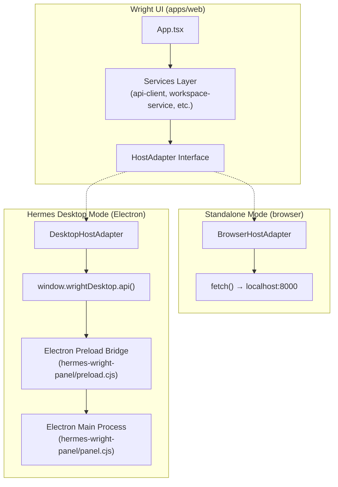
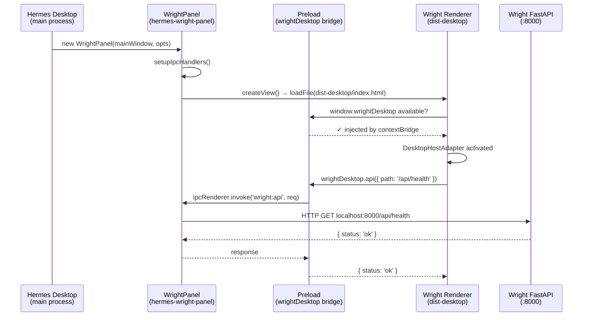

# Dual-Mode Wright UI: Standalone + Hermes Desktop Integration

> Implementation specification for running the Wright web UI both independently and embedded inside Hermes Desktop.

---

## Problem Statement

Wright currently runs as a standalone web application — a Vite/React frontend (`apps/web`) served either by the Vite dev server (`:5173`) or by FastAPI as static files (`:8000`). We need the **same codebase** to also work when loaded as a panel inside the **Hermes Desktop** Electron app, leveraging Electron's native capabilities (filesystem access, terminal, native menus, file dialogs, system notifications) while maintaining full independence for browser-only deployments.

## Design Decisions

| Decision | Choice | Rationale |
|:---|:---|:---|
| **Integration strategy** | Option C: `<webview>` with preload bridge | Clean separation, Wright controls its own build/deploy, full Electron API access |
| **Hermes code changes** | None — do not touch `NousResearch/hermes-agent` | Ship as a standalone integration package that Hermes Desktop can optionally load |
| **Electron capabilities** | All available | Native file dialogs, system notifications, Node.js filesystem, terminal integration |

---

## Background & Research

### How Hermes Desktop Works

The Hermes Desktop app ([apps/desktop](https://github.com/NousResearch/hermes-agent/tree/main/apps/desktop)) is an Electron application:

| Layer | Technology | Role |
|:---|:---|:---|
| **Main Process** | `electron/main.cjs` (~2000 lines) | Manages BrowserWindow, spawns the Hermes backend, handles IPC |
| **Preload Bridge** | `electron/preload.cjs` | Exposes `window.hermesDesktop` API to renderer via `contextBridge` |
| **Renderer** | React 19 + Vite + TailwindCSS v4 | The visible UI — chat, sessions, file browser, settings |
| **Backend** | Python `hermes-agent` gateway | Spawned as child process, communicates via JSON-RPC over WebSocket |

Key integration patterns:
- The renderer detects Electron via `window.hermesDesktop` (injected by preload)
- All backend communication goes through `window.hermesDesktop.api()` (IPC → main process → HTTP)
- File system operations use `hermesDesktop.readFileText()`, `readDir()`, etc.
- The renderer uses `HashRouter` (not `BrowserRouter`) for Electron `file://` compatibility
- Vite config uses `base: './'` for relative asset paths in `file://` context

### How Wright Currently Works

| Layer | Technology | Role |
|:---|:---|:---|
| **Frontend** | React 19 + Vite (`apps/web`) | Standalone SPA with `BrowserRouter` |
| **API Client** | `api-client.ts` | Direct `fetch()` to FastAPI backend |
| **Backend** | FastAPI (`apps/api`) on `:8000` | REST API + serves static `dist/` in production |
| **Agent** | Hermes gateway (`:8642`) | External process, connected via plugin |

The frontend currently uses **direct HTTP `fetch()` calls** to `localhost:8000` via the centralized `apiClient`. This is the main coupling point.

---

## Architecture

### The "Host Adapter" Pattern

Instead of forking the codebase or creating a separate Electron app, we introduce a **Host Adapter** abstraction layer. The Wright UI detects its host environment at startup and binds to the appropriate adapter:



### Runtime Detection

```typescript
// src/services/host-adapter/detect.ts
export function detectHostEnvironment(): 'browser' | 'desktop' {
  if (typeof window !== 'undefined' && 'wrightDesktop' in window) {
    return 'desktop';
  }
  return 'browser';
}
```

### Integration Flow (Hermes Desktop Side)

Since we do **not** modify Hermes code, the integration package (`hermes-wright-panel/`) is designed to be loaded by a downstream integrator (e.g., a custom Hermes Desktop fork, or a future Hermes plugin system). The package exports a `WrightPanel` class that:

1. Creates a `BrowserView` with a custom preload script
2. Loads Wright's `dist-desktop/index.html` (or connects to a running Wright dev server)
3. Handles IPC between the Wright renderer and the Electron main process
4. Proxies Wright API requests to the FastAPI backend



---

## Proposed Changes

### Phase 1: Host Adapter Abstraction Layer

Create the adapter layer that lets Wright's services work in both environments without conditional logic scattered through the codebase.

---

#### [NEW] `apps/web/src/services/host-adapter/host-adapter.ts`

The core interface that all host adapters implement:

```typescript
export interface FileEntry {
  name: string;
  path: string;
  isDirectory: boolean;
  size?: number;
}

export interface SelectOptions {
  title?: string;
  filters?: { name: string; extensions: string[] }[];
  multiple?: boolean;
  directory?: boolean;
}

export interface HostAdapter {
  readonly mode: 'browser' | 'desktop';
  
  // HTTP API proxy
  fetch<T>(method: string, url: string, body?: unknown, options?: RequestInit): Promise<T>;
  
  // File system (desktop: Electron IPC, browser: HTTP to Wright API)
  readFile(path: string): Promise<string>;
  writeFile(path: string, content: string): Promise<void>;
  listDirectory(path: string): Promise<FileEntry[]>;
  selectFiles(options?: SelectOptions): Promise<string[]>;
  
  // Environment
  getApiBaseUrl(): string;
  getWorkspacePath(): string | null;
  
  // Router type (BrowserRouter vs HashRouter for file:// protocol)
  getRouterType(): 'browser' | 'hash';
  
  // Notifications (desktop: native OS, browser: Notification API)
  notify(title: string, body: string): void;
  
  // Terminal (desktop: node-pty via Electron, browser: not available)
  hasTerminal(): boolean;
  
  // Cleanup
  dispose(): void;
}
```

#### [NEW] `apps/web/src/services/host-adapter/browser-adapter.ts`

Implements `HostAdapter` using standard browser APIs — essentially what Wright does today, packaged behind the interface. `fetch()` delegates to the existing `apiClient`. File operations go through the Wright REST API.

#### [NEW] `apps/web/src/services/host-adapter/desktop-adapter.ts`

Implements `HostAdapter` by delegating to `window.wrightDesktop` IPC bridge:
- `fetch()` → `window.wrightDesktop.api()` (IPC to main process, which proxies HTTP)
- `readFile()` → `window.wrightDesktop.readFile()` (direct Node.js fs via main process)
- `listDirectory()` → `window.wrightDesktop.listDirectory()` (direct Node.js fs)
- `selectFiles()` → `window.wrightDesktop.selectFiles()` (native Electron `dialog.showOpenDialog`)
- `notify()` → `window.wrightDesktop.notify()` (native Electron `Notification`)

Falls back gracefully to browser adapter if the bridge is unavailable.

#### [NEW] `apps/web/src/services/host-adapter/detect.ts`

Environment detection: checks for `window.wrightDesktop` to determine mode.

#### [NEW] `apps/web/src/services/host-adapter/index.ts`

Auto-detects the environment and exports a singleton adapter.

---

### Phase 2: Refactor Existing Services to Use Adapter

#### [MODIFY] `apps/web/src/services/api-client.ts`

Replace the direct `fetch()` calls with `hostAdapter.fetch()`. In browser mode this is identical to current behavior. In desktop mode, requests route through Electron IPC.

#### [MODIFY] `apps/web/src/App.tsx`

- Replace `BrowserRouter` with a dynamic router selection based on `hostAdapter.getRouterType()`
- Remove the inline `getApiUrl()` helper (moved to adapter)
- Add desktop-specific chrome detection (titlebar overlay awareness)

```tsx
import { hostAdapter } from './services/host-adapter';
import { HashRouter } from 'react-router-dom';

function App() {
  const Router = hostAdapter.getRouterType() === 'hash' 
    ? HashRouter 
    : BrowserRouter;
  
  return (
    <Router>
      {/* ... existing routes ... */}
    </Router>
  );
}
```

#### [MODIFY] `apps/web/src/services/workspace-service.ts`

For file operations (file list, file preview), use `hostAdapter.listDirectory()` and `hostAdapter.readFile()` in desktop mode — these go through Electron's main process and bypass HTTP entirely.

---

### Phase 3: Vite Build Configuration for Dual Targets

#### [MODIFY] `apps/web/vite.config.ts`

Add a build mode for Electron-compatible output:

```typescript
export default defineConfig(({ command, mode }) => {
  const isDesktop = mode === 'desktop';
  
  return {
    base: isDesktop ? './' : '/',  // Relative paths for file:// protocol
    build: {
      outDir: isDesktop ? 'dist-desktop' : 'dist',
      assetsDir: 'assets',
    },
    define: {
      '__WRIGHT_MODE__': JSON.stringify(isDesktop ? 'desktop' : 'browser'),
    },
  };
});
```

#### [MODIFY] `apps/web/package.json`

New npm script:

```json
{
  "scripts": {
    "build:desktop": "tsc -b && vite build --mode desktop"
  }
}
```

---

### Phase 4: Hermes Desktop Integration Package

> **Constraint**: We do NOT modify `NousResearch/hermes-agent`. This package is designed to be consumed by anyone integrating Wright into an Electron shell.

#### [NEW] `hermes-wright-panel/` (new directory at repo root)

```
hermes-wright-panel/
├── package.json            # npm package metadata
├── preload.cjs             # Electron preload: injects window.wrightDesktop
├── panel.cjs               # Main-process module: creates BrowserView, routes IPC
├── types.d.ts              # TypeScript declarations for window.wrightDesktop
└── README.md               # Integration guide
```

#### `preload.cjs` — Electron Preload Bridge

```javascript
const { contextBridge, ipcRenderer } = require('electron');

contextBridge.exposeInMainWorld('wrightDesktop', {
  // API proxy
  api: (request) => ipcRenderer.invoke('wright:api', request),
  
  // File system
  readFile: (path) => ipcRenderer.invoke('wright:readFile', path),
  writeFile: (path, content) => ipcRenderer.invoke('wright:writeFile', path, content),
  listDirectory: (path) => ipcRenderer.invoke('wright:listDirectory', path),
  selectFiles: (options) => ipcRenderer.invoke('wright:selectFiles', options),
  
  // Terminal
  terminal: {
    start: (options) => ipcRenderer.invoke('wright:terminal:start', options),
    write: (id, data) => ipcRenderer.invoke('wright:terminal:write', id, data),
    resize: (id, size) => ipcRenderer.invoke('wright:terminal:resize', id, size),
    dispose: (id) => ipcRenderer.invoke('wright:terminal:dispose', id),
    onData: (id, callback) => {
      ipcRenderer.on(`wright:terminal:data:${id}`, (_, data) => callback(data));
      return () => ipcRenderer.removeAllListeners(`wright:terminal:data:${id}`);
    },
    onExit: (id, callback) => {
      ipcRenderer.on(`wright:terminal:exit:${id}`, (_, info) => callback(info));
      return () => ipcRenderer.removeAllListeners(`wright:terminal:exit:${id}`);
    },
  },
  
  // Notifications
  notify: (payload) => ipcRenderer.invoke('wright:notify', payload),
  
  // Config
  getConfig: () => ipcRenderer.invoke('wright:getConfig'),
  
  // Theme sync
  onThemeChange: (cb) => {
    ipcRenderer.on('wright:theme-changed', (_, theme) => cb(theme));
    return () => ipcRenderer.removeAllListeners('wright:theme-changed');
  },
});
```

#### `panel.cjs` — Main-Process Panel Manager

Exports a `WrightPanel` class that:
- Creates a `BrowserView` with the custom preload
- Loads Wright's `dist-desktop/index.html` or connects to a dev server
- Registers IPC handlers for all `wright:*` channels
- Proxies API requests to Wright's FastAPI backend via HTTP
- Manages `node-pty` terminal sessions
- Shows native file dialogs via `dialog.showOpenDialog()`
- Sends native notifications via Electron `Notification`

---

### Phase 5: Desktop-Specific UI Enhancements

#### [MODIFY] `apps/web/src/components/layout/AppShell.tsx`

When running in desktop mode:
- Detect and respect the titlebar overlay height (34px, matching Hermes Desktop)
- Add CSS variable `--titlebar-height` for consistent spacing
- Optionally hide/collapse the sidebar if Wright is embedded as a panel

#### [NEW] `apps/web/src/hooks/useDesktopIntegration.ts`

A React hook that provides desktop-specific functionality:
- Listening for theme changes from the Electron host
- Syncing the Wright theme with the Hermes Desktop theme
- Responding to window resize/panel visibility events

---

## File Summary

| Phase | File | Action | Purpose |
|:---|:---|:---|:---|
| 1 | `apps/web/src/services/host-adapter/host-adapter.ts` | NEW | Core adapter interface |
| 1 | `apps/web/src/services/host-adapter/browser-adapter.ts` | NEW | Browser/standalone implementation |
| 1 | `apps/web/src/services/host-adapter/desktop-adapter.ts` | NEW | Electron/desktop implementation |
| 1 | `apps/web/src/services/host-adapter/detect.ts` | NEW | Environment detection |
| 1 | `apps/web/src/services/host-adapter/index.ts` | NEW | Auto-detection + singleton export |
| 2 | `apps/web/src/services/api-client.ts` | MODIFY | Use adapter instead of raw fetch |
| 2 | `apps/web/src/App.tsx` | MODIFY | Dynamic router, remove getApiUrl |
| 2 | `apps/web/src/services/workspace-service.ts` | MODIFY | Use adapter for file ops |
| 3 | `apps/web/vite.config.ts` | MODIFY | Add desktop build mode |
| 3 | `apps/web/package.json` | MODIFY | Add `build:desktop` script |
| 4 | `hermes-wright-panel/package.json` | NEW | Integration package metadata |
| 4 | `hermes-wright-panel/preload.cjs` | NEW | Electron preload bridge |
| 4 | `hermes-wright-panel/panel.cjs` | NEW | Main-process panel manager |
| 4 | `hermes-wright-panel/types.d.ts` | NEW | TypeScript declarations |
| 4 | `hermes-wright-panel/README.md` | NEW | Integration guide |
| 5 | `apps/web/src/components/layout/AppShell.tsx` | MODIFY | Desktop chrome awareness |
| 5 | `apps/web/src/hooks/useDesktopIntegration.ts` | NEW | Desktop integration hook |

---

## Verification Plan

### Automated Tests

```bash
# Existing tests must still pass (browser mode)
npm run test --workspace=apps/web

# New adapter unit tests
npx vitest run src/services/host-adapter/

# Build both targets
npm run build --workspace=apps/web          # Standard browser build
npm run build:desktop --workspace=apps/web  # Desktop build
```

### Manual Verification

1. **Standalone mode**: Run `npm run dev --workspace=apps/web` → confirm existing functionality is unchanged
2. **Production mode**: Build and serve via FastAPI → confirm SPA routing works
3. **Desktop adapter mock**: Create a test page that injects a mock `window.wrightDesktop` object → confirm the adapter switches correctly and IPC calls are routed
4. **Electron integration** (Phase 4): Load `dist-desktop/index.html` in a test Electron shell with the preload script → confirm API calls work through IPC

### Regression Checklist

- [ ] All existing Vitest tests pass
- [ ] All existing Playwright tests pass
- [ ] `getApiUrl()` callers migrated (search for direct fetch usage)
- [ ] `BrowserRouter` works in standalone, `HashRouter` in desktop
- [ ] Production build serves correctly from FastAPI
- [ ] Desktop build loads correctly from `file://` protocol
- [ ] Theme synchronization works in desktop mode
- [ ] Native file dialogs work in desktop mode
- [ ] System notifications work in desktop mode
- [ ] Terminal integration works in desktop mode

---

## Deployment Configurations Update

This feature adds a **fourth deployment configuration** to Wright:

| Configuration | Target Audience | Host | UI Mode |
|:---|:---|:---|:---|
| Development | Core developers | Bare-metal | Standalone browser |
| Docker Appliance | New / simple users | Docker | Standalone browser |
| Plugin Install | Existing Hermes users | Any Hermes host | Standalone browser |
| **Hermes Desktop** | **Desktop app users** | **Electron** | **Embedded panel** |

See [deployment-configurations.md](deployment-configurations.md) for the full deployment matrix.
