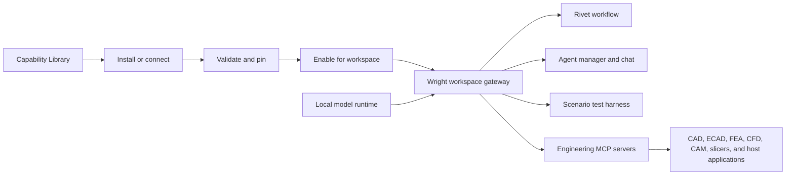
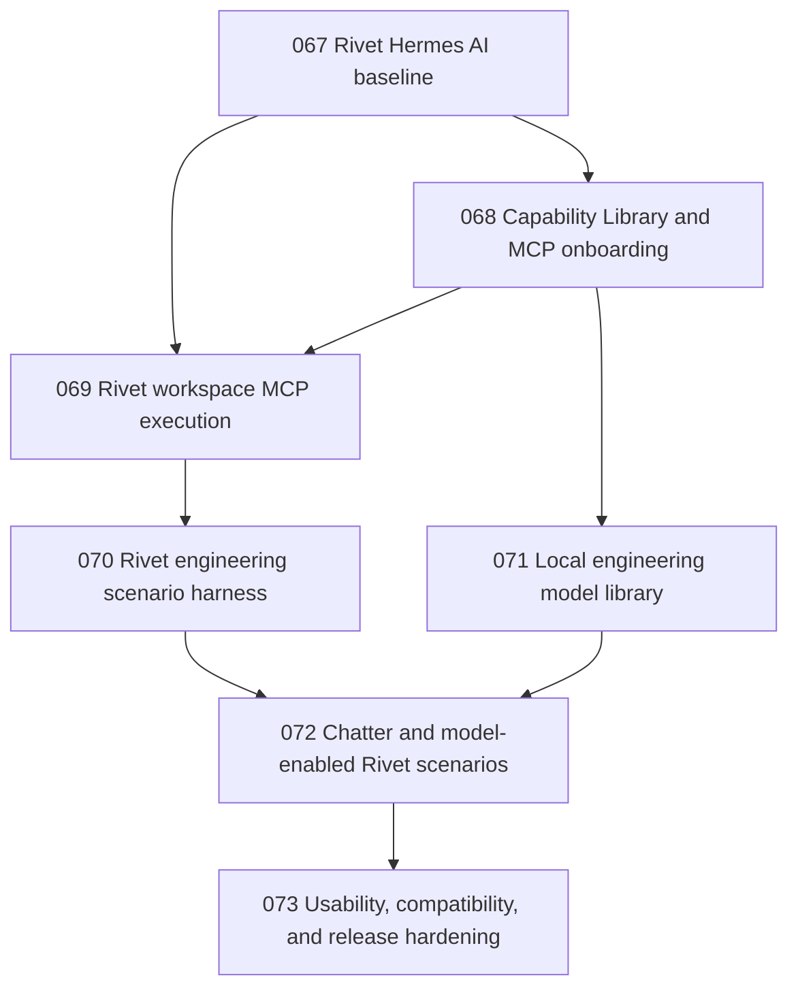

# Engineering Capability Hub and Rivet Validation Program

**Status**: Program reference plan

**Date**: 2026-08-12

**Baseline**: Feature `067-rivet-hermes-ai`
**Purpose**: Provide a stable reference from which Wright can run multiple
independently reviewed Spec Kit feature loops for MCP discovery, Rivet
engineering workflows, and local engineering models.

This is not a replacement for a feature `spec.md`, `plan.md`, or `tasks.md`.
Each delivery loop below must create its own numbered Spec Kit feature and
resolve its own research questions, contracts, constitution checks, migration,
tests, and rollback. This document owns the program boundaries, sequencing,
shared vocabulary, and cross-feature acceptance criteria.

## 1. Program outcome

Wright should let an engineer:

1. Find a trustworthy MCP server or local engineering model that applies to
   the engineer's domain and workstation.
2. Understand its source, maturity, platform requirements, host applications,
   credentials, licenses, hardware needs, data access, and risks before making
   any change.
3. Install or connect it through a guided, reversible flow; validate it; and
   enable it only for selected workspaces.
4. Discover those workspace capabilities while authoring a Rivet workflow.
5. Run the reviewed workflow through Wright's workspace-bound gateway with
   approvals, progress, cancellation, confinement, provenance, and durable
   results.
6. Start from tested multi-domain examples instead of an empty canvas.
7. Reproduce or diagnose a run from exact workflow, server, tool-schema,
   model, input, approval, and artifact identities.

The first representative vertical slices are:

- an official Onshape MCP onboarding journey when its source is publicly
  available;
- a Rivet workflow that invokes enabled workspace MCPs through Wright;
- a deterministic multi-domain bracket or enclosure workflow;
- the Wright CNC Chatter model as the first packaged specialized local model;
- one vetted Hugging Face engineering model that has acceptable licensing,
  packaging, runtime, and test-vector properties.

## 2. Current baseline

The program starts from existing production seams rather than a new parallel
system.

- The built-in engineering MCP catalog contains 42 entries and already models
  verification state, installability, platform support, credentials, risk,
  approval gates, validation evidence, host requirements, and blocked reasons.
- The catalog contains two community Onshape implementations with clean Linux
  protocol validation and explicit credential boundaries. A future official
  Onshape server must be represented as a distinct vendor-authoritative entry;
  it must not silently replace or inherit evidence from a community entry.
- Wright already supports custom server registration, install/update/uninstall,
  credential setup, protocol validation, tool discovery, and per-workspace
  enablement.
- `GatewayService` supplies provider-neutral workspace-bound discovery, tool
  calls, policy, lifecycle, progress, resources, cancellation, and audit.
- SolidEdgeMCP is independently installed and versioned but reached through
  Wright's gateway. The BREP integration has a specialized visible-panel
  lifecycle behind the same gateway-facing call contract.
- Feature 067 supplies the embedded Rivet 2 editor, real Node runner, shared
  revision/review/execution service, durable runs, a Wright-managed Rivet MCP,
  Hermes AI compatibility, and deterministic plus opt-in live tests.
- Rivet validation and the Node runner recognize MCP node types, but the
  runtime currently sends an empty capability grant. External MCP execution
  from Rivet is deliberately the next reviewed boundary.
- Wright can select an existing OpenAI-compatible model endpoint, but it does
  not yet catalog, download, verify, install, load, or invoke specialized local
  engineering model packages.

## 3. Program architecture



### 3.1 Gateway mediation

Rivet must be able to discover and invoke MCP tools. It must not independently
own individual MCP child configuration, long-lived credentials, workspace
authority, or process lifecycle.

The supported execution path is:

```text
Rivet MCP node
  -> short-lived workspace-bound Wright gateway connection
  -> workspace-enabled namespaced tool
  -> Wright policy, approval, lifecycle, and audit
  -> child MCP server
  -> engineering application or service
```

This permits workflows to drive BREP, Solid Edge, Onshape, FreeCAD, KiCad,
CalculiX, OpenFOAM, Python code, CAM systems, slicers, and later approved
machine integrations. It prevents a workflow from bypassing the controls used
by chat and other Wright clients.

### 3.2 Model separation

The program must keep two model classes distinct:

- **Conversational and tool-use LLMs** remain behind the existing
  provider-neutral agent adapter and OpenAI-compatible endpoint configuration.
- **Specialized engineering models** use typed task contracts and Wright-owned
  runtime adapters. Examples include chatter prediction, point-cloud or mesh
  classification, geometry embeddings, segmentation, surrogate solvers, and
  design-quality estimators. These capabilities are projected through the
  Wright gateway so Rivet and agent managers use the same policy boundary.

Downloading a model does not implicitly execute its repository code. A model
package must have an approved runtime adapter, artifact integrity, license
status, test vector, and explicit `trust_remote_code` policy before it can be
loaded.

### 3.3 Portable authoring and reproducible execution

Workflow templates should express required capabilities where practical, such
as `cad.create_parametric_part` or `fea.solve_static`, rather than assume one
server forever. Before review and execution, Wright resolves each requirement
to a concrete workspace-enabled server/tool and records the exact binding.

Workflows may also deliberately pin a named implementation when provider
semantics are important. A run must never silently switch a pinned server,
tool schema, model revision, units policy, or material mapping.

## 4. Shared domain vocabulary

Individual Spec Kit loops may refine these entities but should not invent
conflicting meanings.

### CapabilityDefinition

Describes a discoverable MCP server, MCP tool, specialized model, runtime, or
workflow template. It has stable identity, source, domains, capabilities,
compatibility, maturity, risk, and evidence.

### CatalogSnapshot

An immutable version of catalog metadata from the bundled Wright release or an
approved update channel. It records source, signature/integrity, timestamp,
schema version, and rollback identity.

### InstallPlan

A preview of the exact changes required to install or connect a capability:
commands or artifacts, versions/digests, download size, storage location,
network access, host prerequisites, credentials, license actions, and rollback.

### CapabilityInstallation

The local installed or connected state, including resolved versions, integrity,
health, validation evidence, update availability, and references from
workspaces or workflows.

### WorkspaceGrant

An explicit grant making selected installed capabilities available to one
workspace. It contains no secret values and does not itself approve every
destructive call.

### CapabilityBinding

The reviewed resolution from a workflow node's requested capability to an
exact server/tool or model/runtime, including schema or interface digest.

### WorkflowRevision

The immutable workflow identity already established by Feature 067: workflow
ID, revision, content digest, selected graph, review state, and capability
requirements.

### RunManifest

The durable, bounded record of the workflow revision, concrete capability
bindings, tool/model versions, schema digests, unit and material assumptions,
inputs, approvals, trace identity, outputs, artifacts, and terminal result.

### ModelPackage

A pinned model artifact plus manifest: source revision, task, input/output
schema, format, variant, checksums, size, license, attribution, runtime adapter,
hardware envelope, test vectors, and remote-code policy.

### ScenarioManifest

A testable engineering example with required capabilities, fixtures, workflow,
parameters, approvals, expected artifacts, engineering invariants, supported
providers, failure injections, platform tier, and time/resource budget.

### ValidationEvidence

Immutable evidence explaining what was checked, on which platform and
architecture, against what version/digest, with what outcome and limitations.

## 5. Product and UI plan

The UI should separate discovery from workspace use and workflow execution.

### 5.1 Capability Library

The Library is the global place to discover MCP servers, models, and reviewed
workflow templates. It should provide:

- domain, lifecycle-stage, platform, maturity, risk, locality, host-software,
  and installed-state filters;
- search across name, vendor, capability, application, task, and requirement;
- explicit Official, Verified Community, Experimental, Blocked, and Failed
  evidence states;
- current-machine compatibility and the reason for every incompatible or
  uncertain status;
- detail pages with source, license, data touched, required credentials,
  approvals, dependencies, versions, validation history, example workflows,
  and alternatives;
- catalog refresh history and rollback when an update channel is enabled;
- a structured missing-capability report instead of browser prompts.

### 5.2 Guided MCP onboarding

The Add MCP flow should offer:

1. Install from the Wright catalog.
2. Paste a standard MCP client configuration copied from vendor documentation.
3. Connect a remote Streamable HTTP/SSE endpoint.
4. Register a local command or development server.
5. Report a server that is not yet installable.

Before installation, Wright shows an InstallPlan. After installation, the flow
collects credentials through the existing secret boundary, performs MCP
initialize and discovery, runs a read-only health probe when possible, and
then offers workspace enablement.

Host-application bridges have an additional sequence: detect application,
verify supported version, install or verify add-on, confirm local handshake,
then run a read-only probe. Wright does not install proprietary applications.

### 5.3 Model Library

Model detail should show:

- engineering task and representative input/output;
- model source, revision, authorship, license, citations, and intended-use
  limitations;
- available formats or quantizations;
- download size, installed size, RAM, VRAM, accelerator, and platform needs;
- whether network access or repository code is required;
- compatible Wright runtimes and Rivet scenario templates;
- a standard test-vector result before workspace enablement.

Installation should support resumable downloads, pinned revisions, checksum
verification, atomic activation, offline import/export, reference-aware
uninstall, and clear storage management.

### 5.4 Workspace Capabilities

The workspace view answers:

- Which servers and models can this workspace use?
- Which are healthy, unavailable, updating, or blocked?
- Which workflow revisions depend on them?
- What data or applications can they affect?
- Which grants or credentials are missing?

Enabling a capability is distinct from approving a destructive invocation.

### 5.5 Rivet authoring

Rivet should receive a workspace-scoped capability palette. For MCPs it should
support discovery, prompt retrieval when useful, typed tool selection, argument
mapping, connection refresh, and clear unavailable-schema states. The editor
should show:

- requested capability and resolved implementation;
- server/tool/model version and health;
- unit and artifact contracts;
- approval requirements;
- dry-run or simulation availability;
- validation errors before review;
- run progress, outputs, artifacts, and provenance.

The AI graph builder may use the same workspace capability snapshot to create
nodes. Adding a node does not authorize or execute its engineering side effect.

## 6. Catalog and supply-chain policy

### 6.1 Evidence classes

At minimum, preserve distinctions among:

- official production;
- official preview;
- verified community;
- community candidate;
- user-reported/source-needed;
- API or wrapper candidate, not yet an MCP;
- documentation-only MCP;
- blocked by validation;
- excluded or stale.

Official status requires a vendor-authoritative source. Package popularity,
repository naming, or a vendor logo is insufficient.

### 6.2 Catalog delivery

Research and contract a delivery model with these properties:

- a complete bundled snapshot for offline operation;
- an optional authenticated and integrity-checked update channel;
- schema validation before activation;
- atomic activation and rollback to the previous snapshot;
- provenance for every entry and changed field;
- no automatic installation or enablement caused by catalog refresh;
- retention of local custom entries and user disablement;
- explicit alias/deduplication rules.

The Onshape official release is the first acceptance case. Wright should be
able to publish a distinct official entry promptly, show how it differs from
the two existing community alternatives, and validate it without a code patch.

### 6.3 Installation backends

Research and separately contract supported plans for:

- isolated Python/`uv` packages;
- isolated Node/npm packages;
- digest-pinned containers;
- remote MCP endpoints;
- host-application add-ons and bridges;
- locally developed commands.

Do not add MCP-specific host software to Wright's base image to make catalog
validation pass. Use the clean-container process in
`docs/mcp-catalog/mcp-server-testing-process.md`.

### 6.4 Model supply chain

Model installation must pin immutable source revisions and verify retrieved
files. Prefer non-executable model formats when technically suitable. Loading
pickle-like artifacts, custom Python modules, native extensions, or remote
repository code requires a separately reviewed runtime policy and isolation.

License acceptance, redistribution permission, gated-repository access, and
attribution are product state, not prose hidden in logs.

## 7. Rivet MCP execution contract

The detailed contract belongs to its own Spec Kit loop, but it must preserve
these program requirements.

### Discovery

- Expose only tools from installed, healthy, workspace-enabled servers.
- Namespace tools stably and retain the authoritative upstream schema.
- Include server/tool identity, schema digest, annotations, maturity, risk, and
  availability in the capability snapshot.
- Refresh safely on workspace enablement or MCP `tools/list_changed` events.

### Authoring

- Support Rivet's native MCP discovery/tool nodes if they can honor Wright's
  gateway and security requirements; otherwise provide a minimal Wright-owned
  Rivet node/provider adapter.
- Permit graph validation without starting proprietary applications where a
  cached, version-matched schema is sufficient.
- Mark stale or unresolved bindings before workflow approval.

### Review

- Bind required capabilities to exact implementations and schema digests.
- Present data egress, code execution, application mutation, machine control,
  and credential implications.
- Invalidate approval when workflow bytes or security-relevant bindings change.

### Execution

- Give the runner only a short-lived, run-bound gateway address/token or an
  equivalently confined bridge contract.
- Grant `mcp` only for a reviewed run that declares MCP requirements.
- Let Wright lazily start enabled child servers and specialized application
  lifecycles.
- Apply existing gateway policy and per-call approval.
- Preserve progress, cancellation, output bounds, secret redaction, and process
  cleanup.
- Revoke run authority at terminal completion, cancellation, or timeout.

### Reproducibility

- Persist concrete server/tool/version/schema bindings in the RunManifest.
- Fail clearly when a pinned implementation is missing or incompatible.
- Never silently substitute a server or model during an approved run.

## 8. Engineering scenario suite

### 8.1 Test tiers

| Tier | Purpose | Network/host expectations |
|---|---|---|
| T0 static | Schema, workflow, manifest, policy, and catalog linting | No processes or network |
| T1 deterministic | Fake MCP/model contracts, Rivet execution, approvals, cancellation, and artifacts | Local controlled processes only |
| T2 clean integration | Selected real open-source MCP installs and protocol/backend probes | Bounded network during setup; isolated environment |
| T3 platform/application | Licensed desktop apps, GPU runtimes, vendor clouds, and platform-specific bridges | Explicit opt-in/self-hosted runners |
| T4 hardware | Printers, CNC, robots, PLCs, heaters, spindles, or other physical actuation | Manual gate, simulation first, hardware interlocks |

Normal merge gates must not require cloud credentials, paid services,
proprietary applications, GPUs, or physical hardware. Their absence must not
weaken deterministic contract coverage.

### 8.2 Scenario manifest minimum fields

```yaml
id: printable-structural-bracket
version: 1
engineering_goal: Create and verify a printable loaded bracket.
required_capabilities: []
optional_capabilities: []
workflow_fixture: ""
workspace_fixture: ""
inputs: {}
unit_system: mm-N-s
materials: []
approval_profile: []
expected_artifacts: []
engineering_invariants: []
failure_injections: []
supported_bindings: []
test_tier: T1
time_budget_seconds: 0
resource_budget: {}
cleanup_contract: ""
```

Byte equality is appropriate for canonical JSON or normalized text, but often
not for CAD, mesh, solver, image, or G-code outputs. Scenario assertions should
prefer normalized engineering invariants: dimensions, topology, watertightness,
mass/volume ranges, clearances, element quality, convergence, stress bounds,
temperature/flow ranges, toolpath envelopes, printer bounds, and unit
consistency.

### 8.3 Initial scenario backlog

| Scenario | Domains | Intended chain | Earliest tier |
|---|---|---|---|
| Parametric bracket | CAD, Python, FEA, slicing | Create geometry, calculate loads, solve, revise, export, slice | T1 |
| PCB enclosure | ECAD, CAD, Python, thermal, slicing | Read board envelope, create enclosure, check clearances, evaluate heat, slice | T1/T2 |
| Flow duct or heat sink | CAD/Grasshopper, meshing, CFD, Python | Generate geometry, mesh, solve, post-process, revise | T1/T2 |
| Chatter-aware CNC fixture | CAD, Chatter model, CAM | Create fixture, assess cutting parameters, generate/simulate toolpath | T1/T3 |
| Robot gripper | CAD, FEA, Python, ROS data, printing | Size gripper, verify stress, analyze motion data, prepare prototype | T1/T2 |
| Cloud CAD design review | Onshape, Python, documentation | Inspect/create cloud part, calculate properties, generate grounded review | T2/T3 |

Machine motion, spindle start, heater control, print start, PLC write, or robot
actuation is excluded from initial scenarios. Those require a later T4 feature
with explicit interlocks.

### 8.4 Failure matrix

Every representative scenario should cover relevant failures:

- server not installed, disabled, unhealthy, or wrong platform;
- application not running or add-on not connected;
- missing or expired credentials;
- tool removed or schema changed after workflow review;
- workspace rebind or output path escape;
- units or coordinate-system mismatch;
- partial artifact followed by server failure;
- approval denied or timed out;
- workflow cancellation during a long tool call;
- child crash, gateway restart, or progress loss;
- model missing, corrupt, incompatible, unloaded, or out of memory;
- non-convergent solver or invalid geometry;
- insufficient disk space during model download or artifact creation.

## 9. Local model program

### 9.1 First vertical slice: CNC Chatter

The Chatter loop should establish the model system end to end:

- document model ownership, training provenance, license, supported machines
  and processes, input features, output semantics, and limitations;
- select or export a stable artifact format;
- define typed input/output and unit contracts;
- package pinned artifacts and checksums outside the application source tree;
- implement an isolated runtime adapter;
- provide positive, negative, boundary, malformed, and version-compatibility
  test vectors;
- expose a typed gateway capability with confidence/uncertainty;
- add a Rivet node binding and simulation-only CNC scenario;
- record model revision and runtime identity in the RunManifest.

### 9.2 Hugging Face evaluation

Research candidates by engineering utility rather than download count. Record:

- task and measurable user value;
- source and immutable revision;
- artifact format and whether repository code is required;
- license, gated access, redistribution, attribution, and acceptable-use terms;
- size, platform, framework, RAM/VRAM, accelerator, and dependency envelope;
- test data and evaluation metrics;
- input/output compatibility with Wright artifacts;
- security review and isolation needs;
- maintenance evidence and alternatives.

Select one low-risk, well-documented candidate for the first external model
slice. Do not couple the model library architecture to that candidate.

### 9.3 Runtime adapters

Research a small provider-neutral interface supporting at least:

- health and compatibility probe;
- install/verify/load/unload;
- typed inference with timeout and cancellation;
- progress and resource reporting;
- deterministic test-vector execution;
- bounded outputs and artifact references;
- structured, redacted diagnostics;
- concurrency and memory admission;
- exact runtime/model identity.

Initial support may use one or two carefully selected runtimes. Supporting
every PyTorch, ONNX, TensorRT, llama.cpp, Ollama, vLLM, or custom Python model
in the first feature is explicitly out of scope.

## 10. Spec Kit delivery loops

Feature numbers and names are proposed and should be allocated by the normal
sequential branch script when each loop begins.



### Loop 068: Capability Library and MCP onboarding

**User outcome**: An engineer can find an applicable MCP, understand whether it
will work, install or connect it through a guided flow, validate it, and enable
it for a workspace.

**Research obligations**:

- authoritative MCP discovery sources and update cadence;
- signed/integrity-checked catalog snapshot delivery and rollback;
- import compatibility for common MCP configuration forms;
- installer backend contracts and isolation;
- official/community/evidence taxonomy;
- current-machine compatibility probes;
- user journey and information architecture testing;
- official Onshape release evidence when available.

**Expected contracts**:

- CatalogSnapshot/update contract;
- InstallPlan and installer lifecycle;
- configuration import grammar and error model;
- validation evidence and state transitions;
- UI page/journey contract;
- migration and rollback for existing catalog/custom entries.

**Exit criteria**:

- bundled catalog remains fully usable offline;
- an approved catalog update can add a distinct official server without code
  changes or losing user state;
- supported entries show an exact preflight before installation;
- one verified local package, one remote endpoint, and one host bridge complete
  the guided path in deterministic/integration tests;
- unknown, blocked, or failed entries remain visible with actionable reasons;
- credentials never enter catalog or workflow files.

### Loop 069: Rivet workspace MCP execution

**User outcome**: Rivet can discover workspace-enabled tools and execute a
reviewed workflow that calls BREP, Solid Edge, Onshape, or other MCPs through
Wright's gateway.

**Research obligations**:

- exact Rivet 2 MCP provider/node configuration and supported transports;
- native-node versus Wright-node adapter choice;
- short-lived run gateway binding;
- tool-list refresh and schema snapshot behavior;
- capability resolution and pinning;
- approval aggregation without weakening per-call policy;
- progress/cancellation behavior across long MCP calls.

**Expected contracts**:

- runner MCP request/config extension;
- ephemeral gateway authority;
- discovery and namespacing;
- CapabilityBinding and review invalidation;
- progress/cancellation/result projection;
- BREP/Solid Edge specialized lifecycle parity;
- RunManifest extension.

**Exit criteria**:

- normal tests prove Rivet -> Wright gateway -> two fake child MCPs;
- a graph cannot call disabled, cross-workspace, unreviewed, or unbound tools;
- server/schema changes invalidate or block stale approved bindings;
- cancellation reaches the child and revokes run authority;
- optional live tests prove one BREP and one Solid Edge or other available
  application path without making proprietary software a merge prerequisite.

### Loop 070: Rivet engineering scenario harness

**User outcome**: Engineers and maintainers can run a library of meaningful
examples and see whether Wright produced an engineering-valid result.

**Research obligations**:

- scenario manifest and capability vocabulary;
- normalization and invariant checking by artifact type;
- deterministic fake MCP architecture;
- reusable domain fixtures and test data licensing;
- runtime/resource classification;
- reporting and failure-diagnosis UI.

**Expected contracts**:

- ScenarioManifest schema;
- fake engineering MCP protocol fixtures;
- artifact assertion plugins;
- scenario runner/report format;
- tier selection and environment guards;
- cleanup and residue rules.

**Exit criteria**:

- at least three T1 scenarios exercise multiple independent MCPs;
- failures identify the responsible node/capability and violated invariant;
- normal tests have no external credentials or network;
- selected T2 integrations follow clean-container validation;
- results retain exact workflow and capability provenance.

### Loop 071: Local engineering model library

**User outcome**: An engineer can evaluate, download/import, verify, install,
test, enable, update, and remove an engineering model safely.

**Research obligations**:

- content-addressed/pinned model storage and cache reuse;
- model manifest and task taxonomy;
- Hugging Face download, gating, license, and revision behavior;
- safe artifact formats and remote-code policy;
- runtime adapter scope;
- CPU/GPU compatibility and admission;
- resumable download, offline import/export, and uninstall references;
- UI storage/hardware/license journey.

**Expected contracts**:

- ModelPackage manifest;
- model catalog snapshot and variants;
- download/install/verify state machine;
- runtime adapter interface;
- resource admission and health;
- model secret/token handling;
- model capability projection through the gateway.

**Exit criteria**:

- one Wright-owned test model and one approved external model complete the
  lifecycle;
- model files are pinned and verified before activation;
- installation never implicitly executes repository code;
- failed/interrupted downloads do not create ready installations;
- an installed model can pass a standard test vector and operate offline;
- model removal is blocked or explained when referenced by a workspace or
  approved workflow.

### Loop 072: Chatter and model-enabled Rivet scenarios

**User outcome**: Rivet can combine a specialized local model with engineering
MCPs in a reviewed, reproducible workflow.

**Research obligations**:

- Chatter artifact/runtime conversion and inference contract;
- uncertainty presentation and safe parameter recommendations;
- model binding and warm/cold lifecycle in workflows;
- resource contention and cancellation;
- simulated CAM integration and engineering validation.

**Expected contracts**:

- Chatter ModelPackage and test vectors;
- typed chatter capability/tool schema;
- model capability binding in Rivet;
- model progress/resource events;
- model identity in RunManifest;
- chatter-aware CNC scenario invariants.

**Exit criteria**:

- the Chatter model passes pinned deterministic test vectors;
- a T1 Rivet scenario combines CAD/CAM doubles with real local Chatter
  inference;
- recommendations display units, confidence/uncertainty, model limitations,
  and simulation-only status;
- no machine-control authority is introduced;
- cancellation and insufficient-resource failures are bounded and actionable.

### Loop 073: Usability, compatibility, and release hardening

**User outcome**: The complete experience is understandable, recoverable, and
supported across Wright's claimed native and Docker environments.

**Research obligations**:

- observed usability problems from representative engineering journeys;
- Windows, Linux x64/ARM64, and macOS compatibility gaps;
- catalog/model cache upgrade and rollback;
- accessibility and long-running progress behavior;
- support diagnostics that do not disclose proprietary data;
- release artifact and documentation coverage.

**Exit criteria**:

- defined onboarding journeys meet agreed completion/error-recovery goals;
- component, mocked UI integration, and system E2E tiers cover the experience;
- native lifecycle and Docker tests cover catalog/cache persistence;
- upgrade, rollback, uninstall, and offline behavior are documented and tested;
- merge gates include every deterministic failure found during the program.

## 11. Reusable Spec Kit loop form

Complete this form before invoking `/speckit-specify`. Do not copy all program
scope into one feature.

```markdown
# Loop brief: <working feature name>

## User outcome
<One independently valuable result an engineer can complete.>

## Problem and evidence
<Current behavior, affected users, local code/docs evidence, and external
primary-source evidence that will need research.>

## Program objectives served
<Reference the numbered outcomes and invariants in this program plan.>

## Dependencies
<Merged feature branches, contracts, catalog states, host/runtime prerequisites.>

## In scope
- <Required behavior>

## Out of scope
- <Explicitly deferred behavior>

## User journeys
1. Given ... When ... Then ...

## Required decisions and unknowns
- NEEDS CLARIFICATION: <question that materially changes design or scope>

## Required contracts
- <API, manifest, state machine, runner protocol, UI journey, migration>

## Safety and trust boundaries
- <workspace, secrets, network, code execution, cloud egress, application or
  hardware effects>

## Compatibility and offline behavior
- <Windows/Linux/macOS/architecture/container expectations and degraded mode>

## Testing and evidence
- T0:
- T1:
- T2:
- T3/T4 opt-in:
- Engineering invariants:

## Migration, rollback, and retained state
<How existing users and artifacts are preserved.>

## Measurable success criteria
- <Observable, technology-neutral outcome>

## Done when
- <All required artifacts, tests, docs, and gates>
```

## 12. Spec Kit operating procedure

For each loop:

1. Start from an up-to-date `dev` and allocate a new sequential feature branch.
2. Run `/speckit-specify` using one completed loop brief.
3. Run `/speckit-clarify`; encode material answers in `spec.md`.
4. Run `/speckit-plan`. Phase 0 research must resolve every material unknown
   using primary sources and repository evidence. Record each result as
   Decision, Rationale, and Alternatives considered.
5. Review `research.md`, `data-model.md`, contracts, `quickstart.md`, and both
   constitution checks. Stop for human approval.
6. Run `/speckit-checklist` and `/speckit-tasks`.
7. Run `/speckit-analyze` and resolve critical cross-artifact inconsistencies.
8. Stop for human approval before `/speckit-implement`.
9. Implement tests first, preserve package boundaries, and keep API routes thin.
10. Run focused verification and the authoritative
    `scripts/check-dev-merge.sh` before merging to `dev`.
11. Update this program plan only when a cross-loop decision, dependency,
    sequence, or acceptance criterion changes. Do not rewrite completed feature
    artifacts to describe later behavior.

Research may be divided by ecosystem, UX, runtime, security, and engineering
scenario, but one feature owner must consolidate conflicts into explicit plan
decisions before design proceeds.

## 13. Cross-loop decision gates

### Gate A: Catalog trust and UX

Approve the evidence taxonomy, catalog update/rollback mechanism, install-plan
contract, and top-level UI information architecture before broad installer work.

### Gate B: Rivet gateway boundary

Approve Rivet transport/provider choice, short-lived authority, capability
binding, review invalidation, and RunManifest changes before enabling MCP nodes.

### Gate C: Scenario validity

Approve the ScenarioManifest, unit/material conventions, artifact assertions,
and first three examples before accumulating many workflow fixtures.

### Gate D: Model trust and runtime

Approve ModelPackage, license state, storage, remote-code policy, runtime
adapter, and resource admission before offering external model downloads.

### Gate E: Machine effects

No print start, spindle start, motion, heat, robot, PLC, or other physical
actuation enters scope without a later explicit feature and safety review.

## 14. Program success criteria

The program is complete when:

- a newly published official MCP can be added through an approved catalog
  update, validated, installed/connected, and enabled without a Wright code
  release;
- engineers can tell what will and will not work on their machine before
  installation and receive actionable recovery for blocked states;
- Rivet can discover and call multiple workspace-enabled MCPs through Wright,
  including specialized BREP/Solid Edge lifecycle behavior;
- reviewed runs cannot bypass workspace, credential, approval, schema, or
  capability bindings;
- at least four multi-domain scenarios have deterministic T1 coverage and
  engineering-valid artifact assertions;
- the Chatter model and at least one vetted external engineering model support
  pinned, verified, reversible, offline-capable installation and typed
  inference;
- Rivet can combine specialized model inference with MCP tools and preserve
  complete bounded provenance;
- normal tests use no paid credentials, subscriptions, proprietary apps, GPUs,
  or hardware, while opt-in suites provide honest evidence for those systems;
- the complete capability-library, workspace-enablement, workflow-review, run,
  diagnosis, upgrade, rollback, and uninstall journeys meet the repository's
  component, UI integration, and system test requirements.

## 15. First-loop kickoff brief

The next recommended action after Feature 067 merges is to complete the Loop
068 form with this outcome:

> Create an engineering Capability Library that preserves Wright's existing
> catalog and install state while adding evidence-backed catalog updates,
> current-machine compatibility, guided MCP configuration import and install
> preflight, structured missing-server reporting, validation, and workspace
> enablement. Use a future official Onshape MCP as the acceptance case, keep a
> complete offline bundled snapshot, preserve local custom entries and user
> disablement, and do not install or enable anything merely because catalog
> metadata changed.

That loop should settle the shared catalog trust model and user-facing
information architecture before Rivet MCP execution and local model downloads
add more capability types.
