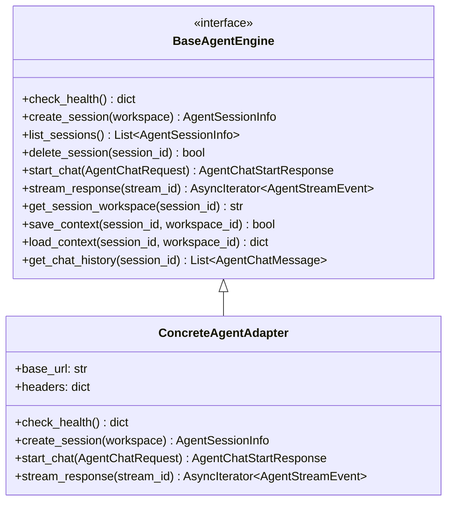
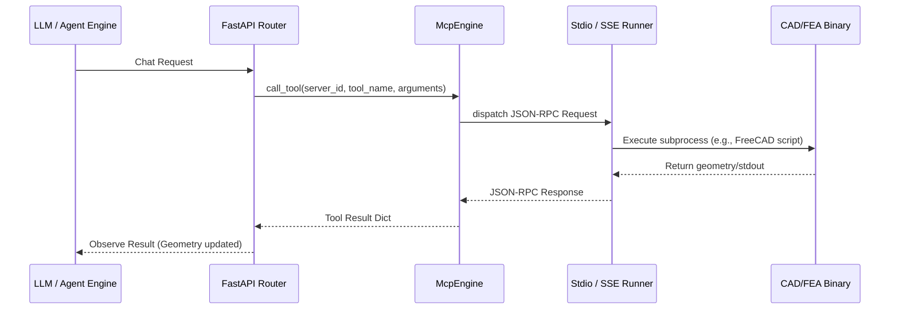
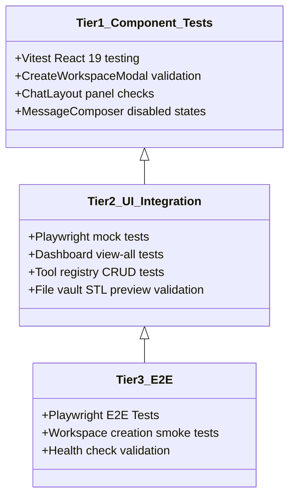

# Technical Analysis Report: Wright Platform
*Wright: An Agent Orchestration Platform for End-to-End Product Development*

---

## 1. Executive Summary & Market Opportunity

The global product development lifecycle—spanning initial product concept, CAD (Computer-Aided Design), CAM (Computer-Aided Manufacturing), CAE/FEA/CFD (Computer-Aided Engineering/Finite Element Analysis/Computational Fluid Dynamics), PDM/PLM (Product Data/Lifecycle Management), and MES (Manufacturing Execution Systems)—is historically bottlenecked by fragmented APIs, proprietary data silos, and manual, user-driven desktop workflows.

**Wright** is a modular agent orchestration platform that engineers and designers use to manage a variety of AI agents focused on different product development tasks. When coupled with local high-performance hardware (such as a Dell GB10 / NVIDIA DGX Spark with 128 GB unified memory), the platform provides a complete, standalone **"engineering AI-in-a-box"** that operates efficiently in fully air-gapped, high-security, or limited-access environments.

```text
                                  ┌───────────────────────────┐
                                  │   Engineers & Designers   │
                                  └─────────────┬─────────────┘
                                                │
                                                ▼
                                  ┌───────────────────────────┐
                                  │   Wright Orchestrator     │
                                  └─────────────┬─────────────┘
                                                │
       ┌──────────────────┬─────────────────────┼─────────────────────┬──────────────────┐
       ▼                  ▼                     ▼                     ▼                  ▼
[Concept Agents]    [CAD Agents]        [Simulation Agents]   [Machining Agents]  [Systems Agents]
       │                  │                     │                     │                  │
       └──────────────────┴───────────┬─────────┴─────────────────────┴──────────────────┘
                                      ▼
                        Model Context Protocol (MCP)
                                      ▼
             Universal Integrations (Open Source & Enterprise Vendors)
```

### The Core Value Proposition for Investors
- **Agent Orchestration Platform**: Wright empowers product teams to deploy and manage task-specific agents tailored to different phases of the design cycle, from initial concept to physical production.
- **Universal Tool Actuation**: Wright leverages the open Model Context Protocol (MCP) as a universal interface layer. If an MCP server is configured for a tool, database, or API in any engineering domain, Wright's orchestrator enables the appropriate agent to utilize it programmatically. This extends from open-source tools to commercial enterprise suites from Autodesk, Siemens, PTC, and Dassault Systèmes.
- **Standalone Engineering AI-in-a-Box**: Coupled with hardware like the Dell GB10, Wright provides a self-contained, powerful engineering sandbox. This is critical for defense, aerospace, and advanced R&D sectors where data cannot leave physical premises due to security compliance or lack of cloud connectivity.
- **Model Agnostic**: Fully decoupled from underlying LLMs, the orchestrator connects to either local on-premise models or remote cloud endpoints.

```mermaid
graph TD
    User([Engineers / Designers]) <--> |Browser UI / Web3D| FE[React 19 Frontend SPA]
    FE <--> |Local Network HTTP / SSE / WS| BE[FastAPI API Gateway]
    
    subgraph Standalone Engineering AI-in-a-Box (e.g. Dell GB10 / DGX Spark)
        BE <--> |Adapter Pattern| AA[Agent Adapters: Local/Remote LLM Engines]
        BE <--> |JSON-RPC over Pipes/WebSockets| TR[TR: McpEngine / Extensible Tool Registry]
        BE <--> |In-Process Arrow| DV[Data Vault: Vector RAG]
        BE <--> |SQL / WAL Mode| DB[(SQLite State Database)]
        
        TR <--> |stdio / subprocess| SC[Local & Proprietary Toolchains: Siemens, PTC, Autodesk, Dassault, FreeCAD]
        TR <--> |webmcp / websocket| BR[Browser DOM Tools]
    end
```

---

## 2. Core Architecture & Monorepo Structure

Wright is structured as a **Modular Monorepo** managed by `uv` to enforce strict architectural boundaries and facilitate fast local dependency resolution. Business logic is completely isolated from routing and presentation, ensuring modularity, testability, and hot-swappable AI backends.

### Directory Layout
```text
wright/
├── apps/
│   ├── api/                    # FastAPI web server (Zero-business-logic, routing only)
│   └── web/                    # React 19 Frontend SPA (Atomic design, WebGL visualization)
├── packages/
│   ├── core/                   # Shared domain models, workspace Git state, and logging/tracing
│   ├── agent_adapters/         # Abstracted interfaces & adapters for LLM engines
│   ├── tool_registry/          # Model Context Protocol (MCP) engine and execution runners
│   └── data_vault/             # Embedded database managers (SQLite WAL, Vector RAG)
├── specs/                      # Spec-kit documentation (Spec-Driven Development)
└── tests/                      # 3-Tier Testing suite (Vitest, pytest, Playwright E2E)
```

### Containerization Strategy (Thick Base / Thin Code)
To eliminate local dependency drift and simplify deployment on air-gapped hardware, Wright employs a **Thick Base / Thin Code** Docker architecture:
- **Base Image (`Dockerfile.base`)**: Contains the massive, system-level dependencies required for engineering computation, including NVIDIA CUDA runtimes, PyTorch, FreeCAD (Python bindings), CalculiX (FEA solver), and OpenSCAD.
- **Application Mount**: The application logic (`/apps` and `/packages`) is mounted as a live volume during development and container execution. This permits near-instant iteration and agent-driven hot-swapping without costly container rebuilds, maximizing deployment efficiency.

---

## 3. Data & Storage Layer: Zero-Server databases

In compliance with the project’s governance constitution, the system operates entirely without background database servers (e.g., standalone PostgreSQL or Qdrant containers). This conserves critical GPU and CPU resources, reserving maximum computational bandwidth for LLM inference. All data storage is embedded and in-process.

| Data Type | Technology | Mode | Details |
| :--- | :--- | :--- | :--- |
| **Relational / State** | SQLite | WAL (Write-Ahead Logging) | Stores workspace metadata, agent sessions, task trees, chat messages, and server statuses. Concurrent reads/writes are handled via WAL mode. |
| **Vector RAG** | Vector DB | In-process via Apache Arrow | Indexes semantic engineering documents, material specifications, standard parts catalogs, and past design patterns. Runs in-process with minimal memory overhead. |
| **Physical Artifacts** | Local Filesystem Vault | Structured Files | Saves binary deliverables (STEP, STL, G-code, FEA meshes) generated by tools. File paths are indexed and queried via SQLite. |

---

## 4. Multi-Agent Orchestration & Adapter Pattern

Wright implements an **Adapter Pattern** (`BaseAgentEngine`) to decouple the API gateway from the underlying LLM serving infrastructure. Hardcoding prompts or model-specific APIs is strictly forbidden. This abstraction allows the platform to support any local or remote inference engine depending on the deployment constraints and hardware capabilities.



### LLM Agnosticism and Configuration
The agent adapter layer bridges the system to any target LLM provider:
- **Local Inference**: Can connect directly to locally hosted engines via standard local APIs (e.g., Llama.cpp, Ollama, local WebUI backends), ensuring 100% offline security.
- **Remote / Cloud Inference**: Can connect to remote enterprise cloud LLM endpoints, utilizing API keys and secure tokens.
- **SSE Streaming**: Natural language tokens, tool call invocations, and progress messages are streamed asynchronously using Server-Sent Events (SSE).
- **Context Persistence**: Workspace-specific agent configurations and conversation histories are serialized and persisted in the local SQLite database (`agent_contexts`), allowing users to restore previous states instantly.

---

## 5. Model Context Protocol (MCP) Integration Engine

The **Model Context Protocol (MCP)**, hosted by the Linux Foundation, is the core interface through which LLMs execute actions in the physical world. Wright features an advanced `McpEngine` that controls the lifecycles, configuration syncs, and JSON-RPC dispatch of multiple concurrent MCP servers.



### Supported Execution Runners
1. **`stdio`**: Launches local binaries or Python packages as background subprocesses, communicating via JSON-RPC over stdin/stdout pipes.
2. **`sse`**: Establishes connections to remote web servers hosting specialized tools, using server-sent event streams.
3. **`webmcp`**: Connects client-side browser DOM actions to the backend via WebSockets. This allows an AI agent to execute commands that manipulate WebGL render canvases, trigger browser downloads, or read highlighted elements in the user's active viewport.

### Dynamic Tool Lifecycle Management
- **Auto-Installation Discovery**: During database migration and engine startup, the system uses `shutil.which` to scan the host shell `$PATH`. If a tool's executable dependency (e.g., `openscad` or `calculix-mcp`) is present, it automatically toggles the server's `is_installed` status in the SQLite registry.
- **Workspace-Scoped Tool Syncing**: When a user activates a workspace, the system reads the project's enabled tools list. An asynchronous background task starts the required MCP servers (initiating subprocesses) and shuts down disabled or unneeded runners, optimizing the appliance's local memory footprint.
- **Agent Server Synchronization**: The system synchronizes the list of active tools into the agent configuration files on disk. The selected LLM is instantly notified of the available tools, enabling zero-latency tool-use transitions.

---

## 6. The Engineering Toolchain & Extensible Tool Registry

The primary purpose of the Wright platform is to serve as an **extensible tool registry** that collects, installs, and validates diverse engineering packages, making them programmatically accessible to AI agents. 

Because agents operate headlessly without interacting with graphical UIs, all tools integrated into the platform are configured to run via command-line interfaces (CLIs), Python API scripts, local geometry kernels, or direct REST connections. New tools can be wrapped in the `tool_registry` package as MCP servers without requiring changes to the core orchestrator or agent schemas.

Based on the default platform design and system capabilities, the following engineering toolchain domains and packages are supported:

### Local and Open-Source Computational Toolchain
| Domain | Tool / Kernel | Interface Paradigm | Primary Purpose / Capabilities |
| :--- | :--- | :--- | :--- |
| **Geometry / 3D CAD** | **CadQuery** | Python Scripting | Programmatic, parametric CSG (Constructive Solid Geometry) modeling; outputs STEP/STL files. |
| | **Build123d** | Python Scripting | Modern, boundary-representation (B-rep) CAD geometry builder. |
| | **FreeCAD Kernel** | Headless Python API | Complex, feature-tree based solid modeling, feature suppression, and CAD manipulation. |
| | **OpenSCAD** | Script CLI / Compiler | Functional CAD modeling with mathematical variables; renders high-fidelity previews. |
| **Simulation / CAE** | **CalculiX** | CLI / `pycalculix` | Finite Element Analysis (FEA) solver for local structural stress, strain, and thermal simulations. |
| | **OpenFOAM** | CLI / Containerized | Heavy-duty Computational Fluid Dynamics (CFD) for gas and fluid flow simulations. |
| | **FluidX3D** | OpenCL / GPU CLI | Fast, GPU-accelerated fluid dynamics solver. |
| **Manufacturing / CAM** | **PrusaSlicer** | CLI / Subprocess | Slices 3D meshes (STL/STEP) to generate machine-readable G-code for 3D printers. |
| | **CuraEngine** | CLI | Console-based slicing compiler for rapid toolpath automation. |
| **Data / PLM / MES** | **PLM Connectors** | REST / SOAP Web APIs | Interfaces with local or enterprise Product Lifecycle Management (PLM/PDM) databases (e.g., Aras, Windchill). |

### Proprietary & Enterprise Vendor Toolchain Integrations
To support mixed-software environments and bridge legacy enterprise setups, Wright is fully compatible with proprietary engineering MCP servers developed by major software vendors and the community:

| Vendor | Integration Name / MCP Server | Transport Type | Description & Domain |
| :--- | :--- | :--- | :--- |
| **Autodesk** | `fusion360-mcp-server` | stdio + TCP Socket | Integrates with local Autodesk Fusion 360 to perform parametric sketching, modeling, and CAM setups/G-code generation. |
| | `aps-mcp-server-nodejs` | stdio | Connects with Autodesk Platform Services (APS) cloud APIs for model derivative extraction and ACC metadata. |
| | `revit-mcp` | stdio | Exposes CRUD operations for BIM architectural design elements in Autodesk Revit. |
| **Siemens** | `WinCC Unified MCP` | sse | Bridges WinCC Unified PC Runtime Openness API for real-time factory data tags and alarm monitoring. |
| | `@siemens/element-mcp` | sse / RAG | RAG-based integration for the Siemens Element design system and UI components. |
| | `Fuse EDA AI Agent` | sse | Orchestrates semiconductor design and microelectronics workflow tasks across the EDA portfolio. |
| **PTC** | `creo-mcp` | stdio + JSON-RPC | Interfaces with local PTC Creo Parametric sessions via JLINK and CREOSON middleware, enabling parameter tuning and BOM extraction. |
| | `hedless-onshape-mcp` | stdio / REST | Executes cloud-native CAD manipulations in Onshape Part Studios. |
| | `ThingWorx MCP` | sse | Connects to ThingWorx IoT platform for machine telemetry and contextual sensor history. |
| **Dassault** | `SolidworksMCP-python` | stdio + COM / VBA | Exposes solid modeling and drawing operations in SolidWorks via Windows COM API, using SQLite checkpoints to prevent kernel crashes. |
| | `SolidworksMCP-TS` | stdio + COM / VBA | Bridges Node.js to SolidWorks, automatically falling back to VBA macro generation for complex parametric operations. |
| | `solidworks-api-mcp` | sse / RAG | Allows agents to search SolidWorks API documentation to verify functions during code generation. |

---

## 7. Engineering Workspace & Local Git Integration

Every project within Wright is structured as a standard directory on the local disk managed by a local **Git repository**. The backend core package exposes a robust `WorkspaceManager` that handles file browser trees, state synchronization, and conflict resolution:

- **Git-Porcelain Status Mapping**: Files are monitored in real-time. The file tree endpoint queries `git status --porcelain` to label each file node as *Unmodified (Clean)*, *Added (A)*, *Deleted (D)*, *Modified (M)*, or *Untracked (U)*, displaying these states directly in the IDE UI.
- **Atomic Operations & Lock Management**: To prevent simultaneous write corruption from concurrent agents or human edits, the `WorkspaceManager` implements file-level locking. A hashing mechanism registers locks inside a hidden `.git/workspace_locks/` directory.
- **Reversion and Checkpoint Commits**: Prior to running complex design scripts, the workspace commits changes locally. If the resulting CAD script fails execution or generates self-intersecting meshes, the system executes an automated rollback (`git reset --hard HEAD`), ensuring the design timeline remains unbroken.
- **Path Traversal Protection**: To enforce strict security boundaries, the `WorkspaceManager` sanitizes and validates all relative paths, preventing agents from reading or writing files outside the designated workspace path or the local `/tmp/` scratch directory.

---

## 8. Observability & Tracing: "Glass Box" Verification

Engineering processes require high predictability. Wright rejects the "black box" design of typical AI applications, implementing a comprehensive end-to-end OpenTelemetry and structured logging architecture:

- **End-to-End Tracing**: Every user request generates a unique `trace_id`. The FastAPI middleware extracts/injects this identifier as the `X-Trace-Id` HTTP header. The trace propagates from the React frontend, through the router handlers, down to agent adapter prompts, tool executions, and SQLite database queries.
- **Semantic Span Hierarchy**: Spans are published to a local **Jaeger** instance using standardized naming structures (e.g., `workspace.create`, `agent.chat.start`, `db.sqlite.query`, `tool.openscad_generate`). This allows developers and compliance auditors to inspect latency distributions and debug tool execution errors.
- **Structured JSON Logging**: The entire Python codebase utilizes `structlog` to output standardized JSON lines, automatically binding the active trace context and parent span.
- **Client-Side Log Persistence**: The React client records console and API errors locally using **IndexedDB** (`wright-logs` database). This provides an offline log buffer that can be queried by users or sent to support systems for diagnosing local runtime failures.

---

## 9. Testing and Quality Assurance Stack

Wright is covered by a rigorous, three-tier testing pyramid to guarantee 100% reliability in fully offline environments. All pipeline verification occurs locally.



- **Tier 1: Component Validation (Vitest)**: Tests critical React components in isolation. Verifies rendering, user event handlers, loading transitions, and error states under mock API conditions.
- **Tier 2: UI Integration (Playwright)**: Validates complete page-level user journeys (e.g., tool installation flows, git commit inputs, STL file downloads) with a fully mocked backend API.
- **Tier 3: E2E System Tests (Pytest & Playwright)**: Executes happy-path smoke tests against live local backend servers, validating the database migrations, network sockets, SSE streams, and geometry creation end-to-end.

---

## 10. Security & Governance Control

Operating on sensitive intellectual property, Wright incorporates native, air-gapped security frameworks:

- **Zero-Cloud Authentication**: Uses FastAPI's native `OAuth2PasswordBearer` with `passlib` (bcrypt hashing) and `python-jose` (JSON Web Tokens) to authenticate local operators. No external telemetry or cloud identity providers (e.g., Auth0, Cognito) are permitted.
- **Role-Based Access Control (RBAC)**: Distinguishes between standard Engineers (allowed to execute chats, browse files, and run CAD tools) and Administrators (allowed to register custom MCP tools, delete workspace histories, and modify engine configurations).
- **Destructive Gating via MCP Metadata**: Interactive tools expose semantic metadata tags (`readOnlyHint`, `destructiveHint`, `idempotentHint`). Safe operations (e.g., querying mechanical properties, listing file nodes) are executed automatically by the agent. Destructive actions (e.g., executing shell scripts, deleting CAD bodies, committing git history) are paused by the client shell, requiring explicit user approval before execution.

---

## 11. Technology Stack Summary

```text
┌────────────────────────────────────────────────────────────────────────┐
│                              USER VIEWPORT                             │
│                  React 19 (SPA) • TypeScript 6 • Tailwind              │
│                  Vite • Vitest • Playwright • IndexedDB                │
└───────────────────────────────────┬────────────────────────────────────┘
                                    │
                         HTTPS / SSE / WebSockets
                                    │
┌───────────────────────────────────▼────────────────────────────────────┐
│                             API GATEWAY                                │
│                   FastAPI • Pydantic v2 • Uvicorn                      │
│                OpenTelemetry Middleware • OAuth2 / JWT                 │
└───────────────────────────────────┬────────────────────────────────────┘
                                    │
                    In-Process Calls / Subprocesses
                                    │
┌───────────────────────────────────▼────────────────────────────────────┐
│                             CORE SERVICE                               │
│           Python 3.13 • structlog • SQLite (WAL) • Vector DB           │
│        BaseAgentEngine (Agnostic) • McpEngine (Stdio/SSE/Web)          │
└───────────────────────────────────┬────────────────────────────────────┘
                                    │
                           Subprocess Execution
                                    │
┌───────────────────────────────────▼────────────────────────────────────┐
│                   EXTENSIBLE LOCAL COMPUTE TOOLCHAIN                   │
│  CAD/Geometry: CadQuery • Build123d • FreeCAD • OpenSCAD • Fusion 360  │
│  Simulation: CalculiX FEA • OpenFOAM CFD • FluidX3D                    │
│  Manufacturing: PrusaSlicer CLI • CuraEngine (G-code)                  │
│  Enterprise Vendor Integrations: Siemens WinCC/Element • PTC Creo/     │
│  Onshape • Autodesk Revit/APS • Dassault SolidWorks/3DEXPERIENCE       │
└────────────────────────────────────────────────────────────────────────┘
```

---

## 12. Conclusion & Next-Generation Development Roadmap

Wright represents a highly viable commercial product for enterprises requiring secure, offline product lifecycle and engineering automation. The modularity of the architecture guarantees that as new tools and platforms emerge, agents can be deployed to utilize them immediately without core refactoring.

### Future Roadmap
1. **Domain Expansion**: Extending agent capabilities to support PDM (Product Data Management), MES (Manufacturing Execution Systems), and complex multi-disciplinary optimization (MDO) tools.
2. **Interactive 3D Views (MCP-UI)**: Expanding the UI client to support the newly proposed MCP-UI specifications, rendering interactive parameter sliders and 3D stress-analysis contours directly inside the conversational chat view.
3. **Advanced PLM Synchronizers**: Building offline adapters for local Aras Innovator PLM or Windchill instances, allowing AI agents to automatically submit new engineering designs for change request reviews.
