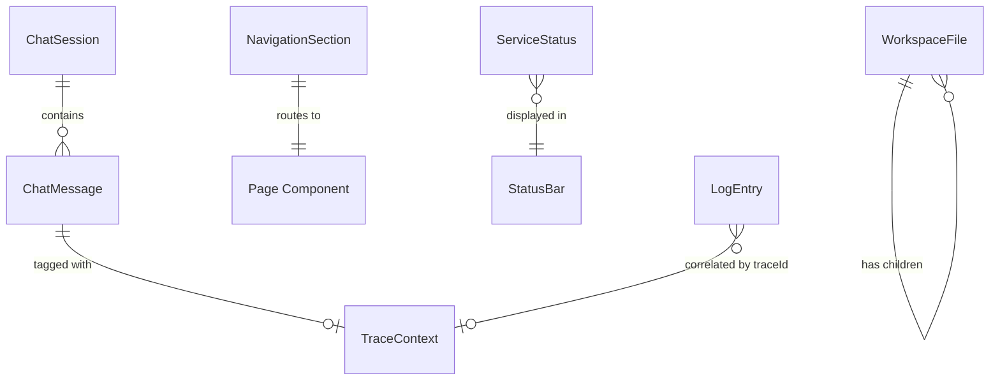

# Data Model: Initial UI Foundation

**Feature**: 001-initial-ui | **Date**: 2026-06-02

## Entities

### NavigationSection

Represents a routable section of the application displayed in the sidebar.

| Field | Type | Description |
|-------|------|-------------|
| id | string | Unique identifier (e.g., `"dashboard"`, `"agent-chat"`) |
| label | string | Display name shown in sidebar |
| path | string | URL path for routing (e.g., `"/agent-chat"`) |
| icon | string | Icon identifier for sidebar display |
| order | number | Display order in the sidebar (ascending) |

**Validation rules**:
- `id` must be unique across all sections
- `path` must start with `/`
- `order` must be a positive integer

**Instances** (v1):

| id | label | path | icon | order |
|----|-------|------|------|-------|
| dashboard | Dashboard | / | layout-dashboard | 1 |
| agent-chat | Agent Chat | /agent-chat | message-square | 2 |
| tool-registry | Tool Registry | /tool-registry | wrench | 3 |
| file-vault | File Vault | /file-vault | folder | 4 |

---

### ChatSession

Represents a conversation session with the Hermes Agent. Modeled after the Hermes WebUI Session class (session_id, title, messages, timestamps).

| Field | Type | Description |
|-------|------|-------------|
| sessionId | string | Unique hex identifier (12 chars, matching Hermes convention) |
| title | string | Session title, auto-generated from first user message |
| messages | ChatMessage[] | Ordered list of messages in the session |
| createdAt | number | Unix timestamp of session creation |
| updatedAt | number | Unix timestamp of last modification |
| isActive | boolean | Whether this is the currently viewed session |

**Validation rules**:
- `sessionId` must be a 12-character hex string
- `title` is truncated to 64 characters (matching Hermes `title_from()` behavior)
- `messages` array preserves insertion order
- `updatedAt` >= `createdAt`

**State transitions**:
```
[Created] → [Active] → [Inactive]
                ↕
            [Active] (re-selected)
```

**Persistence**: Stored in `localStorage` under key `wright-chat-sessions`. Serialized as JSON.

---

### ChatMessage

Represents a single message in a chat conversation. Compatible with the OpenAI message format used by Hermes.

| Field | Type | Description |
|-------|------|-------------|
| id | string | Unique message identifier |
| role | `"user"` \| `"assistant"` | Sender role |
| content | string | Message text content |
| timestamp | number | Unix timestamp of message creation |
| traceId | string \| null | OpenTelemetry trace ID for the action that created this message |

**Validation rules**:
- `role` must be one of the two allowed values
- `content` must be a non-empty string for user messages
- `traceId` is null for messages created without telemetry context

---

### ServiceStatus

Represents the health state of a backend service.

| Field | Type | Description |
|-------|------|-------------|
| serviceId | string | Unique service identifier |
| name | string | Human-readable service name |
| endpoint | string | URL endpoint for health check |
| state | `"connected"` \| `"disconnected"` \| `"unknown"` | Current connection state |
| lastChecked | number \| null | Unix timestamp of the last health check |

**Validation rules**:
- `state` defaults to `"unknown"` on first load
- `lastChecked` is null before the first check completes

**Instances** (v1):

| serviceId | name | endpoint |
|-----------|------|----------|
| wright-api | Wright API | /api/health |
| hermes-agent | Hermes Agent | /api/agent/health |
| inference | LLM Inference | /api/inference/health |

**Polling**: Health checks run every 15 seconds. State updates on response/timeout.

---

### WorkspaceFile

Represents a file or directory in the workspace browser panel.

| Field | Type | Description |
|-------|------|-------------|
| name | string | File or directory name |
| path | string | Relative path from workspace root |
| type | `"file"` \| `"directory"` | Node type |
| size | number \| null | File size in bytes (null for directories) |
| children | WorkspaceFile[] \| null | Child entries (null for files, lazy-loaded for dirs) |

**Validation rules**:
- `type` determines which fields are populated
- `children` is only populated when a directory is expanded (lazy loading)
- Directory listing returns at most 200 entries per level (matching Hermes's `list_dir` behavior)

**Sort order**: Directories first, then files, case-insensitive alphabetical within each group (matching Hermes convention).

---

### TraceContext

Represents a telemetry trace for a user action, surfaced in the UI status area.

| Field | Type | Description |
|-------|------|-------------|
| traceId | string | OpenTelemetry trace ID (32-character hex string) |
| spanId | string | Span ID within the trace |
| actionName | string | Human-readable action description |
| startTime | number | Unix timestamp (ms) when the action started |
| duration | number \| null | Duration in milliseconds (null if in progress) |
| status | `"ok"` \| `"error"` \| `"in-progress"` | Trace outcome |

---

### LogEntry

Represents a structured log event emitted by the browser application.

| Field | Type | Description |
|-------|------|-------------|
| timestamp | string | ISO 8601 timestamp |
| level | `"debug"` \| `"info"` \| `"warn"` \| `"error"` | Log level |
| message | string | Human-readable log message |
| component | string | Source component identifier (e.g., `"ChatLayout"`, `"Router"`) |
| traceId | string \| null | Associated OpenTelemetry trace ID |
| metadata | Record<string, unknown> | Arbitrary structured data |

**Validation rules**:
- `timestamp` is always ISO 8601 format
- `component` uses PascalCase matching the React component name
- `metadata` is optional and defaults to `{}`

## Relationships


