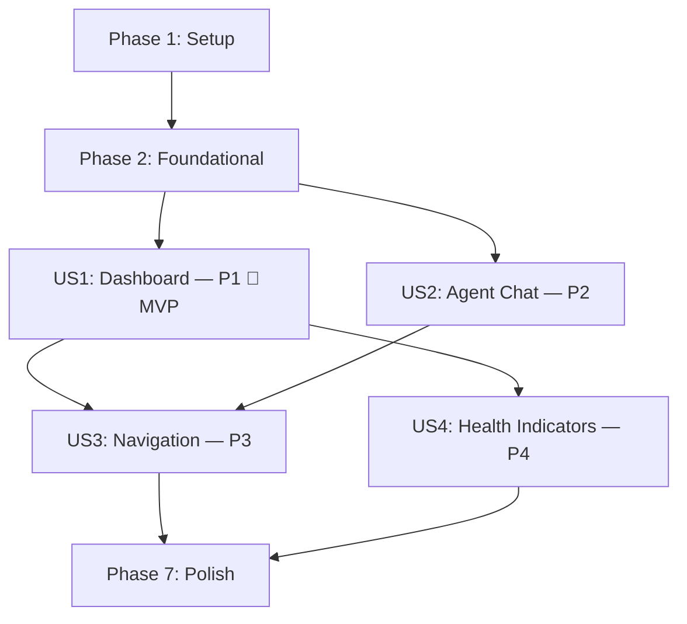

# Tasks: Initial UI Foundation

**Input**: Design documents from `/specs/001-initial-ui/`

**Prerequisites**: plan.md ✅, spec.md ✅, research.md ✅, data-model.md ✅, contracts/ ✅, quickstart.md ✅

**Tests**: Included — spec requires Playwright (Tier 2) and Vitest (Tier 1) per constitution § 6.

**Organization**: Tasks grouped by user story to enable independent implementation and testing.

## Format: `[ID] [P?] [Story] Description`

- **[P]**: Can run in parallel (different files, no dependencies)
- **[Story]**: Which user story this task belongs to (e.g., US1, US2, US3, US4)
- Exact file paths included in descriptions

## Path Conventions

- **Frontend**: `apps/web/src/`
- **Playwright tests**: `tests/ui-integration/`
- **Design docs**: `specs/001-initial-ui/`

---

## Phase 1: Setup (Shared Infrastructure)

**Purpose**: Initialize the React + Vite + TypeScript project in `apps/web/`

- [x] T001 Initialize Vite + React + TypeScript project in `apps/web/` via `npx create-vite`
- [x] T002 Install core dependencies: `react-router-dom`, `@opentelemetry/sdk-trace-web`, `@opentelemetry/api` in `apps/web/package.json`
- [x] T003 [P] Install dev dependencies: `vitest`, `@testing-library/react`, `@testing-library/jest-dom`, `jsdom`, `playwright`, `@playwright/test` in `apps/web/package.json`
- [x] T004 [P] Configure TypeScript with strict mode in `apps/web/tsconfig.json`
- [x] T005 [P] Configure Vitest for component testing in `apps/web/vite.config.ts`
- [x] T006 Configure Playwright for UI integration tests in `playwright.config.ts` at repo root, with `webServer` pointing to `apps/web/`

---

## Phase 2: Foundational (Blocking Prerequisites)

**Purpose**: Design token system, logging, telemetry, and shared types that ALL user stories depend on

**⚠️ CRITICAL**: No user story work can begin until this phase is complete

- [x] T007 Create design tokens CSS file with Hermes calm-console palette in `apps/web/src/tokens/design-tokens.css` (colors, typography, spacing, radii per contracts/ui-contracts.md § 4)
- [x] T008 [P] Create shared TypeScript types for all entities in `apps/web/src/store/types.ts` (NavigationSection, ChatSession, ChatMessage, ServiceStatus, WorkspaceFile, TraceContext, LogEntry per data-model.md)
- [x] T009 [P] Implement structured JSON logger service in `apps/web/src/services/logger.ts` (Logger interface per contracts/ui-contracts.md § 1)
- [x] T010 [P] Implement OpenTelemetry telemetry service with ConsoleSpanExporter in `apps/web/src/services/telemetry.ts` (TelemetryService interface per contracts/ui-contracts.md § 1)
- [x] T011 [P] Create `useLogger` React hook in `apps/web/src/hooks/useLogger.ts` (component-scoped structured logging)
- [x] T012 [P] Create `useTrace` React hook in `apps/web/src/hooks/useTrace.ts` (action-scoped OpenTelemetry spans)
- [x] T013 Initialize logger and telemetry in React entry point `apps/web/src/main.tsx`
- [x] T014 Create global CSS reset and app-level styles importing design tokens in `apps/web/src/index.css`

**Checkpoint**: Foundation ready — design tokens, logging, telemetry, and types in place. User story implementation can begin.

---

## Phase 3: User Story 1 — View the Engineering Dashboard (Priority: P1) 🎯 MVP

**Goal**: Render a responsive dashboard with header, sidebar navigation, and main content area. Works offline with placeholder states.

**Independent Test**: Load the app in a browser → dashboard renders with header, sidebar, and content area. No console errors. Placeholder content visible.

### Tests for User Story 1

- [x] T015 [P] [US1] Vitest component test: AppShell renders header, sidebar, and content in `apps/web/tests/AppShell.spec.tsx`
- [x] T016 [P] [US1] Vitest component test: Sidebar renders all navigation items in `apps/web/tests/Sidebar.spec.tsx`
- [x] T017 [P] [US1] Playwright integration test: dashboard loads and renders all layout regions in `tests/ui-integration/dashboard.spec.ts`

### Implementation for User Story 1

- [x] T018 [P] [US1] Create `StatusDot` primitive component in `apps/web/src/components/common/StatusDot.tsx` (colored indicator dot for connection states)
- [x] T019 [P] [US1] Create `NavItem` primitive component in `apps/web/src/components/common/NavItem.tsx` (sidebar navigation link)
- [x] T020 [P] [US1] Create `Placeholder` component in `apps/web/src/components/common/Placeholder.tsx` (empty state placeholder for sections)
- [x] T021 [US1] Create `Sidebar` layout component in `apps/web/src/components/layout/Sidebar.tsx` (renders NavigationSection list using NavItem)
- [x] T022 [US1] Create `StatusBar` layout component in `apps/web/src/components/layout/StatusBar.tsx` (service health indicators using StatusDot)
- [x] T023 [US1] Create `Header` layout component in `apps/web/src/components/layout/Header.tsx` (app title + StatusBar)
- [x] T024 [US1] Create `AppShell` layout component in `apps/web/src/components/layout/AppShell.tsx` (Header + Sidebar + main content area)
- [x] T025 [US1] Create `DashboardPage` in `apps/web/src/components/pages/DashboardPage.tsx` (welcome content with placeholder panels)
- [x] T026 [US1] Wire AppShell and DashboardPage into `apps/web/src/App.tsx` with React Router (route `/` → Dashboard)
- [x] T027 [US1] Update `apps/web/index.html` with meta tags, title "Wright", and `<noscript>` fallback message
- [x] T028 [US1] Add `data-testid` attributes to all interactive elements in US1 components (per constitution § 6)
- [x] T029 [US1] Add structured logging for page load and component mount events in US1 components via `useLogger` hook

**Checkpoint**: Dashboard renders with header, sidebar, and content area. Logging emits structured JSON. Playwright test passes. MVP complete.

---

## Phase 4: User Story 2 — Interact with the Hermes Agent via Chat (Priority: P2)

**Goal**: Hermes-style three-panel chat interface: sessions sidebar (left), chat transcript with composer (center), workspace file browser (right). Works offline with stub data.

**Independent Test**: Navigate to Agent Chat → three-panel layout renders. Type and send a message → message appears in transcript. Create/switch sessions. Workspace panel shows placeholder file tree.

### Tests for User Story 2

- [x] T030 [P] [US2] Vitest component test: ChatLayout renders three panels in `apps/web/tests/ChatLayout.spec.tsx`
- [x] T031 [P] [US2] Vitest component test: MessageComposer sends messages on submit in `apps/web/tests/MessageComposer.spec.tsx`
- [x] T032 [P] [US2] Vitest component test: SessionsSidebar lists sessions, handles selection, and renders 50 sessions without layout degradation (SC-011) in `apps/web/tests/SessionsSidebar.spec.tsx`
- [x] T033 [P] [US2] Playwright integration test: Agent Chat three-panel layout and message flow in `tests/ui-integration/agent-chat.spec.ts`

### Implementation for User Story 2

- [x] T034 [US2] Implement stub `AgentService` in `apps/web/src/services/agent-service.ts` (returns echo responses for v1, per contracts/ui-contracts.md § 1)
- [x] T035 [US2] Implement chat session state management with React Context + useReducer in `apps/web/src/store/sessions.ts` (ChatSession, ChatMessage CRUD, localStorage persistence)
- [x] T036 [P] [US2] Create `MessageBubble` component in `apps/web/src/components/chat/MessageBubble.tsx` (user/assistant message rendering with role styling)
- [x] T037 [P] [US2] Create `FileTree` recursive component in `apps/web/src/components/common/FileTree.tsx` (expandable file/directory tree)
- [x] T038 [US2] Create `MessageComposer` component in `apps/web/src/components/chat/MessageComposer.tsx` (textarea + send button, auto-resize)
- [x] T039 [US2] Create `ChatTranscript` component in `apps/web/src/components/chat/ChatTranscript.tsx` (scrollable message list using MessageBubble, auto-scroll on new messages)
- [x] T040 [US2] Create `SessionsSidebar` component in `apps/web/src/components/chat/SessionsSidebar.tsx` (session list, create/select/delete actions)
- [x] T041 [US2] Create `WorkspacePanel` component in `apps/web/src/components/chat/WorkspacePanel.tsx` (file tree browser with placeholder data)
- [x] T042 [US2] Create `ChatLayout` component in `apps/web/src/components/chat/ChatLayout.tsx` (CSS Grid three-panel layout: 260px | 1fr | 280px, right panel collapsible)
- [x] T043 [US2] Create `AgentChatPage` in `apps/web/src/components/pages/AgentChatPage.tsx` (wraps ChatLayout with session context provider)
- [x] T044 [US2] Add route `/agent-chat` → AgentChatPage in `apps/web/src/App.tsx`
- [x] T045 [US2] Add `data-testid` attributes to all interactive elements in US2 components
- [x] T046 [US2] Add structured logging for chat events (message sent, session created/switched) via `useLogger` hook
- [x] T047 [US2] Add telemetry spans for send-message action via `useTrace` hook (trace ID visible in message metadata)

**Checkpoint**: Agent Chat section fully functional with three-panel layout, session CRUD, message compose/send, and workspace panel. All works offline with stub data.

---

## Phase 5: User Story 3 — Navigate Between Application Sections (Priority: P3)

**Goal**: Full client-side routing between Dashboard, Agent Chat, Tool Registry, and File Vault. URL persistence, browser history, and active state in sidebar.

**Independent Test**: Click each sidebar nav item → correct view loads, URL updates, sidebar highlights active item. Use browser back/forward → navigation works. Paste URL → loads directly.

### Tests for User Story 3

- [x] T048 [P] [US3] Playwright integration test: navigation between all sections and URL persistence in `tests/ui-integration/navigation.spec.ts`

### Implementation for User Story 3

- [x] T049 [P] [US3] Create `ToolRegistryPage` placeholder in `apps/web/src/components/pages/ToolRegistryPage.tsx`
- [x] T050 [P] [US3] Create `FileVaultPage` placeholder in `apps/web/src/components/pages/FileVaultPage.tsx`
- [x] T051 [P] [US3] Create `NotFoundPage` in `apps/web/src/components/pages/NotFoundPage.tsx` (404 with link back to dashboard)
- [x] T052 [US3] Add routes `/tool-registry`, `/file-vault`, and `*` (catch-all) in `apps/web/src/App.tsx`
- [x] T053 [US3] Wire Sidebar active state to current route via React Router's `useLocation` in `apps/web/src/components/layout/Sidebar.tsx`
- [x] T054 [US3] Add `data-testid` attributes to all interactive elements in US3 components
- [x] T055 [US3] Add structured logging for navigation events (route changes) via `useLogger` hook

**Checkpoint**: All 4 sections + 404 page routable. Browser back/forward works. URLs are shareable/bookmarkable.

---

## Phase 6: User Story 4 — View System Health and Activity Indicators (Priority: P4)

**Goal**: Status area in the header showing service connectivity (API, Hermes Agent, LLM inference) and latest trace ID. Polls for health changes.

**Independent Test**: Load UI without backend → all status dots show "disconnected". View status area → latest trace ID visible after a navigation event.

### Tests for User Story 4

- [x] T056 [P] [US4] Vitest component test: StatusBar renders service statuses and trace info in `apps/web/tests/StatusBar.spec.tsx`

### Implementation for User Story 4

- [x] T057 [US4] Implement `HealthService` in `apps/web/src/services/health-service.ts` (polling with 15s interval, status change callbacks per contracts/ui-contracts.md § 1)
- [x] T058 [US4] Create `useHealthStatus` hook in `apps/web/src/hooks/useHealthStatus.ts` (wraps HealthService, provides React state)
- [x] T059 [US4] Wire `StatusBar` to live health polling via `useHealthStatus` in `apps/web/src/components/layout/StatusBar.tsx`
- [x] T060 [US4] Wire `StatusBar` to display latest trace ID from telemetry service in `apps/web/src/components/layout/Header.tsx`
- [x] T061 [US4] Add `data-testid` attributes to all interactive elements in US4 components
- [x] T062 [US4] Add structured logging for health status changes via `useLogger` hook

**Checkpoint**: Status bar shows live service connectivity. Trace IDs visible. Health polls every 15 seconds.

---

## Phase 7: Polish & Cross-Cutting Concerns

**Purpose**: Improvements that affect multiple user stories

- [x] T063 [P] Responsive layout CSS adjustments for tablet screen widths in `apps/web/src/tokens/design-tokens.css` and component CSS
- [x] T064 [P] Add CSS transitions/animations for sidebar hover, page transitions, and status dot state changes
- [x] T065 [P] Browser compatibility check — verify no console errors on Chrome, Firefox, Edge
- [x] T066 Run quickstart.md validation — follow quickstart steps and verify all instructions work
- [x] T067 Final `data-testid` audit — confirm 100% coverage of interactive elements (SC-003) and verify zero hardcoded color/spacing values in component CSS (FR-009 token enforcement)
- [x] T068 Run full Playwright test suite and fix any failures
- [x] T069 Run full Vitest suite and fix any failures

---

## Dependencies & Execution Order

### Phase Dependencies

- **Setup (Phase 1)**: No dependencies — start immediately
- **Foundational (Phase 2)**: Depends on Phase 1 completion — BLOCKS all user stories
- **US1 — Dashboard (Phase 3)**: Depends on Phase 2 — creates the layout shell
- **US2 — Agent Chat (Phase 4)**: Depends on Phase 2 — can run in parallel with US1 but US1 creates the AppShell that US2 renders inside
- **US3 — Navigation (Phase 5)**: Depends on Phase 3 (AppShell + Sidebar) and Phase 4 (AgentChatPage) — wires all routes together
- **US4 — Health Indicators (Phase 6)**: Depends on Phase 3 (Header/StatusBar components exist)
- **Polish (Phase 7)**: Depends on all user stories being complete

### User Story Dependencies



### Within Each User Story

- Tests FIRST → ensure they FAIL before implementation
- Primitives/common components before layout components
- State management before UI components that consume state
- Page components last (assemble everything)
- `data-testid` and logging as final steps per story

### Parallel Opportunities

- **Phase 1**: T003 and T004, T005 can all run in parallel
- **Phase 2**: T008, T009, T010, T011, T012 can all run in parallel (different files)
- **Phase 3**: T015, T016, T017 (tests) in parallel; T018, T019, T020 (primitives) in parallel
- **Phase 4**: T030, T031, T032, T033 (tests) in parallel; T036, T037 (components) in parallel
- **Phase 5**: T049, T050, T051 (page placeholders) in parallel
- **Phase 7**: T063, T064, T065 all in parallel

---

## Parallel Example: User Story 2 (Agent Chat)

```bash
# Launch all tests together:
Task T030: "ChatLayout renders three panels in apps/web/tests/ChatLayout.spec.tsx"
Task T031: "MessageComposer sends messages in apps/web/tests/MessageComposer.spec.tsx"
Task T032: "SessionsSidebar lists sessions in apps/web/tests/SessionsSidebar.spec.tsx"
Task T033: "Playwright: Agent Chat layout and flow in tests/ui-integration/agent-chat.spec.ts"

# Launch independent components together:
Task T036: "MessageBubble in apps/web/src/components/chat/MessageBubble.tsx"
Task T037: "FileTree in apps/web/src/components/common/FileTree.tsx"
```

---

## Implementation Strategy

### MVP First (User Story 1 Only)

1. Complete Phase 1: Setup (T001–T006)
2. Complete Phase 2: Foundational (T007–T014)
3. Complete Phase 3: User Story 1 — Dashboard (T015–T029)
4. **STOP and VALIDATE**: Dashboard renders, Playwright test passes, structured logs emit
5. Demo the MVP

### Incremental Delivery

1. Setup + Foundational → Foundation ready
2. Add US1: Dashboard → Test → Demo (MVP! ✅)
3. Add US2: Agent Chat → Test → Demo (three-panel Hermes-style chat ✅)
4. Add US3: Navigation → Test → Demo (all sections routable ✅)
5. Add US4: Health Indicators → Test → Demo (status bar live ✅)
6. Polish → Final validation → Feature complete

### Single-Developer Strategy (recommended for this feature)

1. Phase 1 + 2: Foundation (~1 session)
2. Phase 3: Dashboard MVP (~1 session)
3. Phase 4: Agent Chat (~2 sessions — most complex phase)
4. Phase 5 + 6: Navigation + Health (~1 session)
5. Phase 7: Polish (~1 session)

---

## Notes

- [P] tasks = different files, no dependencies on incomplete tasks
- [Story] label maps task to specific user story for traceability
- Each user story is independently completable and testable
- All tests should fail before implementation (TDD per constitution § 6)
- Commit after each task or logical group
- Stop at any checkpoint to validate story independently
- Docker integration is explicitly OUT OF SCOPE for this feature
