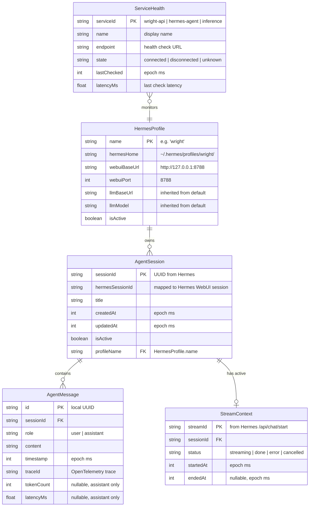
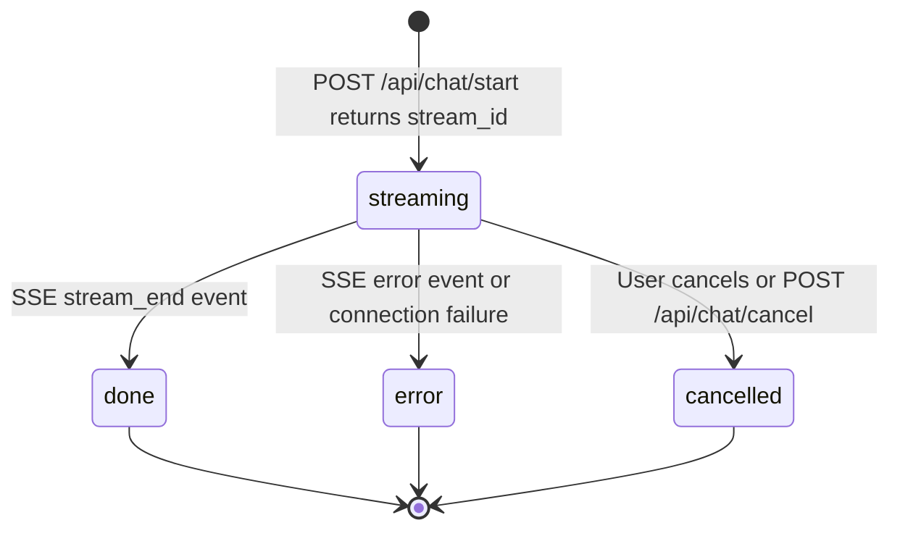
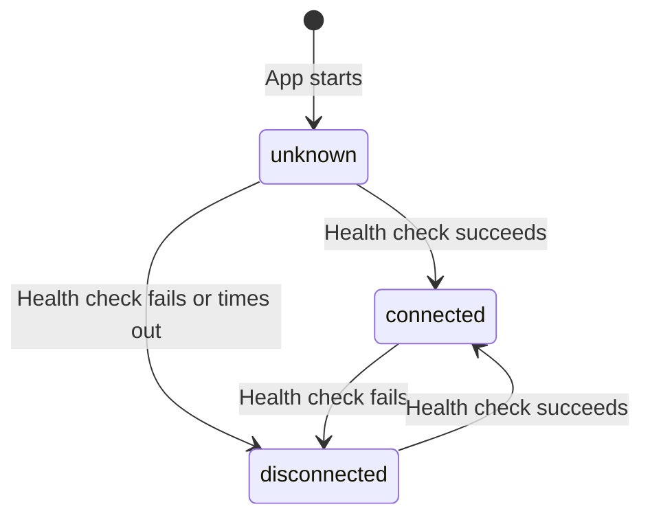

# Data Model: Hermes & LLM Integration

**Branch**: `002-hermes-llm-integration` | **Date**: 2026-06-02

## Entity Diagram

## Entity Details

### HermesProfile

Represents a dedicated Hermes agent profile for the Wright application. Created once during setup. Configuration is cloned from the default profile.

| Field | Type | Source | Notes |
|-------|------|--------|-------|
| name | string | setup script | Always "wright" for this feature |
| hermesHome | string | `hermes profile show wright` | Full path to profile HERMES_HOME |
| webuiBaseUrl | string | Wright API config | URL of the dedicated WebUI instance |
| webuiPort | int | Wright API config | Dedicated port (8788) |
| llmBaseUrl | string | cloned config.yaml | Inherited from default profile |
| llmModel | string | cloned config.yaml | Inherited from default profile |
| isActive | boolean | runtime check | Whether WebUI process is running |

### AgentSession

A conversation thread. Maps 1:1 to a Hermes WebUI session. Created via `POST /api/session/new` on the Hermes WebUI.

| Field | Type | Source | Notes |
|-------|------|--------|-------|
| sessionId | string | Wright internal ID | Used by frontend store |
| hermesSessionId | string | Hermes WebUI API | Used for backend proxy calls |
| title | string | Auto-generated or user-set | Updated on first message |
| createdAt | int | epoch ms | Set at creation |
| updatedAt | int | epoch ms | Updated on each message |
| isActive | boolean | runtime state | Whether session is currently streaming |
| profileName | string | FK → HermesProfile | Always "wright" |

### AgentMessage

A single message in a session. User messages are local; assistant messages are populated from SSE stream events.

| Field | Type | Source | Notes |
|-------|------|--------|-------|
| id | string | local UUID | Generated client-side |
| sessionId | string | FK → AgentSession | Parent session |
| role | string | "user" or "assistant" | Determines rendering |
| content | string | user input or SSE tokens | Streamed for assistant |
| timestamp | int | epoch ms | When message was created/completed |
| traceId | string | OpenTelemetry | Nullable, set by Wright API |
| tokenCount | int | SSE metadata | Nullable, assistant messages only |
| latencyMs | float | measured | Nullable, time to first token |

### StreamContext

Tracks an active SSE stream between the Wright API and Hermes WebUI. Transient — exists only during an active chat turn.

| Field | Type | Source | Notes |
|-------|------|--------|-------|
| streamId | string | Hermes `/api/chat/start` response | Used to connect to SSE |
| sessionId | string | FK → AgentSession | Owning session |
| status | string | runtime state | streaming → done/error/cancelled |
| startedAt | int | epoch ms | When stream was initiated |
| endedAt | int | epoch ms | Nullable, when stream completed |

### ServiceHealth

Real-time connectivity status for monitored backend services. Already exists in the frontend store from feature 001.

| Field | Type | Source | Notes |
|-------|------|--------|-------|
| serviceId | string | hardcoded | wright-api, hermes-agent, inference |
| name | string | display label | Human-readable |
| endpoint | string | Wright API health route | Backend proxy endpoint |
| state | string | health check result | connected/disconnected/unknown |
| lastChecked | int | epoch ms | Timestamp of last poll |
| latencyMs | float | measured | Round-trip time of health check |

## State Transitions

### StreamContext Lifecycle

### ServiceHealth States

