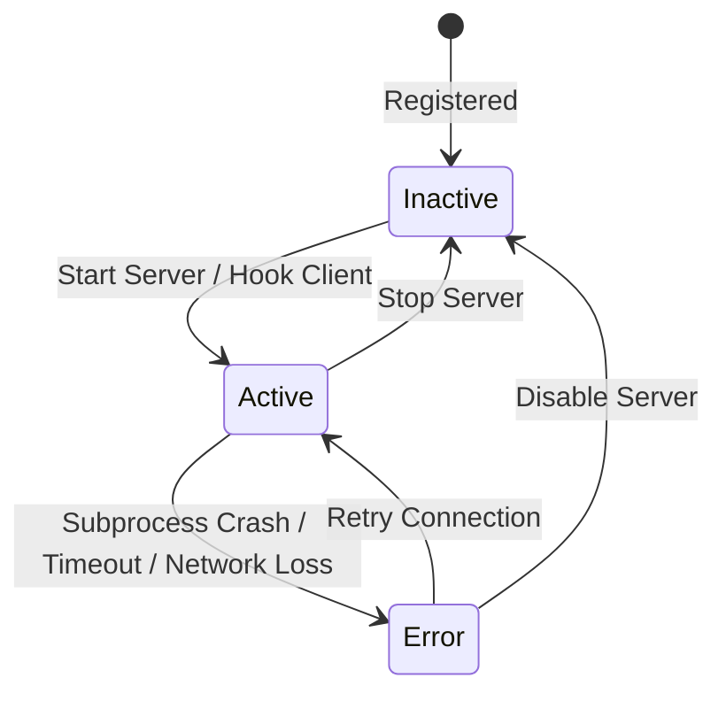

# Data Model: MCP & Tool Registry

**Branch**: `003-mcp-tool-registry` | **Date**: 2026-06-02

## SQLite Schemas

The following tables will be added to the local SQLite database.

### 1. `mcp_servers`

Stores the configurations for standard and custom Model Context Protocol servers.

```sql
CREATE TABLE mcp_servers (
    server_id TEXT PRIMARY KEY,          -- UUIDv4 format
    name TEXT NOT NULL UNIQUE,          -- Canonical server name
    type TEXT NOT NULL CHECK(type IN ('stdio', 'sse', 'webmcp')),
    command TEXT,                       -- JSON array of commands/args if stdio, URL if sse, NULL if webmcp
    is_active INTEGER NOT NULL DEFAULT 0 CHECK(is_active IN (0, 1)),
    status TEXT NOT NULL DEFAULT 'inactive' CHECK(status IN ('active', 'inactive', 'error')),
    error_message TEXT,                 -- Detailed logs if server status is 'error'
    category TEXT NOT NULL DEFAULT 'utilities',
    created_at INTEGER NOT NULL,        -- Unix epoch timestamp
    updated_at INTEGER NOT NULL         -- Unix epoch timestamp
);
```

### 2. `mcp_tools`

Stores the individual tools exposed by the active MCP servers. This table is refreshed on server activation / discovery.

```sql
CREATE TABLE mcp_tools (
    tool_id TEXT PRIMARY KEY,           -- Format: server_id:tool_name
    server_id TEXT NOT NULL,            -- FK to mcp_servers
    name TEXT NOT NULL,                 -- Invocation function name
    description TEXT,                   -- Prompt-facing instruction
    input_schema TEXT NOT NULL,         -- Stringified JSON Schema for validation
    is_enabled INTEGER NOT NULL DEFAULT 1 CHECK(is_enabled IN (0, 1)),
    created_at INTEGER NOT NULL,
    FOREIGN KEY (server_id) REFERENCES mcp_servers(server_id) ON DELETE CASCADE
);
```

## State Transitions


