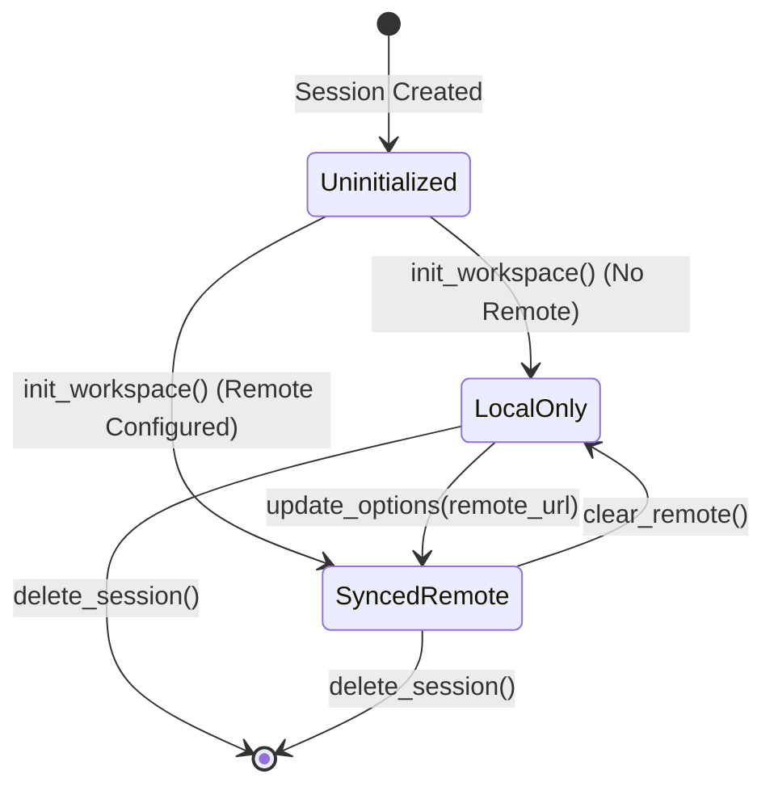
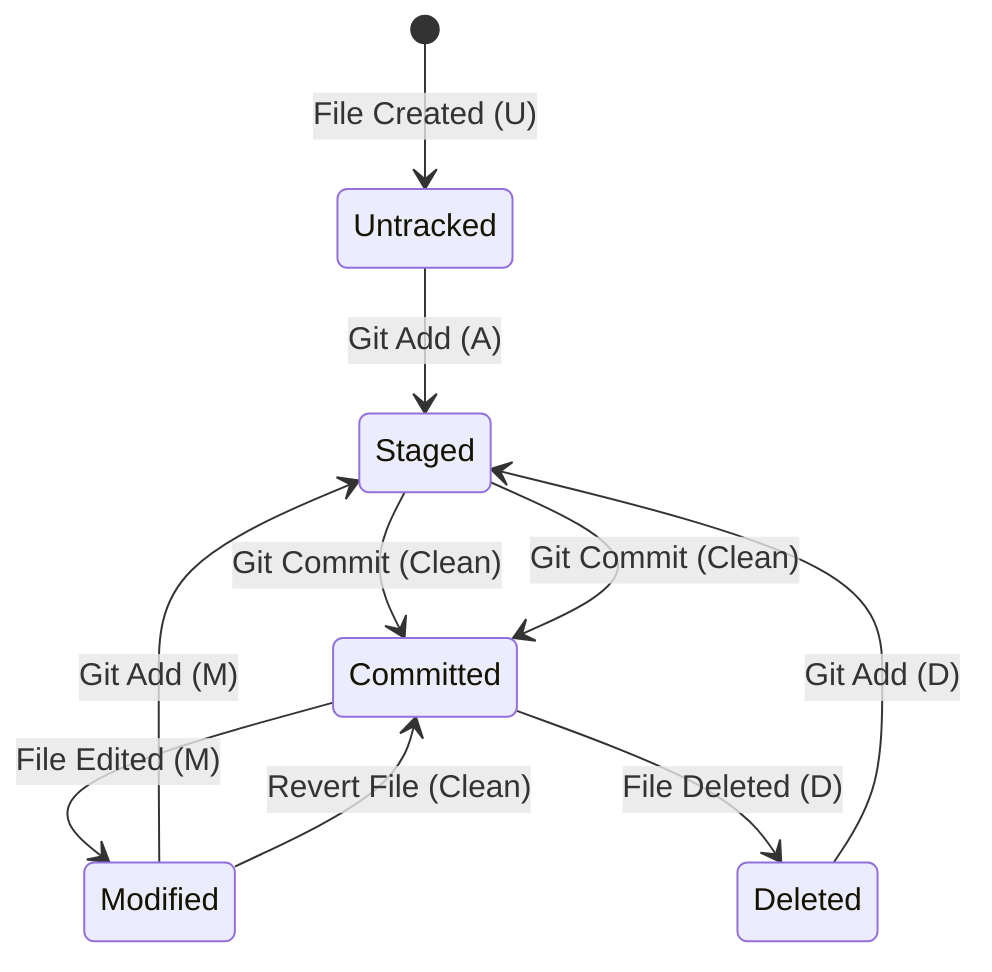

# Data Model: Engineering Workspace

This document defines the schema, entities, and data models for the Engineering Workspace feature.

## 1. Database Schema (SQLite)

We will add the `engineering_workspaces` table to the SQLite database to store metadata about each workspace and its remote configuration.

```sql
CREATE TABLE IF NOT EXISTS engineering_workspaces (
    workspace_id TEXT PRIMARY KEY,
    session_id TEXT NOT NULL UNIQUE,
    local_path TEXT NOT NULL,
    git_remote_url TEXT,
    git_username TEXT,
    git_token TEXT, -- Encrypted token
    created_at INTEGER NOT NULL,
    updated_at INTEGER NOT NULL,
    FOREIGN KEY (session_id) REFERENCES sessions(session_id) ON DELETE CASCADE
);
```

## 2. API Data Models (Pydantic / TypeScript)

### WorkspaceNode (Folder Tree Node)
Represents a single file or directory in the explorer tree, decorated with Git status metadata.

```python
from pydantic import BaseModel
from typing import List, Optional

class WorkspaceNode(BaseModel):
    name: str
    path: str
    type: str  # 'file' | 'directory'
    size: Optional[int] = None
    last_modified: int
    git_status: str  # 'Clean' | 'M' (Modified) | 'U' (Untracked) | 'A' (Added) | 'D' (Deleted)
    children: Optional[List['WorkspaceNode']] = None
```

```typescript
export interface WorkspaceNode {
  name: string;
  path: string;
  type: 'file' | 'directory';
  size: number | null;
  last_modified: number;
  git_status: 'Clean' | 'M' | 'U' | 'A' | 'D';
  children: WorkspaceNode[] | null;
}
```

### GitCommit
Represents a commit in the git log history.

```python
class GitCommit(BaseModel):
    commit_hash: str
    message: str
    author: str
    timestamp: int
```

```typescript
export interface GitCommit {
  commit_hash: string;
  message: string;
  author: string;
  timestamp: number;
}
```

### GitStatusResponse
Represents the status of staged and unstaged files.

```python
class GitStatusItem(BaseModel):
    path: str
    git_status: str  # 'M' | 'U' | 'A' | 'D'
    staged: bool

class GitStatusResponse(BaseModel):
    branch_name: str
    is_clean: bool
    changes: List[GitStatusItem]
```

## 3. State Transitions

### Workspace Lifecycle Transitions



### Git File Status State Diagram


