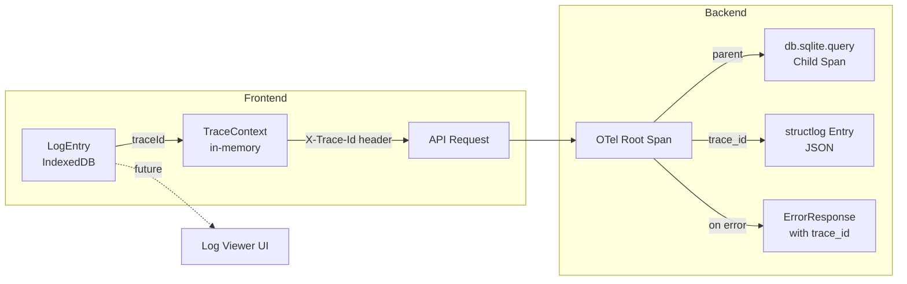

# Data Model: Quality, Testing & Observability Refactor

**Date**: 2026-06-03

## New Entities

### LogEntry (Frontend — IndexedDB)

| Field | Type | Description |
|-------|------|-------------|
| `id` | string (auto-generated) | Unique entry ID (UUID or auto-increment) |
| `timestamp` | string (ISO 8601) | When the log entry was created |
| `level` | enum: `debug`, `info`, `warn`, `error` | Log severity level |
| `message` | string | Log message content |
| `component` | string | Source component (e.g., `DashboardPage`, `agent-service`) |
| `traceId` | string | null | OTel trace ID for correlation with backend spans |
| `sessionId` | string | null | Active workspace session ID |
| `metadata` | Record<string, unknown> | Arbitrary structured data (error details, request params, etc.) |

**IndexedDB indexes**: `level`, `component`, `traceId`, `timestamp` (for efficient filtering)

**Retention**: FIFO eviction at 10,000 entries (configurable).

### ErrorResponse (Backend — Pydantic)

| Field | Type | Description |
|-------|------|-------------|
| `error_code` | string | Machine-readable error code (e.g., `WORKSPACE_NOT_FOUND`) |
| `message` | string | Human-readable error description |
| `trace_id` | string | OTel trace ID from the active span context |
| `details` | dict | null | Optional structured error context |

### TraceContext (Frontend — in-memory)

| Field | Type | Description |
|-------|------|-------------|
| `traceId` | string | Active trace ID from OTel or generated |
| `spanId` | string | Active span ID |
| `operationName` | string | Name of the current span (e.g., `ui.workspace.create`) |
| `startTime` | number | Epoch timestamp when span started |
| `duration` | number | null | Span duration in ms (null if in-progress) |
| `status` | enum: `ok`, `error`, `in-progress` | Current span status |

*Already exists in `store/types.ts` as `TraceContext`. No schema changes needed — used as-is.*

## Existing Entities (Unchanged)

The following existing SQLite tables are NOT modified by this feature:

- `engineering_workspaces` — workspace metadata
- `mcp_servers` — MCP server registry
- `mcp_tools` — MCP tool catalog
- `agent_contexts` — workspace agent context storage

## Relationships



## State Transitions

### LogEntry Lifecycle

```
Created → Persisted to IndexedDB → Queried by Log Viewer → Pruned (FIFO)
```

### Span Lifecycle

```
Started (by middleware/decorator) → Attributes set → Events recorded → Ended (success/error)
```

No complex state machines. All entities are append-only (logs) or request-scoped (spans, errors).
