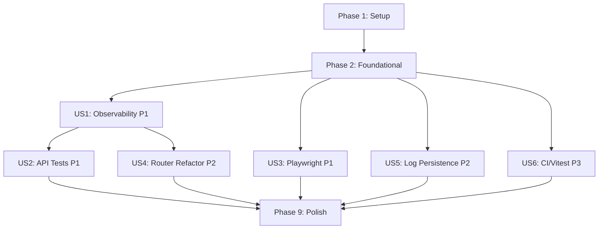

# Tasks: Quality, Testing & Observability Refactor

**Input**: Design documents from `/specs/008-quality-testing-observability/`

**Prerequisites**: plan.md (required), spec.md (required), research.md, data-model.md, contracts/error-response.md, quickstart.md

**Tests**: Tests are explicitly requested in the feature specification. All tests MUST pass at 100%.

**Organization**: Tasks are grouped by user story to enable independent implementation and testing of each story.

## Format: `[ID] [P?] [Story] Description`

- **[P]**: Can run in parallel (different files, no dependencies)
- **[Story]**: Which user story this task belongs to (e.g., US1, US2, US3)
- Include exact file paths in descriptions

---

## Phase 1: Setup (Shared Infrastructure)

**Purpose**: Create new directories, install dependencies, configure tooling

- [ ] T001 Create backend schema module directory and __init__.py in apps/api/src/api/schemas/__init__.py
- [ ] T002 [P] Create backend middleware directory and __init__.py in apps/api/src/api/middleware/__init__.py
- [ ] T003 [P] Create backend services directory and __init__.py in apps/api/src/api/services/__init__.py
- [ ] T004 [P] Create frontend test setup directory at apps/web/src/test/
- [ ] T005 [P] Add Vitest, @testing-library/react, @testing-library/jest-dom, @testing-library/user-event as dev dependencies in apps/web/package.json
- [ ] T006 [P] Add idb (IndexedDB wrapper) as dependency in apps/web/package.json
- [ ] T007 Configure Vitest in apps/web/vitest.config.ts with jsdom environment and test setup file
- [ ] T008 Create Vitest test setup with DOM matchers in apps/web/src/test/setup.ts

---

## Phase 2: Foundational (Blocking Prerequisites)

**Purpose**: Core observability infrastructure that MUST be complete before ANY user story can be implemented

**⚠️ CRITICAL**: No user story work can begin until this phase is complete

- [ ] T009 Create shared structlog configuration module with JSON renderer and trace_id binding in packages/core/src/core/logging.py
- [ ] T010 [P] Create shared OTel tracer factory with @traced decorator and traced_db context manager in packages/core/src/core/tracing.py
- [ ] T011 Create standardized ErrorResponse Pydantic model in apps/api/src/api/schemas/common.py per contracts/error-response.md
- [ ] T012 Create FastAPI tracing middleware that creates root span per request, extracts X-Trace-Id header, and injects trace_id into request state in apps/api/src/api/middleware/tracing.py
- [ ] T013 Register OTel middleware, configure structlog globally, register custom ErrorResponse exception handler in apps/api/src/api/main.py
- [ ] T014 Create centralized API fetch wrapper with auto-tracing (api.fetch spans), X-Trace-Id header propagation, and structured error logging in apps/web/src/services/api-client.ts
- [ ] T015 Create IndexedDB log store with addEntry, query, prune, getRecentEntries in apps/web/src/services/log-store.ts per data-model.md LogEntry schema

**Checkpoint**: Foundation ready — observability infrastructure operational, error responses standardized, api-client and log-store available for all stories

---

## Phase 3: User Story 1 — Developer Debugs a Failing Workspace Operation (Priority: P1) 🎯 MVP

**Goal**: All backend logs are structured JSON with trace_id. Every API endpoint has OTel spans. Frontend logs persist to IndexedDB. All API errors return standardized ErrorResponse.

**Independent Test**: Trigger workspace operations and verify structured JSON log entries contain trace_id, OTel spans appear in Jaeger, and frontend IndexedDB contains log entries.

### Tests for User Story 1

- [ ] T016 [P] [US1] Create OTel tracing test verifying span creation and trace_id propagation in apps/api/tests/test_tracing.py
- [ ] T017 [P] [US1] Create IndexedDB log store unit test covering addEntry, query, prune in apps/web/src/test/services/log-store.test.ts
- [ ] T018 [P] [US1] Create api-client unit test covering traced fetch, error capture, X-Trace-Id header in apps/web/src/test/services/api-client.test.ts

### Implementation for User Story 1

- [ ] T019 [P] [US1] Extract all Pydantic request/response models from workspace router into apps/api/src/api/schemas/workspace.py (25+ models)
- [ ] T020 [P] [US1] Extract sync_workspace_tools_to_hermes and sync_mcp_server_to_hermes into apps/api/src/api/services/hermes_sync.py
- [ ] T021 [US1] Extract activate_workspace business logic (direct SQL) from workspace router into packages/core/src/core/workspace.py as activate_workspace() function
- [ ] T022 [US1] Refactor apps/api/src/api/routers/workspace.py: replace import logging with structlog, import schemas from schemas/workspace.py, import services from services/hermes_sync.py, add @traced decorator to all handlers (target < 300 lines)
- [ ] T023 [P] [US1] Add @traced decorator and structlog to all handlers in apps/api/src/api/routers/agent.py with consistent ErrorResponse usage
- [ ] T024 [P] [US1] Add @traced decorator, remove inline sync functions, add consistent ErrorResponse usage in apps/api/src/api/routers/mcp.py
- [ ] T025 [US1] Wrap all SQLite operations in packages/core/src/core/workspace.py with traced_db for db.sqlite.query/db.sqlite.execute child spans
- [ ] T026 [US1] Update apps/web/src/services/logger.ts to persist log entries to IndexedDB via log-store.ts in addition to console output
- [ ] T027 [US1] Update apps/web/src/services/telemetry.ts to add startUISpan helper and ui.error.boundary span creation
- [ ] T028 [US1] Migrate apps/web/src/services/workspace-service.ts to use api-client.ts for all HTTP calls
- [ ] T029 [P] [US1] Migrate apps/web/src/services/agent-service.ts to use api-client.ts for all HTTP calls
- [ ] T030 [P] [US1] Migrate apps/web/src/services/mcp-service.ts to use api-client.ts for all HTTP calls
- [ ] T031 [P] [US1] Migrate apps/web/src/services/health-service.ts to use api-client.ts for all HTTP calls
- [ ] T032 [US1] Verify zero `import logging` in any router file; verify structlog JSON output; verify OTel spans in test

**Checkpoint**: All backend logs structured JSON, all endpoints traced, frontend logs persisted. US1 independently verifiable by running `pytest tests/test_tracing.py` and checking Jaeger UI.

---

## Phase 4: User Story 2 — Developer Runs Comprehensive API Tests (Priority: P1)

**Goal**: Every public API endpoint has at least one happy-path and one error-path pytest test. All tests pass at 100%.

**Independent Test**: Run `cd apps/api && PYTHONPATH=src uv run pytest tests/ -v` and verify 100% pass rate with every endpoint covered.

### Tests for User Story 2 (these ARE the deliverable)

- [ ] T033 [US2] Update apps/api/tests/conftest.py with shared mock_agent_engine fixture, traced_client fixture, and ErrorResponse assertion helper
- [ ] T034 [P] [US2] Add missing workspace API tests in apps/api/tests/test_workspace_api.py: test_create_workspace_invalid_name, test_create_workspace_invalid_path, test_get_workspace_by_id_not_found, test_save_agent_context_roundtrip, test_load_agent_context_not_found, test_activate_workspace_not_found, test_default_dir_endpoint, test_error_responses_include_trace_id
- [ ] T035 [P] [US2] Create complete agent router test suite in apps/api/tests/test_agent_api.py: test_create_session_success, test_create_session_backend_failure, test_list_sessions_success, test_list_sessions_empty, test_delete_session_success, test_delete_session_not_found, test_start_chat_success, test_start_chat_backend_failure, test_chat_stream_sse_events, test_get_active_agent, test_set_active_agent
- [ ] T036 [P] [US2] Add missing MCP API tests in apps/api/tests/test_mcp_api.py: test_toggle_tool_not_found, test_delete_server_not_found, test_install_server_success, test_uninstall_server_success, test_install_server_not_found
- [ ] T037 [US2] Run full pytest suite and fix any failures until 100% pass rate: `cd apps/api && PYTHONPATH=src uv run pytest tests/ -v --tb=short`

**Checkpoint**: Full API test suite passes at 100%. Every public endpoint covered. Run pytest to verify.

---

## Phase 5: User Story 3 — QA Engineer Validates All UI User Journeys with Playwright (Priority: P1)

**Goal**: Every page in the application has a Playwright spec file covering primary user flows, error states, and loading states. All tests pass at 100%.

**Independent Test**: Run `npx playwright test tests/ui-integration/` and verify 100% pass rate.

### data-testid Remediation (prerequisite for Playwright tests)

- [ ] T038 [P] [US3] Add missing data-testid attributes to apps/web/src/components/pages/DashboardPage.tsx: dashboard-workspace-card-{id}, dashboard-workspace-empty-state, dashboard-view-all-btn, dashboard-create-workspace-btn, dashboard-tool-registry-card, dashboard-file-vault-card
- [ ] T039 [P] [US3] Add missing data-testid attributes to apps/web/src/components/pages/ToolRegistryPage.tsx: tool-registry-register-btn, tool-registry-search-input, tool-registry-server-card-{id}
- [ ] T040 [P] [US3] Add missing data-testid attributes to apps/web/src/components/pages/FileVaultPage.tsx: file-vault-file-list, file-vault-file-item-{path}, file-vault-preview-panel, file-vault-download-btn
- [ ] T041 [P] [US3] Add missing data-testid attributes to apps/web/src/components/chat/SessionsSidebar.tsx: sessions-sidebar-item-{id}, sessions-sidebar-delete-btn-{id}
- [ ] T042 [P] [US3] Add missing data-testid attributes to apps/web/src/components/chat/WorkspacePanel.tsx: workspace-panel-tab-{name}, workspace-panel-file-node-{path}
- [ ] T043 [P] [US3] Add missing data-testid attributes to apps/web/src/components/chat/ChatTranscript.tsx (chat-message-{id}) and MessageBubble.tsx (message-bubble-{role}-{id})
- [ ] T044 [P] [US3] Add missing data-testid attributes to apps/web/src/components/common/FileTree.tsx: file-tree-node-{path}, file-tree-expand-btn-{path}
- [ ] T045 [P] [US3] Add missing data-testid attributes to apps/web/src/components/tools/ToolCard.tsx: tool-card-toggle-{id}, tool-card-install-btn-{id}, tool-card-remove-btn-{id}
- [ ] T046 [P] [US3] Add missing data-testid attributes to apps/web/src/components/tools/AddToolModal.tsx: add-tool-name-input, add-tool-type-select, add-tool-command-input, add-tool-submit-btn, add-tool-cancel-btn
- [ ] T047 [P] [US3] Add missing data-testid attributes to apps/web/src/components/layout/Sidebar.tsx nav items: sidebar-nav-{section}

### Playwright Tests for User Story 3

- [ ] T048 [US3] Expand tests/ui-integration/dashboard.spec.ts: add tests for empty state display, workspace list rendering, error state on API failure, view-all toggle, create modal validation errors
- [ ] T049 [P] [US3] Expand tests/ui-integration/agent-chat.spec.ts: add tests for workspace-not-found error state, loading indicator, chat API error handling, session delete, workspace panel display
- [ ] T050 [P] [US3] Create tests/ui-integration/workspace-panel.spec.ts: test file tree display, file creation, git status display, git commit flow, tool toggle, panel tab switching
- [ ] T051 [P] [US3] Create tests/ui-integration/tool-registry.spec.ts: test tool list rendering, register custom tool via modal, toggle activation, install/uninstall, delete with confirmation, registration error
- [ ] T052 [P] [US3] Create tests/ui-integration/file-vault.spec.ts: test file list rendering, STL preview, code preview, empty vault state
- [ ] T053 [P] [US3] Create tests/ui-integration/error-states.spec.ts: test API 500 error display, 404 workspace not found, loading indicators, network timeout handling
- [ ] T054 [US3] Run full Playwright UI integration suite and fix any failures until 100% pass rate: `npx playwright test tests/ui-integration/`

**Checkpoint**: All Playwright UI integration tests pass at 100%. Every page has a spec file. All interactive elements have data-testid.

---

## Phase 6: User Story 4 — Developer Refactors Workspace Router for Clean Interfaces (Priority: P2)

**Goal**: Workspace router is under 300 lines. All business logic is in core/service modules. All Pydantic models are in schemas module.

**Independent Test**: Verify `wc -l apps/api/src/api/routers/workspace.py` returns under 300. Run pytest to confirm no regressions.

### Implementation for User Story 4

> Note: Most refactoring tasks for US4 are already included in Phase 3 (US1) tasks T019-T022. This phase covers verification and cleanup.

- [ ] T055 [US4] Verify workspace router is under 300 lines: `wc -l apps/api/src/api/routers/workspace.py`
- [ ] T056 [US4] Verify zero direct SQL queries remain in workspace router (all delegated to core functions)
- [ ] T057 [US4] Verify all Pydantic models are imported from apps/api/src/api/schemas/workspace.py, not defined inline
- [ ] T058 [US4] Run full pytest suite to confirm no regressions after refactoring: `cd apps/api && PYTHONPATH=src uv run pytest tests/ -v`

**Checkpoint**: Router is clean, thin, under 300 lines. All tests still pass at 100%.

---

## Phase 7: User Story 5 — Developer Integrates Frontend Log Persistence for Future Log Viewer (Priority: P2)

**Goal**: Frontend logs persist to IndexedDB. Log store supports querying by level, component, traceId, time range. Retention auto-prunes at configurable limit.

**Independent Test**: Trigger UI actions, then query IndexedDB via DevTools to verify entries exist with proper structure.

### Implementation for User Story 5

> Note: Core log-store.ts and logger.ts updates are already included in Phase 2 (T015) and Phase 3 (T026). This phase covers query API and retention.

- [ ] T059 [US5] Add configurable retention limit (default 10,000) with FIFO pruning to apps/web/src/services/log-store.ts
- [ ] T060 [US5] Add query filters (level, component, traceId, time range) to log-store.ts for future Log Viewer consumption
- [ ] T061 [US5] Add sessionId field binding from active workspace context in apps/web/src/services/logger.ts
- [ ] T062 [US5] Verify graceful fallback to console-only when IndexedDB is unavailable (incognito mode) in logger.ts
- [ ] T063 [US5] Update log-store.test.ts to cover retention pruning, query filters, and fallback behavior

**Checkpoint**: Frontend log persistence complete. Entries survive page refresh. Queryable for future Log Viewer.

---

## Phase 8: User Story 6 — CI Pipeline Runs Full Test Suite with Confidence (Priority: P3)

**Goal**: Vitest component tests cover 6+ critical components. System E2E test verifies live stack. All test tiers pass at 100%.

**Independent Test**: Run all three test tiers locally and verify they complete with 100% pass rate.

### Vitest Component Tests (Tier 1)

- [ ] T064 [P] [US6] Create component test for CreateWorkspaceModal in apps/web/src/test/components/CreateWorkspaceModal.test.tsx: modal open/close, form validation, submit success, submit error
- [ ] T065 [P] [US6] Create component test for ChatLayout in apps/web/src/test/components/ChatLayout.test.tsx: renders three-panel layout, sidebar toggle
- [ ] T066 [P] [US6] Create component test for SessionsSidebar in apps/web/src/test/components/SessionsSidebar.test.tsx: empty list, populated list, create session click, delete session click
- [ ] T067 [P] [US6] Create component test for MessageComposer in apps/web/src/test/components/MessageComposer.test.tsx: empty input disabled, type + send, keyboard shortcut
- [ ] T068 [P] [US6] Create component test for FileTree in apps/web/src/test/components/FileTree.test.tsx: render tree, expand/collapse, click file, empty tree
- [ ] T069 [P] [US6] Create component test for ToolCard in apps/web/src/test/components/ToolCard.test.tsx: render card data, toggle activation, install click, remove click

### System E2E Tests (Tier 3)

- [ ] T070 [US6] Create full-stack workspace creation E2E test in tests/e2e/workspace-creation.spec.ts: POST /api/workspace/create, verify in UI
- [ ] T071 [P] [US6] Create smoke test in tests/e2e/smoke.spec.ts: health endpoint check, dashboard renders, navigate to each section
- [ ] T072 [US6] Update playwright.config.ts to include tests/e2e/ directory with separate project configuration for E2E tests

### Verification

- [ ] T073 [US6] Run Vitest component tests and fix any failures until 100% pass: `cd apps/web && npx vitest run`
- [ ] T074 [US6] Run E2E tests against live stack and fix any failures until 100% pass: `npx playwright test tests/e2e/`

**Checkpoint**: All three test tiers pass at 100%. Component, integration, and E2E coverage complete.

---

## Phase 9: Polish & Cross-Cutting Concerns

**Purpose**: Final verification, documentation, and cross-cutting cleanup

- [ ] T075 Verify zero `import logging` remaining in any backend router or core file: `grep -rn "import logging" apps/api/src/ packages/`
- [ ] T076 [P] Verify all interactive UI elements have data-testid by running audit: `grep -rn "data-testid" apps/web/src/components/ | wc -l`
- [ ] T077 [P] Verify OpenTelemetry span names follow semantic hierarchy from spec.md: workspace.create, workspace.files.list, agent.chat.start, db.sqlite.query, etc.
- [ ] T078 Run complete test suite (all tiers) end-to-end and verify 100% pass rate
- [ ] T079 Update quickstart.md with final test commands and verification steps in specs/008-quality-testing-observability/quickstart.md
- [ ] T080 Run constitution compliance re-check against all 11 gates in plan.md

---

## Dependencies & Execution Order

### Phase Dependencies

- **Setup (Phase 1)**: No dependencies — can start immediately
- **Foundational (Phase 2)**: Depends on Setup completion — BLOCKS all user stories
- **US1 (Phase 3)**: Depends on Foundational — BLOCKS US2 (API tests need refactored code)
- **US2 (Phase 4)**: Depends on US1 (tests must test the refactored endpoints)
- **US3 (Phase 5)**: Can start after Foundational — data-testid tasks are independent of backend work
- **US4 (Phase 6)**: Depends on US1 (verification of refactoring already done in US1)
- **US5 (Phase 7)**: Can start after Foundational — frontend log store is independent
- **US6 (Phase 8)**: Can start after Foundational — component tests are independent
- **Polish (Phase 9)**: Depends on ALL user stories being complete

### User Story Dependencies



### Within Each User Story

- Tests written FIRST, verified to fail before implementation
- Models/schemas before services
- Services before route handlers
- Core implementation before integration
- Story complete before verification checkpoint

### Parallel Opportunities

- All Setup tasks (T001-T008) marked [P] can run in parallel
- Foundational tasks T009 and T010 can run in parallel
- **After Foundational**: US3, US5, and US6 can all start in parallel with US1
- Within US1: T019, T020, T023, T024, T029-T031 are all parallelizable
- Within US3: All data-testid tasks (T038-T047) can run in parallel
- Within US3: All Playwright spec files (T049-T053) can run in parallel after data-testid tasks
- Within US6: All Vitest component tests (T064-T069) can run in parallel

---

## Parallel Example: User Story 1

```bash
# Launch all parallelizable tests first:
Task: "Create OTel tracing test in apps/api/tests/test_tracing.py"           # T016
Task: "Create IndexedDB log store test in apps/web/src/test/services/"       # T017
Task: "Create api-client test in apps/web/src/test/services/"                # T018

# Launch all parallelizable implementation tasks:
Task: "Extract Pydantic models to apps/api/src/api/schemas/workspace.py"     # T019
Task: "Extract sync functions to apps/api/src/api/services/hermes_sync.py"   # T020
Task: "Add tracing to apps/api/src/api/routers/agent.py"                     # T023
Task: "Add tracing to apps/api/src/api/routers/mcp.py"                      # T024
```

## Parallel Example: User Story 3 (data-testid)

```bash
# All data-testid tasks can run simultaneously (different component files):
Task: "Add data-testid to DashboardPage.tsx"           # T038
Task: "Add data-testid to ToolRegistryPage.tsx"        # T039
Task: "Add data-testid to FileVaultPage.tsx"           # T040
Task: "Add data-testid to SessionsSidebar.tsx"         # T041
Task: "Add data-testid to WorkspacePanel.tsx"          # T042
Task: "Add data-testid to ChatTranscript/MessageBubble"# T043
Task: "Add data-testid to FileTree.tsx"                # T044
Task: "Add data-testid to ToolCard.tsx"                # T045
Task: "Add data-testid to AddToolModal.tsx"            # T046
Task: "Add data-testid to Sidebar.tsx"                 # T047
```

---

## Implementation Strategy

### MVP First (User Story 1 Only)

1. Complete Phase 1: Setup
2. Complete Phase 2: Foundational (CRITICAL — blocks all stories)
3. Complete Phase 3: User Story 1 (Observability)
4. **STOP and VALIDATE**: Verify structured logs, OTel spans, error responses
5. All backend code is now clean and observable

### Incremental Delivery

1. Complete Setup + Foundational → Infrastructure ready
2. Add US1 (Observability) → Backend fully instrumented (MVP!)
3. Add US2 (API Tests) → Backend fully tested → Safe to refactor further
4. Add US3 (Playwright) → Frontend fully tested
5. Add US4 (Router Refactor Verification) → Code quality validated
6. Add US5 (Log Persistence) → Frontend observable for future Log Viewer
7. Add US6 (Vitest + E2E) → Full test pyramid complete
8. Polish → All gates pass, constitution compliant

### Parallel Team Strategy

With multiple developers:

1. Team completes Setup + Foundational together
2. Once Foundational is done:
   - Developer A: US1 (Backend Observability) → US2 (API Tests) → US4 (Verification)
   - Developer B: US3 (Playwright + data-testid)
   - Developer C: US5 (Log Persistence) + US6 (Vitest + E2E)
3. Stories complete and integrate independently
4. Team completes Polish phase together

---

## Notes

- [P] tasks = different files, no dependencies
- [Story] label maps task to specific user story for traceability
- Each user story is independently completable and testable
- All tests must pass at 100% before a story is considered complete
- Commit after each task or logical group
- Stop at any checkpoint to validate story independently
- The spec requires 100% pass rate for ALL test suites — no exceptions
