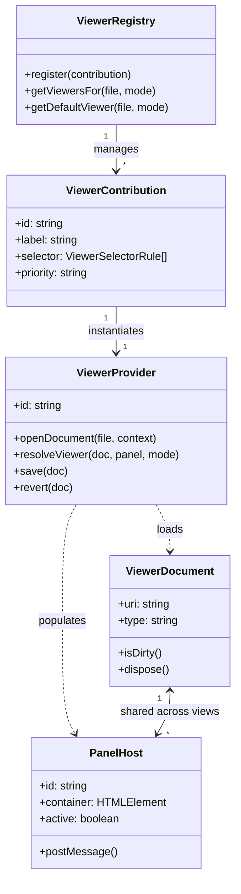

# Data Model: Pluggable Viewer Panel API

This document details the logical entities and attributes for the pluggable viewer panel subsystem.

## Entities & Attributes

### 1. FileDescriptor
A descriptor representing a workspace file metadata resource.

| Field | Type | Description | Validation / Constraints |
|---|---|---|---|
| `id` | string | Unique internal identifier | Non-empty, alphanumeric |
| `uri` | string | Canonical file path or URI | Must be a valid URI |
| `name` | string | Display name of the file | Non-empty |
| `extension`| string | Lowercase file extension (without dot) | e.g. "py", "step", "pdf" |
| `mimeType` | string | Standard MIME classification | e.g. "application/step" |
| `size` | number | Optional size of file in bytes | Non-negative integer |
| `metadata` | Record | Custom key-value metadata | Optional |

### 2. ViewerDocument
Representing the memory model of the document data layer.

| Attribute / Method | Type / Signature | Description |
|---|---|---|
| `uri` | string (readonly) | The canonical document source URI |
| `type` | string (readonly) | Logical category name |
| `isDirty()` | () => boolean | Checks if changes are unsaved |
| `markClean()` | () => void | Resets the dirty status |
| `dispose()` | () => void | Releases document bindings and memory |

### 3. PanelHost
Representing the tab/layout container within the editor panel.

| Attribute / Method | Type / Signature | Description |
|---|---|---|
| `id` | string (readonly) | Unique tab panel ID |
| `title` | string | Display title in the tab bar |
| `container` | HTMLElement | DOM mount point for the viewer |
| `active` | boolean (readonly) | Tab is currently selected and active |
| `visible` | boolean (readonly) | Tab is visible inside viewport |
| `postMessage(msg)` | (msg: unknown) => void | Sends a message to the viewer context |

### 4. ViewerContribution
The registration metadata of a registered viewer provider.

| Field | Type | Description |
|---|---|---|
| `id` | string | Unique provider identifier (e.g. "step-3d") |
| `label` | string | User-friendly display label |
| `selector` | ViewerSelectorRule[] | Selection rules for matching files |
| `priority` | "default" \| "option" | Choice selection priority hierarchy |
| `providerFactory` | () => ViewerProvider | Callback to instantiate the provider |

## Relationships

