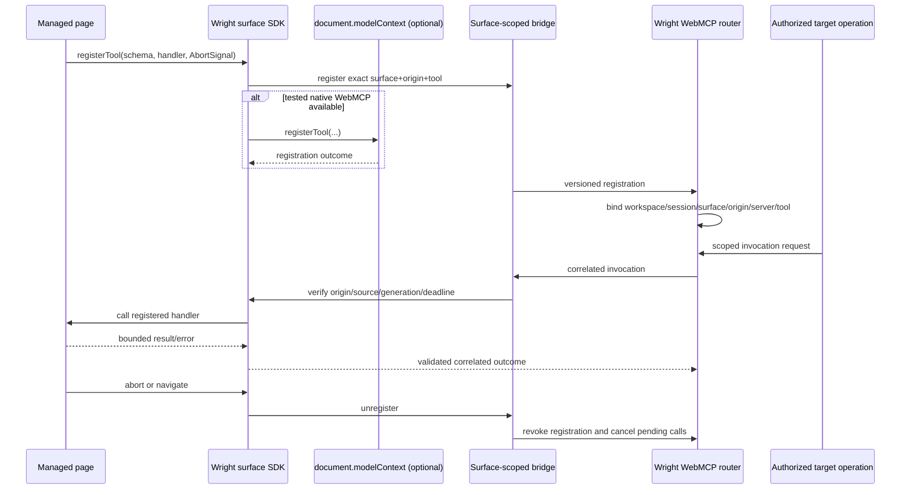

# Workspace Surface Lifecycles

These sequences define ownership, authority, cleanup and observable states. Each external action is idempotent by request key and emits trace-linked, redacted diagnostic events.

## Managed Live Application

```mermaid
sequenceDiagram
  actor User
  participant Web as Wright client
  participant API as Surface API
  participant Svc as SurfaceService
  participant Pol as Policy/Grants
  participant Proc as Process adapter
  participant App as BREP/web app
  participant Prev as Preview origin

  User->>Web: Open declared app in panel/browser
  Web->>API: start/open(surface, preference, idempotency key)
  API->>Svc: authenticated workspace-scoped command
  Svc->>Pol: validate manifest, RBAC, source version, capabilities
  Pol-->>Svc: allow / consent required / deny
  Svc->>Proc: allocate loopback endpoint and launch argv
  Proc-->>Svc: PID+creation time+job/group ownership
  Svc->>App: bounded readiness probes
  App-->>Svc: ready
  Svc->>Svc: create immutable TargetPin and ready generation
  Svc-->>API: descriptor + eligible presentation
  API-->>Web: absolute URL with single-use token fragment
  Web->>Prev: load token-free bootstrap document
  Web->>Prev: POST fragment token in request body
  Prev->>Prev: verify audience/user/workspace/instance; set host-only cookie
  Prev-->>Web: set cookie; bootstrap clears fragment and navigates to clean app root
  Web->>Prev: HTTP / WebSocket / SSE
  Prev->>App: stripped, target-pinned request
  App-->>Prev: preserved response/stream/frames
  Prev-->>Web: isolated presentation
  User->>Web: Close presentation or stop runtime
  Web->>API: explicit close OR stop
  API->>Svc: state command
  alt close presentation
    Svc->>Svc: revoke presentation credential; apply lifetime policy
  else stop owned runtime
    Svc->>Proc: graceful tree stop, then bounded escalation
    Proc-->>Svc: reconciliation evidence
    Svc->>Svc: revoke pins, presentations and instance grants
  end
```

Rules:

- `starting` is recorded before launch; readiness success atomically creates the target pin and moves to `ready`.
- App-specific lifetime wins; omitted lifetime is `workspace`. Closing the last view does not implicitly stop a workspace-lifetime app.
- Panel and browser presentations reuse one shareable instance, including simultaneous idempotent opens; an isolated manifest discloses the distinction and creates a new instance deliberately. Per-source single-instance starts serialize and return the existing starting/ready generation.
- Unhealthy can recover to ready without changing generation; process exit or target ownership loss moves to failed and invalidates presentation authority.
- Browser-open failure does not stop the app. It returns a stable host-adapter error with a copyable safe action.

## Python Display and Update

```mermaid
sequenceDiagram
  actor Engineer
  participant Run as Wright Python runner
  participant Py as User program + wright package
  participant API as Display ingestion API
  participant Vault as SQLite/file vault
  participant Web as Surface renderer

  Engineer->>Run: Run beginner_graph.py
  Run->>Py: inject execution-scoped endpoint/token
  Py->>Py: wright.line(...) or wright.display(value)
  Py->>API: versioned MIME bundle + display_id + idempotency key
  API->>API: authenticate execution/workspace; validate/limit/serialize
  API->>Vault: store immutable payload revision and current pointer
  Vault-->>API: surface/revision
  API-->>Py: accepted descriptor
  API-->>Web: surface created/updated event
  Web->>Web: select safe typed renderer and show revision
  Engineer->>Run: Change data and rerun
  Py->>API: higher revision for same logical display_id
  API->>Vault: append revision; compare-and-set current
  API-->>Web: update existing logical surface
```

Rules:

- Producer completion is not required for display visibility, but a durable accepted revision remains after process exit.
- Duplicate idempotency keys return the original revision. Late/lower revisions cannot replace current output.
- Ordinary HTML is sanitized; Plotly is typed data with bundled renderer; explicit active HTML becomes a separate unprivileged source kind/profile and receives no bridge.
- Missing endpoint/token yields an actionable message explaining that the program must run through Wright or an explicitly configured local display session.

## MCP App

```mermaid
sequenceDiagram
  participant MCP as Child MCP server
  participant GW as Wright MCP gateway
  participant Svc as SurfaceService
  participant Host as MCP App host bridge
  participant Proxy as Distinct-origin sandbox proxy
  participant View as Inner MCP App view

  MCP-->>GW: tool metadata _meta.ui.resourceUri
  GW->>GW: preserve canonical/server-scoped association
  GW-->>Svc: UI-capable result + meaningful fallback
  Svc->>GW: resources/read(server connection, ui:// URI)
  GW->>MCP: scoped resources/read
  MCP-->>GW: text/html;profile=mcp-app + UI metadata
  GW-->>Svc: content + hash + policy projection
  Svc-->>Host: McpAppSurface descriptor
  Host->>Proxy: initialize raw HTML + validated CSP/permissions
  Proxy->>View: create sandboxed inner document
  View->>Host: versioned JSON-RPC postMessage
  Host->>Host: verify source/origin/instance/protocol/capability
  Host->>GW: same-server resource/tool/context operation
  GW->>GW: visibility, RBAC, grant, schema, audit
  GW-->>Host: result/error
  Host-->>View: exact-target correlated response
  Host->>Proxy: teardown on close/navigation/session end
```

Rules:

- The server connection identity is part of every UI resource/tool call; URI equality never crosses servers.
- A resource can be fetched by exact read even if it was omitted from list.
- No host message is sent before the official initialization lifecycle completes.
- Undeclared domains/permissions use restrictive defaults; tool calls require same server and app visibility.
- Stable fallback content is shown when UI negotiation, resource load, CSP, or renderer support fails.

## WebMCP Adapter



No global window event or tool-name-only routing participates. Native draft registration is an optional additional exposure, not a replacement for the stable Wright contract.

## Startup Reconciliation

1. Mark persisted nonterminal runtime/presentation records `reconciling` internally and make them ineligible for new presentation.
2. Verify workspace still exists and source version/policy remain valid.
3. For Wright-owned runtime, verify PID+creation time, platform job/group/container identity, generation and listening target ownership.
4. If all evidence matches, create fresh target/presentation authority and project the applicable lifecycle state.
5. If owned evidence proves a stale/leaked tree, stop it and mark stopped/failed with recovery evidence.
6. If ownership cannot be proved, do not kill/adopt it; mark failed and show a deliberate restart/diagnostic action.
7. Expire all old bootstrap tokens/cookies, target pins, instance grants and WebMCP registrations.

API composition completes this reconciliation before accepting new surface starts
or presentations. Shutdown rejects new commands, revokes presentation/message
authority, cancels streams, stops and reconciles owned runtimes, flushes the
SQLite/vault outbox and diagnostics, and only then closes the MCP gateway,
workspace executor, telemetry provider, and storage adapters. Exact bounds and
degraded-platform rules are defined in `policy-defaults.md`.

## Failure, Cancellation and Ordering

- Client disconnect cancels downstream proxy work unless a declared durable operation is already accepted.
- Closing a tab disposes its presentation exactly once; stopping an app invalidates every presentation before terminating the process tree.
- Workspace closure rejects new surface commands, revokes authority, cancels pending messages/streams, stops owned workspace-lifetime runtimes, reconciles ports/processes, then completes.
- Wright shutdown follows the same order across all workspaces with a global deadline and recovery record for failures.
- A machine sleep/network interruption may move health to unknown/unhealthy but cannot extend expired authority silently.
- Every response/event includes the current surface revision/generation so the client discards stale state.

## Retained Client Host Policy

- Stateful live/MCP/WebMCP hosts remain mounted while inactive, hidden with accessible inactive semantics and bounded by a configurable retained-host limit.
- Static file and MIME hosts may serialize view state and suspend.
- On pressure, the client requests suspend/teardown only if the surface profile supports it; otherwise it explains reload risk before eviction.
- Close presentation, close surface tab, detach view, stop runtime and delete durable output are distinct commands with distinct confirmations/effects.
