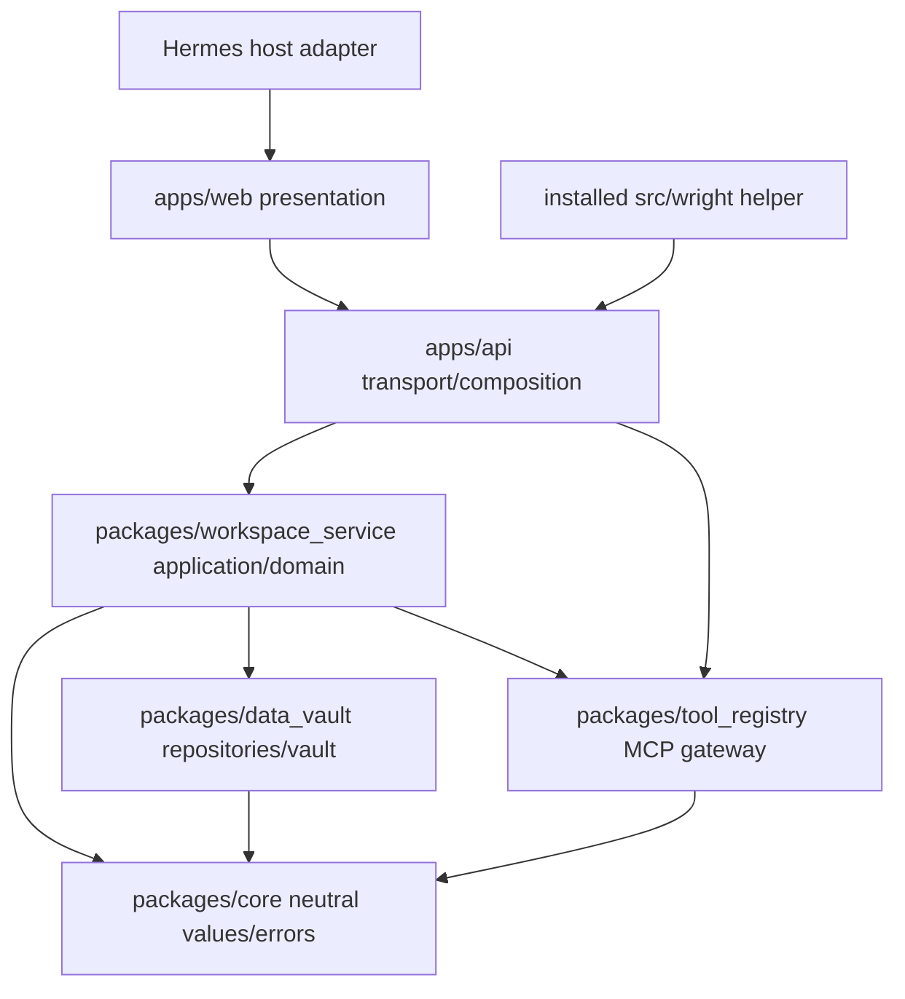

# Workspace Surfaces Package Ownership

## Dependency Direction

No inward package imports FastAPI routes, React, Electron, an optional app framework, or a specific agent manager. The authoritative dependency graph is `architecture/python-packages.toml`; any new edge updates that manifest, package metadata/README, and `tests/test_import_boundaries.py` evidence together.

## Ownership Matrix

| Concern | Owner | Must not own |
|---|---|---|
| Side-effect-neutral surface IDs/values/errors/redaction/telemetry contracts | `core` | Filesystem, process, database, FastAPI or framework behavior |
| Surface aggregate/state transitions/use cases | `workspace_service` using `core` values | React state or route serialization |
| Launch/attach/readiness/health/lifetime/process tree | `workspace_service` ports/use cases/adapters | MCP metadata or UI rendering |
| Target validation/pinning and proxy policy | `workspace_service` | Arbitrary URL selection from API request |
| Display ingestion/serialization policy | `workspace_service` plus public `src/wright` producer adapters | Browser executable renderer implementation |
| Surface metadata/grants/preferences/runtime persistence | `data_vault` repositories through `workspace_service` ports | Authorization decisions |
| MCP UI capability negotiation/metadata/resources/visibility | `tool_registry` | Live process management or React bridge DOM |
| HTTP/Pydantic/auth/composition | `apps/api` | Business/state-transition logic |
| HTTP/WS/SSE data-plane transport adapter | `apps/api` router invoking preview service | Target authorization or target choice |
| Surface registry/renderers/retained deck/focus UI | `apps/web` | Runtime truth, target URL construction or grant authority |
| MCP App host/client message validation | `apps/web` for window/source checks; gateway/service for authority | Tool policy solely in browser |
| WebMCP SDK/native feature detection | `apps/web/services/surfaces` | Global window broadcast |
| System browser open/desktop endpoint resolution | host-adapter contract + Electron implementation | Arbitrary shell/IPC access |
| Public beginner API/value adapters | `src/wright` | Server lifecycle or durable credentials |
| Examples/conformance fixtures | `examples/workspace-surfaces`, `tests` | Production branching/special cases |

## Public Boundaries

### `workspace_service`

Exposes typed commands/queries such as declare, start, stop, restart, open/close presentation, ingest/update display, decide/revoke grant, diagnose and reconcile. It accepts authenticated actor/workspace/session context as explicit parameters and returns domain projections/errors. It owns transactions and idempotency.

Ports cover repositories/vault, token issuance, clock/IDs, process supervisor, resolver/connector, preview transport, browser capability projection, event publisher and MCP UI gateway. Platform/network libraries remain adapters.

### `tool_registry`

Exposes server-scoped UI capability/resource operations and app-originated calls. It preserves original upstream provenance and canonical projection, applies same-server visibility/policy, and audits decisions. `workspace_service` refers to an opaque MCP binding, not an upstream client implementation.

### `apps/api`

Routes perform authentication, Pydantic parse, dependency resolution, command invocation and response projection only. Preview routes receive an already authorized presentation and delegate request/stream/frame handling to the preview application service. No route resolves arbitrary destinations or owns lifecycle state.

### `apps/web`

The browser treats descriptors as projections, not truth. It never turns a source URL into a preview proxy URL, mints authority, or authorizes a tool. It does own DOM/window origin checks because only the browser can prove `event.source`; the backend repeats all authority/scoping checks.

### `src/wright`

The installed helper serializes supported values to the public display envelope and sends them only to an execution-scoped endpoint. Importing it has no server/process/network side effect. Optional plotting imports are lazy. `wright.line(...)` works with core dependencies and returns a display handle with update/close metadata, not hidden global runtime authority.

## Forbidden Couplings

- FastAPI route importing a concrete process or SQLite adapter.
- React constructing upstream target URLs, commands, ports, cookies or grants.
- `workspace_service` importing `tool_registry` internals instead of a port/public service contract.
- MCP server/resource identity reduced to URI/tool name alone.
- Optional Panel/Streamlit/Gradio/Dash dependencies imported by core runtime.
- Electron exposing generic shell, arbitrary IPC, raw tokens or preload APIs to surface frames.
- File provider forced to implement live-app lifecycle; compatibility adapter separates the contracts.
- Surface-specific exceptions added to `WorkspacePanel`, fixed legacy proxy or global WebMCP service instead of registry/use-case abstractions.

## Review Rules

Every implementation task names its package owner and required contract test. Review rejects business logic in routes, authorization only in the client, target selection from request-controlled URLs, manager-specific lifecycle in the runtime core, and cross-package imports that bypass public exports. Circular dependency checks and import-boundary tests are added to the standard gate.
