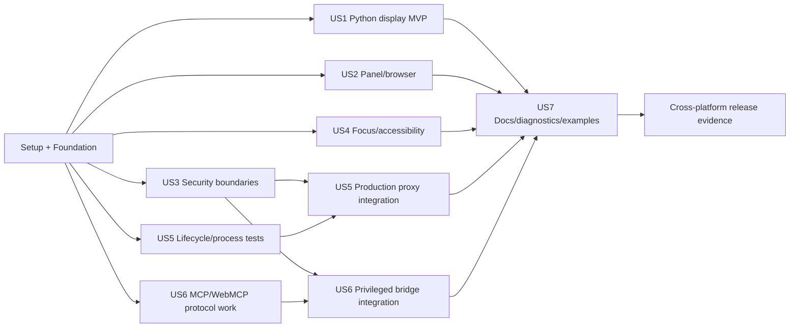

# Tasks: Workspace Surfaces

**Input**: Design documents from `specs/053-workspace-surfaces/`

**Prerequisites**: `plan.md`, `spec.md`, `research.md`, `data-model.md`, `threat-model.md`, `lifecycle.md`, `migration.md`, `package-ownership.md`, `quickstart.md`, and `contracts/`

**Testing discipline**: Tests are mandatory. In every user-story phase, complete the listed tests first, run them to record the expected failure, then implement until they pass. Do not weaken a test to match an incomplete implementation.

**Organization**: Tasks are grouped by the seven user stories so each story has an independent acceptance path. Requirement and success-criterion identifiers are included for deterministic traceability.

## Format: `[ID] [P?] [Story] Description`

- **[P]**: Can be worked in parallel because it targets different files and has no incomplete dependency.
- **[Story]**: Maps to a user story in `spec.md`; setup, foundational, and final tasks have no story label.
- Every task names the authoritative file or directory it changes or verifies.

---

## Phase 1: Setup and Contract Scaffolding

**Purpose**: Prepare package exports, locked dependencies, configuration, fixtures, and test projects without changing existing viewer behavior.

- [X] T001 Add version-pinned `@modelcontextprotocol/ext-apps`, `dompurify`, `plotly.js-dist-min`, and required type packages to `apps/web/package.json` and `apps/web/package-lock.json`, recording license/provenance review inputs in `docs/security/dependency-review.md` (FR-014, FR-028, FR-051)
- [X] T002 Add the installed public `wright` package and package-data entries for schemas/renderer assets to `pyproject.toml`, `src/wright/__init__.py`, and wheel-content assertions in `tests/packaging/test_wheel_contents.py` (FR-010, FR-017, FR-051)
- [X] T003 [P] Add surface feature flags, preview-host/domain settings, bootstrap TTL, and every version-1 runtime/proxy/retention default from `specs/053-workspace-surfaces/policy-defaults.md` to `packages/workspace_service/src/workspace_service/config.py`, `apps/api/src/api/config.py`, and `.env.example` (FR-025, FR-027, FR-036, FR-043)
- [X] T004 [P] Create package export scaffolding in `packages/core/src/core/surfaces/__init__.py`, `packages/workspace_service/src/workspace_service/surfaces/__init__.py`, `packages/tool_registry/src/tool_registry/ui/__init__.py`, and `apps/web/src/services/surfaces/index.ts` (FR-001, FR-053)
- [X] T005 [P] Copy/version the approved JSON/OpenAPI contracts into production package data under `packages/core/src/core/surfaces/schemas/` and add checksum drift validation in `tests/contract/workspace_surfaces/test_schema_sync.py` (FR-053)
- [X] T006 [P] Create reference and hostile fixture roots under `examples/workspace-surfaces/` and `tests/fixtures/workspace_surfaces/` with README ownership rules in both directories (FR-055)
- [X] T007 [P] Add `workspace_surfaces` pytest markers/extras and cross-platform fixture discovery to `pyproject.toml` and `tests/conftest.py` (FR-052, SC-010)
- [X] T008 [P] Add Chromium, Firefox, WebKit, and desktop-surface project definitions with explicit feature detection to `playwright.config.ts` and `tests/ui-integration/playwright.workspace-surfaces.ts` (FR-032, FR-052, SC-010)
- [X] T009 Update the enforced dependency graph and package metadata for any new public imports in `architecture/python-packages.toml`, `packages/core/pyproject.toml`, `packages/data_vault/pyproject.toml`, `packages/workspace_service/pyproject.toml`, and their README files (FR-053)
- [X] T010 Run and record setup-only lock, import-boundary, schema-sync, and package-manifest checks in `specs/053-workspace-surfaces/evidence/setup.md` before foundational implementation (FR-051, FR-053)

---

## Phase 2: Foundational Surface Model and Boundaries

**Purpose**: Establish neutral values, persistence, application ports, API projections, frontend registry/store, compatibility migration, and telemetry required by every story.

**CRITICAL**: No user-story implementation starts until this phase passes its tests.

### Foundational tests — write and observe failure first

- [X] T011 [P] Add exhaustive `SurfaceDescriptor`, source-kind, lifecycle-transition, identity, generation, and stable-error tests to `packages/core/tests/surfaces/test_models.py` (FR-001 through FR-003, FR-053)
- [X] T012 [P] Add migration-6 order/checksum/backup/future-schema and surface-repository isolation tests to `packages/data_vault/tests/test_surface_migration.py` and `packages/data_vault/tests/test_surface_repository.py` (FR-002, FR-008, FR-045)
- [X] T013 [P] Add workspace/user/session cross-scope, explicit engineer/admin surface-authority matrix, optimistic revision, idempotency, and illegal-transition service tests to `packages/workspace_service/tests/surfaces/test_surface_service.py` (FR-002 through FR-003, FR-038, FR-045)
- [X] T014 [P] Add authenticated engineer/admin Pydantic request/response, forbidden-role, and zero-route-business-logic contract tests to `apps/api/tests/test_surfaces_api_contract.py` (FR-002, FR-038, FR-053)
- [X] T015 [P] Add structured redaction, trace propagation through every SQLite/vault read/write, generated-artifact prompt/constraints/script access and non-log-leakage, stable diagnostic code, and forbidden-secret tests to `packages/core/tests/surfaces/test_telemetry.py` and `packages/workspace_service/tests/surfaces/test_diagnostics.py` (FR-044, FR-049 through FR-050)
- [X] T016 [P] Add discriminated descriptor parsing, stable ID, revision, malformed-state, and version-2 layout migration tests to `apps/web/src/services/surfaces/surface-contract.spec.ts` and `apps/web/src/store/surfaces.spec.tsx` (FR-001 through FR-003, FR-008)
- [X] T017 [P] Add file-provider compatibility/selection/save/revert/dispose and current file-content API regression tests to `apps/web/src/services/surfaces/file-surface-adapter.spec.ts` and `apps/api/tests/test_workspace_file_content_compat.py` (FR-009, SC-011)
- [X] T018 [P] Extend dependency-fitness tests for all new static/dynamic imports in `tests/test_import_boundaries.py` (constitution package boundaries)
- [X] T019 [P] Add installed-wheel import, schema asset, and no-import-side-effect tests to `tests/packaging/test_wright_surface_package.py` (FR-010, FR-051, FR-053)

### Foundational implementation

- [X] T020 Implement side-effect-neutral surface IDs, source discriminators, descriptor/generation-provenance values, lifecycle enums/transitions, revisions, and validation in `packages/core/src/core/surfaces/models.py` (FR-001 through FR-003, FR-049)
- [X] T021 [P] Implement stable surface errors, redaction values, audit/telemetry contracts, and trace/correlation fields in `packages/core/src/core/surfaces/errors.py` and `packages/core/src/core/surfaces/telemetry.py` (FR-044, FR-049 through FR-050)
- [X] T022 Add contiguous checksummed migration 6 for surface, display/provenance, runtime, preference, grant, MCP binding, and audit records to `packages/data_vault/src/data_vault/migrations.py` without modifying prior migrations (FR-008, FR-045, FR-049)
- [X] T023 Implement workspace/user-scoped surface, generation-provenance, preference, grant, runtime, and diagnostic repositories with optimistic revisions and OpenTelemetry spans for every SQLite/vault read/write in `packages/data_vault/src/data_vault/surface_repository.py` (FR-002, FR-008, FR-045, FR-049 through FR-050)
- [X] T024 [P] Implement atomic content-addressed display/resource payload revision storage in `packages/data_vault/src/data_vault/surface_vault.py` (FR-015)
- [X] T025 Define lowest-consumer repository, vault, clock, ID, token, process, network, event, and MCP UI ports in `packages/workspace_service/src/workspace_service/surfaces/ports.py` (FR-001, FR-053)
- [X] T026 Implement the workspace-scoped `SurfaceService` state machine, idempotency, revision checks, and query projections in `packages/workspace_service/src/workspace_service/surfaces/service.py` (FR-001 through FR-003)
- [X] T027 [P] Implement structured surface event publication and bounded diagnostic history in `packages/workspace_service/src/workspace_service/surfaces/events.py` and `packages/workspace_service/src/workspace_service/surfaces/diagnostics.py` (FR-044, FR-049 through FR-050)
- [X] T028 Wire repositories, ports, services, startup reconciliation placeholders, and shutdown ordering in `apps/api/src/api/composition.py` and `packages/workspace_service/src/workspace_service/composition.py` (FR-045, FR-050)
- [X] T029 Implement thin authenticated surface list/get/declare routes and versioned Pydantic projections in `apps/api/src/api/routers/surfaces.py` and `apps/api/src/api/schemas/surfaces.py` (FR-001 through FR-003, FR-053)
- [X] T030 [P] Implement workspace/session-scoped descriptor event streaming with Last-Event-ID bounds in `apps/api/src/api/routers/surface_events.py` (FR-015, FR-050)
- [X] T031 Implement discriminated TypeScript surface contracts, renderer/presenter registry, and capability projections in `apps/web/src/services/surfaces/surface-contract.ts` and `apps/web/src/services/surfaces/registry.ts` (FR-001, FR-053)
- [X] T032 Implement stable-ID surface/tab state, revision rejection, exact-once disposal, and versioned persistence in `apps/web/src/store/surfaces.tsx` (FR-002 through FR-003, FR-008)
- [X] T033 Implement `FileSurfaceAdapter` over the existing viewer registry/document contract without changing `/api/workspace/files/content` in `apps/web/src/services/surfaces/file-surface-adapter.ts` (FR-009, SC-011)
- [X] T034 Mount the new routes/store behind default-off flags and preserve the legacy viewer path in `apps/api/src/api/main.py`, `apps/web/src/App.tsx`, and `apps/web/src/components/chat/WorkspacePanel.tsx` (FR-009)

**Checkpoint**: Neutral contracts, persistence, thin API, frontend model, file compatibility, and telemetry pass independently with surface flags off.

---

## Phase 3: User Story 1 — Vibe-Code a Graph in the Workspace (Priority: P1) MVP

**Goal**: A novice produces and revises a durable labeled graph from a new Python file without ports, servers, HTML, JavaScript, or optional packages.

**Independent Test**: Install the built wheel in a clean environment, run the one-import beginner example through Wright, see a labeled graph within the target, change one value, rerun, observe one logical surface update, and retain the result after Python exits.

### Tests for User Story 1 — write and observe failure first

- [X] T035 [P] [US1] Add no-dependency `wright.line/bar/scatter/histogram`, validation, accessibility, and no-import-side-effect tests to `tests/sdk/test_wright_graphs.py` (FR-010 through FR-011, SC-002)
- [X] T036 [P] [US1] Add Matplotlib, Plotly, pandas/table, PIL/image, SVG, `_repr_mimebundle_`, non-finite, oversized, and optional-dependency adapter tests to `tests/sdk/test_wright_display_adapters.py` (FR-012 through FR-016)
- [X] T037 [P] [US1] Add display-envelope media-specific encoding/data-shape allowlist, depth/item/byte/time, non-HTML active-mode rejection, idempotency, revision, and accessibility contract tests to `tests/contract/workspace_surfaces/test_display_envelope.py` (FR-013 through FR-016, FR-043)
- [X] T038 [P] [US1] Add execution-token audience/expiry/workspace, producer binding, duplicate, stale-revision, and rejection API tests to `apps/api/tests/test_surface_display_api.py` (FR-002, FR-015 through FR-016, FR-039)
- [X] T039 [P] [US1] Add atomic vault/current-pointer/crash-recovery/durable-after-process, explicit durable-output delete/retention/recovery disclosure, plus exact prompt/direct marker, effective constraints, script revision, workspace authorization, and log-redaction tests to `packages/workspace_service/tests/surfaces/test_display_service.py` (FR-007, FR-012, FR-015, FR-049)
- [X] T040 [P] [US1] Add safe text/table/image/SVG/sanitized-HTML renderer tests to `apps/web/src/services/surfaces/renderers/safe-renderers.spec.tsx` (FR-012 through FR-016)
- [X] T041 [P] [US1] Add lazy offline Plotly renderer, malformed-data, renderer-error, accessible fallback, and update tests to `apps/web/src/services/surfaces/renderers/plotly-renderer.spec.tsx` (FR-012 through FR-016, FR-051)
- [X] T042 [P] [US1] Add mocked and live beginner/update/history/error/delete-with-retention-disclosure journeys to `tests/ui-integration/workspace-surfaces/python-display.spec.ts` and `tests/e2e/workspace-surfaces/test_python_display.py` (FR-007, User Story 1, SC-002 through SC-003)
- [X] T043 [P] [US1] Add clean-wheel, no-checkout, offline beginner/Matplotlib/Plotly example smoke tests to `tests/packaging/test_workspace_surface_examples.py` (FR-017, FR-051)

### Implementation for User Story 1

- [X] T044 [P] [US1] Implement pure public display values, `DisplayHandle`, errors, and graph-helper input normalization in `src/wright/models.py` and `src/wright/graphs.py` (FR-010 through FR-011)
- [X] T045 [P] [US1] Implement bounded lazy Matplotlib/Plotly/table/PIL/`_repr_mimebundle_` adapters and safe fallbacks in `src/wright/adapters.py` (FR-012 through FR-016)
- [X] T046 [US1] Implement the execution-scoped display client, contract negotiation, idempotency, update, and actionable process-side errors in `src/wright/client.py` and `src/wright/display.py` (FR-013 through FR-016)
- [X] T047 [US1] Inject only the short-lived display endpoint/token/contract and authenticated task/execution provenance context into Wright-run Python, then revoke it on execution end in `packages/workspace_service/src/workspace_service/use_cases/run.py` and `packages/workspace_service/src/workspace_service/surfaces/display_tokens.py` (FR-002, FR-039, FR-045, FR-049)
- [X] T048 [US1] Implement media/encoding selection, size/time validation, active-HTML classification, exact prompt-or-direct marker/constraints/script provenance capture, immutable revisions, atomic current-pointer updates, and workspace-authorized durable-output deletion/retention scheduling in `packages/workspace_service/src/workspace_service/surfaces/display_service.py` (FR-007, FR-012 through FR-016, FR-043, FR-049)
- [X] T049 [US1] Implement the execution-authenticated display ingestion and authenticated durable-output delete routes with stable problem/retention projections in `apps/api/src/api/routers/surface_displays.py` (FR-007, FR-013 through FR-016, FR-053)
- [X] T050 [P] [US1] Implement safe text/table/raster/SVG/DOMPurify HTML renderers with locked documents and accessible descriptions in `apps/web/src/services/surfaces/renderers/safe-renderers.tsx` (FR-012 through FR-016)
- [X] T051 [P] [US1] Implement lazy bundled-offline Plotly rendering and accessible table/text fallback in `apps/web/src/services/surfaces/renderers/plotly-renderer.tsx` (FR-012 through FR-014, FR-051)
- [X] T052 [US1] Connect display-created/updated/deleted events to stable logical tabs without partial/stale replacement; implement labeled revision history and destructive delete confirmation with truthful retention/recovery; and expose an authorized artifact-verification panel for exact prompt/direct marker, constraints, and Python script revision in `apps/web/src/store/surfaces.tsx` and `apps/web/src/components/surfaces/DisplaySurface.tsx` (FR-007, FR-015, FR-049)
- [X] T053 [P] [US1] Create the one-import beginner graph, updating graph, five-minute Matplotlib, Plotly, tables/images, and safe-HTML examples in `examples/workspace-surfaces/beginner_graph.py`, `updating_graph.py`, `matplotlib_graph.py`, `plotly_graph.py`, and `display_gallery.py` (FR-010 through FR-017, SC-002)
- [X] T054 [US1] Publish novice authoring, expected output, update/history/delete-retention behavior, offline behavior, optional dependency, accessibility, active-HTML warning, and troubleshooting guidance in `docs/workspace-surfaces/python-graphics.md` (FR-007, FR-016 through FR-017, FR-051)

**Checkpoint**: User Story 1 passes from a clean installed wheel with surface flags limited to safe display; no live-app functionality is required.

---

## Phase 4: User Story 2 — Open an Application in the Panel or Browser (Priority: P1)

**Goal**: Open a declared ready app in the Wright panel, system browser, or both against the same shareable instance, remember a valid default, and recover truthfully.

**Independent Test**: Use a pre-authorized ready-app fixture, interact in the panel, open the same instance in the browser through a fake/real host adapter, verify shared state and preference, then exercise framing refusal and stale restore without launching a new app.

### Tests for User Story 2 — write and observe failure first

- [X] T055 [P] [US2] Add presentation eligibility, sharing/isolated reuse, close-versus-stop, preference revalidation, bootstrap issuance, and stale-instance tests to `packages/workspace_service/tests/surfaces/test_presentation_service.py` (FR-004 through FR-008)
- [X] T056 [P] [US2] Add panel/browser create/close, absolute-URL, idempotency, unauthorized workspace/session, and no-raw-target API tests to `apps/api/tests/test_surface_presentations_api.py` (FR-002, FR-004 through FR-008, FR-042)
- [X] T057 [P] [US2] Add browser host-adapter absolute-preview validation, external-open failure, and approved-direct-URL tests to `apps/web/src/services/host-adapter/browser-adapter.spec.ts` (FR-004, FR-042)
- [X] T058 [P] [US2] Add Electron IPC allowlist, unexpected navigation/window-open denial, and no-child-preload-access tests to `hermes-wright-panel/tests/surface-host-adapter.spec.cjs` (FR-035, FR-042)
- [X] T059 [P] [US2] Add panel/browser/both toolbar, preference, lifecycle/status, close/stop distinction, and recovery-state component tests to `apps/web/src/components/surfaces/SurfaceToolbar.spec.tsx` (FR-004 through FR-008, FR-048, FR-054)
- [X] T060 [P] [US2] Add same-instance panel+browser state, alternate presentation, browser failure, and retained-tab journeys to `tests/ui-integration/workspace-surfaces/presentation-choice.spec.ts` (User Story 2, SC-004)
- [X] T061 [P] [US2] Add XFO/`frame-ancestors` refusal and always-usable browser fallback journeys to `tests/ui-integration/workspace-surfaces/frame-fallback.spec.ts` (FR-037, FR-042)
- [X] T062 [P] [US2] Add reload/reconcile valid-instance versus deliberate-restart state tests to `apps/web/src/store/surfaces-restore.spec.tsx` and `tests/ui-integration/workspace-surfaces/presentation-restore.spec.ts` (FR-003, FR-008)

### Implementation for User Story 2

- [X] T063 [US2] Implement presentation eligibility, shared/isolated instance selection, separate close semantics, preference fallback, and short-lived launch projection in `packages/workspace_service/src/workspace_service/surfaces/presentation_service.py` (FR-004 through FR-008)
- [X] T064 [P] [US2] Implement principal/workspace/source-version presentation preferences in `packages/data_vault/src/data_vault/surface_preferences.py` (FR-008)
- [X] T065 [US2] Implement thin create/close presentation and preference routes in `apps/api/src/api/routers/surface_presentations.py` (FR-004 through FR-008, FR-042)
- [X] T066 [P] [US2] Extend `SurfaceHostAdapter` with backend URL resolution, issued-preview validation, capabilities, and guarded external open in `apps/web/src/services/host-adapter/host-adapter.ts` and `browser-adapter.ts` (FR-004, FR-027, FR-042)
- [X] T067 [P] [US2] Add narrow `wright:openExternal` IPC, renderer sandbox, `will-navigate`, and `setWindowOpenHandler` policy in `hermes-wright-panel/preload.cjs`, `panel.cjs`, and `types.d.ts` (FR-035, FR-042)
- [X] T068 [P] [US2] Implement accessible panel/browser/both, focus, lifecycle, status, diagnostics, and close controls with stable test IDs in `apps/web/src/components/surfaces/SurfaceToolbar.tsx` (FR-004 through FR-008, FR-048, FR-054)
- [X] T069 [US2] Implement the panel presenter using only backend-issued absolute preview URLs and explicit fallback states in `apps/web/src/services/surfaces/presenters/live-app-presenter.ts` (FR-004, FR-027, FR-042)
- [X] T070 [US2] Implement bounded retained hosts, inactive semantics, exact-once presentation disposal, and state-preserving tab switches in `apps/web/src/components/surfaces/SurfaceDeck.tsx` (FR-005 through FR-007)
- [X] T071 [P] [US2] Implement truthful starting/unhealthy/stopped/failed/frame-unknown states and browser/restart recovery actions in `apps/web/src/components/surfaces/SurfaceStatus.tsx` (FR-003, FR-048)
- [X] T072 [P] [US2] Add a deterministic shareable ready-app fixture with observable shared state in `tests/fixtures/workspace_surfaces/shareable_app/app.py` and `manifest.surface.json` (FR-005, FR-055)
- [X] T073 [US2] Document panel/browser/both choice, remembered defaults, close-versus-stop, framing fallback, and desktop failure recovery in `docs/workspace-surfaces/opening-surfaces.md` (FR-004 through FR-008, FR-042)

**Checkpoint**: User Story 2 works against a ready fixture without depending on the production process manager from User Story 5.

---

## Phase 5: User Story 3 — Use a Surface Without Crossing Security Boundaries (Priority: P1)

**Goal**: Enforce origin, credential, URL, file, capability, message, resource, and cleanup boundaries against a deliberately hostile surface.

**Independent Test**: Open the hostile fixture and prove zero successful cross-workspace/surface, credential, path, target, unauthorized-tool, stale-grant, or privileged-local-service attempts with redacted audit evidence.

### Tests for User Story 3 — write and observe failure first

- [X] T074 [P] [US3] Add grant declaration/risk/persistence/expiry/revocation/policy-override, engineer self-grant, administrator-only attach/policy, and principal/source-version tests to `packages/workspace_service/tests/surfaces/test_capability_grants.py` (FR-038, FR-045)
- [X] T075 [P] [US3] Add surface-message schema, binding, generation, replay, deadline, ordering, size/rate, cancellation, and stable-error tests to `packages/workspace_service/tests/surfaces/test_surface_messages.py` (FR-031, FR-033 through FR-034, FR-043)
- [X] T076 [P] [US3] Add distinct-preview-host, fragment bootstrap, body exchange, single-use/TTL/audience/cookie/revocation and `/api` fallthrough-denial tests to `apps/api/tests/test_surface_preview_bootstrap.py` (FR-035 through FR-039, FR-045)
- [X] T077 [P] [US3] Add URL parser, credentials/scheme, alternate-IP, IPv4-mapped IPv6, A/AAAA, private/metadata/control-plane, rebinding, Host/SNI, and immutable-pin tests to `packages/workspace_service/tests/surfaces/test_target_policy.py` (FR-040)
- [X] T078 [P] [US3] Add Wright header/cookie/CSRF/forwarded/hop-by-hop stripping, Domain-cookie escape, same/cross-target redirect, and CSP/XFO preservation tests to `apps/api/tests/test_surface_preview_security.py` (FR-037, FR-039 through FR-040)
- [X] T079 [P] [US3] Add wrong `event.origin`, `event.source`, sibling frame, wildcard target, stale generation, malformed/oversized message, and teardown-race tests to `apps/web/src/services/surfaces/bridge/surface-bridge.spec.ts` (FR-033 through FR-037, FR-043)
- [X] T080 [P] [US3] Add hostile iframe CSP/sandbox/Permissions Policy/storage/popup/navigation/device/download and cross-surface tests plus plain-language consent disclosure for source/version/data/risk/reason/policy/duration/persistence and distinct allow/deny/cancel paths to `tests/ui-integration/workspace-surfaces/hostile-surface.spec.ts` (FR-035 through FR-038, FR-043, SC-008)
- [X] T081 [P] [US3] Add cross-user/workspace/session/source/instance, engineer/admin forbidden-operation API, generated-provenance access, and vault/file traversal/symlink/reparse/ADS/UNC tests to `apps/api/tests/test_surface_scope_security.py` and `packages/workspace_service/tests/surfaces/test_surface_file_security.py` (FR-002, FR-038, FR-041, FR-049)
- [X] T082 [P] [US3] Add structured log/trace/error leakage tests for bearer, cookie, secret env, query, target pin, user content, and upstream logs to `tests/security/test_surface_redaction.py` (FR-039, FR-044)
- [X] T083 [P] [US3] Add declared/default/administrator-narrowed header-count+bytes, body/decompressed body, frame/JSON/depth, request+message+stream rate, app/process/CPU/memory/connection, buffering/log/restart, first-byte/idle/lifetime and degraded-enforcement denial/diagnostic tests to `tests/security/test_surface_limits.py` (FR-025, FR-043)

### Implementation for User Story 3

- [X] T084 [P] [US3] Implement risk-tiered `CapabilityGrant` evaluation, exact scopes, operation/instance consumption, expiry, revocation, and administrator-policy narrowing in `packages/workspace_service/src/workspace_service/surfaces/grants.py` (FR-038, FR-045)
- [X] T085 [P] [US3] Implement grant persistence and revocation queries in `packages/data_vault/src/data_vault/surface_grants.py` (FR-038, FR-045)
- [X] T086 [US3] Implement authenticated composite-bound surface message routing, validation, replay/idempotency, cancellation, and stable outcomes in `packages/workspace_service/src/workspace_service/surfaces/messages.py` (FR-031, FR-033 through FR-034, FR-043)
- [X] T087 [P] [US3] Implement pure IP/URL normalization and address-class values in `packages/core/src/core/surfaces/network_values.py` (FR-040)
- [X] T088 [US3] Implement resolver abstraction, all-answer validation, DNS rebinding defense, numeric target pinning, Host/SNI derivation, and attach approval in `packages/workspace_service/src/workspace_service/surfaces/target_policy.py` (FR-040)
- [X] T089 [US3] Implement opaque preview-host routing plus fragment-to-body single-use bootstrap and host-only presentation cookies in `apps/api/src/api/routers/surface_preview.py` and `packages/workspace_service/src/workspace_service/surfaces/presentation_tokens.py` (FR-035 through FR-039)
- [X] T090 [US3] Implement preview-host dispatch before the control SPA, denying `/api`, `/mcp`, unbound hosts, and cross-instance routes in `apps/api/src/api/main.py` and `apps/api/src/api/surface_host_dispatch.py` (FR-002, FR-035 through FR-036)
- [X] T091 [P] [US3] Implement request/response header filtering, target cookies, redirect validation, and security-header preservation helpers in `apps/api/src/api/surface_proxy_security.py` (FR-037, FR-039 through FR-040)
- [X] T092 [P] [US3] Implement source-profile sandbox, CSP, Permissions Policy, referrer, navigation, popup, download, and active-HTML isolation projection in `packages/workspace_service/src/workspace_service/surfaces/browser_policy.py` (FR-014, FR-035 through FR-037)
- [X] T093 [P] [US3] Implement exact-origin/source/version browser bridge envelopes with no wildcard privileged messages in `apps/web/src/services/surfaces/bridge/surface-bridge.ts` (FR-033 through FR-037)
- [X] T094 [P] [US3] Implement accessible plain-language capability consent/revocation UI showing source/version/workspace, operation/bounded data, risk/reason, effective policy, duration/expiry/persistence, denial consequence, administrator-only state, and distinct allow/deny/cancel actions in `apps/web/src/components/surfaces/CapabilityDialog.tsx` (FR-038, FR-048, FR-054)
- [X] T095 [US3] Implement coordinated revocation on logout, workspace close, presentation disposal, runtime replacement, and grant revoke in `packages/workspace_service/src/workspace_service/surfaces/revocation.py` (FR-045)
- [X] T096 [P] [US3] Implement centralized bounded request/message/runtime limit policy and stable limit errors in `packages/workspace_service/src/workspace_service/surfaces/limits.py` (FR-025, FR-043)
- [X] T097 [P] [US3] Implement direct-navigation-only undeclared URL approval and UI with no proxy/credential/bridge promotion in `packages/workspace_service/src/workspace_service/surfaces/external_urls.py` and `apps/web/src/components/surfaces/ExternalUrlSurface.tsx` (FR-004, FR-042)
- [X] T098 [US3] Create the hostile surface/application fixtures and expected redacted audit assertions in `tests/fixtures/workspace_surfaces/hostile_surface/` (FR-035 through FR-045, FR-055, SC-008)

**Checkpoint**: User Story 3's hostile suite passes without requiring a real BREP installation or broad network access.

---

## Phase 6: User Story 4 — Focus on the UI While Continuing the Conversation (Priority: P1)

**Goal**: Maximize the active surface into all non-chat space while keeping chat operable, resizable, persistent, responsive, keyboard accessible, and state preserving.

**Independent Test**: Enter focus mode, update a surface through chat, resize with pointer and keyboard, switch tabs, use the narrow layout, leave focus mode, and verify focus/state continuity with zero serious accessibility violations.

### Tests for User Story 4 — write and observe failure first

- [x] T099 [P] [US4] Add the exact focus/normal/narrow state, 320px/480px container minimums, basis-point ratios, 200% zoom, switcher, migration, and restoration reducer tests from `specs/053-workspace-surfaces/ux-contract.md` to `apps/web/src/components/workspace/workspace-layout.spec.ts` (FR-046 through FR-047)
- [x] T100 [P] [US4] Add semantic tablist/roving focus/close/selection/restoration, explicit no-reorder behavior, and keyboard separator ARIA/2%/10%/Home/End tests from `specs/053-workspace-surfaces/ux-contract.md` to `apps/web/src/components/surfaces/SurfaceTabs.spec.tsx` and `apps/web/src/components/workspace/PaneSeparator.spec.tsx` (FR-047, FR-054)
- [x] T101 [P] [US4] Add retained live-host versus suspendable static-host, pressure warning, exact-once disposal, and focus restoration tests to `apps/web/src/components/surfaces/SurfaceDeck.spec.tsx` (FR-005 through FR-007, FR-047)
- [x] T102 [P] [US4] Add wide focus/chat-update/resize/tab-switch/exit and narrow chat-surface-switcher journeys to `tests/ui-integration/workspace-surfaces/focus-layout.spec.ts` (User Story 4, SC-005)
- [x] T103 [P] [US4] Add keyboard-only, focus-trap escape, visible focus, semantic role, and axe critical/serious checks to `tests/ui-integration/workspace-surfaces/focus-accessibility.spec.ts` (FR-047, SC-005)

### Implementation for User Story 4

- [x] T104 [P] [US4] Add the exact `ux-contract.md` surface/chat minimum/default/maximum sizing, 8px separator target, focus, tab, status, 200%-zoom, and responsive tokens to `apps/web/src/styles/tokens.css` (constitution atomic design)
- [x] T105 [P] [US4] Implement accessible semantic surface tabs with roving focus and stable test IDs in `apps/web/src/components/surfaces/SurfaceTabs.tsx` (FR-047, FR-054)
- [x] T106 [P] [US4] Implement pointer/keyboard container-relative separator with ARIA min/max/current values in `apps/web/src/components/workspace/PaneSeparator.tsx` (FR-047, FR-054)
- [x] T107 [US4] Implement the basis-point, container-relative versioned normal/focus/narrow layout reducer, exact defaults/constraint conflict behavior, and malformed/legacy state migration in `apps/web/src/components/workspace/workspace-layout.ts` and `apps/web/src/store/surface-layout.ts` (FR-046 through FR-047)
- [x] T108 [US4] Implement the grid-based workspace layout that hides the left drawer in focus mode and reserves bounded chat in `apps/web/src/components/workspace/WorkspaceLayout.tsx` (FR-046)
- [x] T109 [US4] Implement explicit accessible Chat/Surface narrow switcher without clipping or unmounting retained content in `apps/web/src/components/workspace/ResponsivePaneSwitcher.tsx` (FR-046 through FR-047)
- [x] T110 [US4] Integrate stable retained `SurfaceDeck`, chat pane, status, focus entry/exit, and layout persistence in `apps/web/src/components/chat/WorkspacePanel.tsx` (FR-046 through FR-047)
- [x] T111 [P] [US4] Implement host focus-entry, before/after-frame return controls, F6 host-region cycle, nonconforming-frame disclosure/browser fallback, Electron return accelerator integration, tab-close restoration, and mode-restoration helpers in `apps/web/src/services/surfaces/focus-manager.ts` (FR-047)
- [x] T112 [P] [US4] Add component stories/play functions for normal, focus, narrow, loading, error, and permission states in `apps/web/src/components/surfaces/WorkspaceSurfaces.stories.tsx` (constitution Tier 1)
- [x] T113 [US4] Document focus, keyboard resizing, iframe escape, responsive behavior, and retained-state limits in `docs/workspace-surfaces/focus-and-accessibility.md` (FR-046 through FR-047)

**Checkpoint**: User Story 4 passes entirely with static/ready fixtures and does not depend on the live process manager.

---

## Phase 7: User Story 5 — Run and Recover Managed Web Applications (Priority: P2)

**Goal**: Launch or approve-attach full JavaScript web apps, prove readiness/ownership, proxy HTTP/WebSocket/SSE correctly, recover, and clean the complete process tree on every supported deployment.

**Independent Test**: Launch the FastAPI dashboard with allocated port, nested assets, redirects, SSE and WebSocket; use panel/browser concurrently; crash/restart/stop/close the workspace; verify bounded recovery and zero leaked process, port, credential, grant, stream, or route.

### Tests for User Story 5 — write and observe failure first

- [ ] T114 [P] [US5] Add manifest schema/default/interpolation/no-shell/cwd/env/secret/probe/presentation/transport, command-versus-approved-attach ownership, workspace/lease/defined-activity idle lifetime, and exact `policy-defaults.md` process/CPU/memory/request/response/decoded/rate/buffer/header/connection/stream/log/time limit tests to `tests/contract/workspace_surfaces/test_live_app_manifest.py` (FR-018 through FR-019, FR-023, FR-025)
- [ ] T115 [P] [US5] Add fake-clock/process/port runtime state, per-instance locking/generation/idempotency, start/retry/restart/stop/lifetime tests to `packages/workspace_service/tests/surfaces/test_live_app_manager.py` (FR-020, FR-022 through FR-026)
- [ ] T116 [P] [US5] Add readiness versus transport/application health, timeout, crash, restart-budget, and actionable-diagnostic tests to `packages/workspace_service/tests/surfaces/test_app_health.py` (FR-022 through FR-025)
- [ ] T117 [P] [US5] Add POSIX process-group descendant, graceful/escalated stop, cancellation, PID-reuse, executable/listener identity, and orphan tests to `tests/native_runtime/test_surface_process_posix.py` (FR-020, FR-024, FR-052)
- [ ] T118 [P] [US5] Add Windows Job Object assignment, hidden launch, descendants, breakaway/failure reporting, kill-on-close, PID-reuse, and listener tests to `tests/native_runtime/test_surface_process_windows.py` (FR-020, FR-024, FR-052)
- [ ] T119 [P] [US5] Add startup reconciliation for valid, stale-owned, unprovable, mismatched generation, occupied port, and expired authority to `packages/workspace_service/tests/surfaces/test_runtime_reconciliation.py` (FR-020, FR-024, FR-045)
- [ ] T120 [P] [US5] Add real HTTP method/path/query/body/duplicate-header/cookie/compression/chunk/cancel/1xx/204/304/redirect conformance to `tests/contract/workspace_surfaces/test_http_proxy.py` (FR-021, FR-025)
- [ ] T121 [P] [US5] Add real WebSocket Origin/subprotocol/text/binary/close/backpressure/limit/reconnect/revoke conformance to `tests/contract/workspace_surfaces/test_websocket_proxy.py` (FR-021, FR-025)
- [ ] T122 [P] [US5] Add real SSE no-buffer/comment/heartbeat/retry/id/Last-Event-ID/204/disconnect/deadline conformance to `tests/contract/workspace_surfaces/test_sse_proxy.py` (FR-021, FR-025)
- [ ] T123 [P] [US5] Add two-app/same-app-isolated concurrent route/cookie/log/health/lifecycle collision tests to `tests/e2e/workspace-surfaces/test_concurrent_live_apps.py` (FR-026, SC-006)
- [ ] T124 [P] [US5] Add authenticated lifecycle API start/retry/restart/stop/log/health/invalid-state and thin-route tests to `apps/api/tests/test_live_app_api.py` (FR-022 through FR-025)
- [ ] T125 [P] [US5] Add live panel/browser FastAPI dashboard journey with nested assets, deep links, redirect, SSE, WebSocket, crash/restart, and stop to `tests/ui-integration/workspace-surfaces/live-app.spec.ts` (User Story 5, SC-003 through SC-007)
- [ ] T126 [P] [US5] Add Docker single-port opaque-preview-host and remote-adapter origin/reachability tests to `tests/e2e/workspace-surfaces/test_surface_deployments.py` (FR-027, SC-010)
- [ ] T127 [P] [US5] Add clean-container FastAPI, Panel, Streamlit, Gradio, and Dash root/deep-link/asset/redirect/cookie/upload/WebSocket/SSE/readiness/health/shutdown/offline/two-instance conformance from `specs/053-workspace-surfaces/framework-conformance.md` to `tests/contract/workspace_surfaces/test_framework_manifests.py` without installing them in the base image (FR-027, FR-051, FR-055)

### Implementation for User Story 5

- [ ] T128 [P] [US5] Implement immutable manifest values, command/approved-attach ownership consistency, documented placeholder interpolation, workspace/lease/defined-activity idle lifetime, complete runtime/proxy limits, defaults, secret references, and policy projection in `packages/core/src/core/surfaces/live_app_manifest.py` (FR-018 through FR-019, FR-023, FR-025)
- [ ] T129 [US5] Implement workspace-confined manifest discovery/validation and explicit attach approval in `packages/workspace_service/src/workspace_service/surfaces/manifests.py` (FR-018 through FR-019, FR-040)
- [ ] T130 [US5] Implement race-resistant loopback endpoint allocation/reservation and listener ownership verification in `packages/workspace_service/src/workspace_service/surfaces/endpoints.py` (FR-020)
- [ ] T131 [US5] Replace one-shot blocking execution for managed apps with an async process-supervisor port, bounded redacted ring logs, cancellation, and identity evidence in `packages/workspace_service/src/workspace_service/surfaces/process_supervisor.py` (FR-019, FR-024 through FR-025)
- [ ] T132 [P] [US5] Implement POSIX new-session/process-group launch, graceful/escalated tree stop, and psutil reconciliation in `packages/workspace_service/src/workspace_service/surfaces/process_posix.py` (FR-024, FR-052)
- [ ] T133 [P] [US5] Implement Windows hidden launch, kill-on-close Job Object, descendant reconciliation, and explicit degraded-control errors in `packages/workspace_service/src/workspace_service/surfaces/process_windows.py` (FR-024, FR-052)
- [ ] T134 [P] [US5] Implement container/remote process and preview-origin adapter contracts without assuming browser reachability in `packages/workspace_service/src/workspace_service/surfaces/process_remote.py` (FR-027, FR-052)
- [ ] T135 [US5] Implement the serialized live-app manager for launch/attach, generation, workspace default, restart budget, absolute leases, defined app/presentation-activity idle timeout, manual policy, and cleanup in `packages/workspace_service/src/workspace_service/surfaces/live_app_manager.py` (FR-018 through FR-026)
- [ ] T136 [P] [US5] Implement bounded readiness/health probes that distinguish target transport and application failure in `packages/workspace_service/src/workspace_service/surfaces/health.py` (FR-022)
- [ ] T137 [P] [US5] Implement bounded redacted runtime log capture/tail/rotation and diagnostic projection in `packages/workspace_service/src/workspace_service/surfaces/runtime_logs.py` (FR-025, FR-044, FR-049)
- [ ] T138 [US5] Create/revoke immutable target pins only after readiness and process/listener ownership proof in `packages/workspace_service/src/workspace_service/surfaces/target_pins.py` (FR-020, FR-040)
- [ ] T139 [US5] Implement streamed HTTP proxying with cancellation, limits, preserved semantics, and security helpers in `apps/api/src/api/surface_http_proxy.py` (FR-021, FR-025, FR-040, FR-043)
- [ ] T140 [P] [US5] Implement WebSocket proxying with exact Origin/subprotocol/frame/close/backpressure/revocation semantics in `apps/api/src/api/surface_websocket_proxy.py` (FR-021, FR-025, FR-043)
- [ ] T141 [P] [US5] Implement SSE streaming with Last-Event-ID/heartbeat/204/deadline/disconnect semantics in `apps/api/src/api/surface_sse_proxy.py` (FR-021, FR-025, FR-043)
- [ ] T142 [US5] Route all preview-host application methods/transports through the authorized presentation and immutable target in `apps/api/src/api/routers/surface_preview.py` (FR-021, FR-026 through FR-027)
- [ ] T143 [US5] Implement thin lifecycle/log/health endpoints and accessible start/retry/restart/stop actions in `apps/api/src/api/routers/live_apps.py` and `apps/web/src/components/surfaces/LiveAppControls.tsx` (FR-022 through FR-025, FR-048, FR-054)
- [ ] T144 [US5] Add API startup reconciliation and cleanup-before-gateway/executor shutdown in `apps/api/src/api/main.py`, revoking routes/credentials before process termination (FR-024, FR-045)

**Checkpoint**: User Story 5 passes the real transport fixture and platform-specific process tests; BREP can use the generic manifest without a one-off proxy.

---

## Phase 8: User Story 6 — Use MCP-Provided and Web-Integrated UIs (Priority: P2)

**Goal**: Preserve and host stable MCP Apps through the official sandbox/bridge and replace global WebMCP broadcast with exact scoped routing plus a feature-detected draft-native adapter.

**Independent Test**: Connect a reference MCP App whose `ui://` resource is readable but absent from list, call an authorized same-server app-visible tool, deny cross-server/model-only operations, then run two WebMCP surfaces with identical tool names and prove exact routing/fallback/teardown.

### Tests for User Story 6 — write and observe failure first

- [ ] T145 [P] [US6] Add canonical/deprecated tool UI metadata, content-item UI metadata, all content types, structured content, result metadata, and meaningful fallback model tests to `packages/tool_registry/tests/test_mcp_ui_models.py` (FR-028, FR-034)
- [ ] T146 [P] [US6] Add child initialize capability/version, resources list/templates/read/subscribe, notifications, cancellation, and transport error tests to `packages/tool_registry/tests/test_mcp_ui_runners.py` (FR-028 through FR-029)
- [ ] T147 [P] [US6] Add exact `resources/read` success when UI URI is omitted from list and cache invalidation tests to `packages/tool_registry/tests/test_gateway_ui_resources.py` (FR-029, SC-009)
- [ ] T148 [P] [US6] Add identical `ui://` URI across server/session/workspace collision and content-hash/source-version tests to `packages/tool_registry/tests/test_gateway_ui_resource_scoping.py` (FR-002, FR-029)
- [ ] T149 [P] [US6] Add model/app visibility, app-only exclusion, same-server allow, cross-server/model-only denial, policy/grant/cancel/audit tests to `packages/tool_registry/tests/test_gateway_app_tools.py` (FR-030 through FR-031, SC-009)
- [ ] T150 [P] [US6] Add extension negotiation and canonical metadata merge/no-Wright-provenance-overwrite tests to `packages/tool_registry/tests/test_mcp_server_ui_capabilities.py` (FR-028, FR-053)
- [ ] T151 [P] [US6] Add official AppBridge initialization/context/resource/tool/user-message/update/teardown and wrong-source/origin/replay tests to `apps/web/src/services/surfaces/mcp/mcp-app-host.spec.ts` (FR-030 through FR-034)
- [ ] T152 [P] [US6] Add double-iframe restrictive-default CSP, permission/domain validation, undeclared fetch/object/frame, and no-pre-init-message tests to `tests/ui-integration/workspace-surfaces/mcp-app-sandbox.spec.ts` (FR-035 through FR-037, SC-009)
- [ ] T153 [P] [US6] Add absent/unsupported capability, missing/bad resource, CSP failure, renderer failure, and useful non-UI fallback tests to `apps/web/src/services/surfaces/mcp/mcp-app-presenter.spec.tsx` (FR-028 through FR-030, FR-034)
- [ ] T154 [P] [US6] Add official reference MCP App end-to-end authorized/denied/fallback journeys to `tests/e2e/workspace-surfaces/test_mcp_app.py` (User Story 6, SC-009)
- [ ] T155 [P] [US6] Add composite workspace/session/surface/generation/origin/server/tool registration and identical-name routing tests to `apps/api/tests/test_surface_webmcp.py` (FR-032 through FR-033)
- [ ] T156 [P] [US6] Add navigation/abort/dispose/disconnect cancellation, stale/late/replay, schema/size/rate, injection, and policy tests to `apps/api/tests/test_surface_webmcp_security.py` (FR-031 through FR-034, FR-043)
- [ ] T157 [P] [US6] Add absent/current/rejected/changing `document.modelContext`, Permissions Policy, and scoped fallback tests to `apps/web/src/services/surfaces/webmcp/webmcp-adapter.spec.ts` (FR-032 through FR-034)
- [ ] T158 [P] [US6] Add two simultaneous same-tool-name pages, native-absent fallback, denial, and teardown journeys to `tests/ui-integration/workspace-surfaces/webmcp.spec.ts` (FR-032 through FR-034, SC-009)

### Implementation for User Story 6

- [ ] T159 [P] [US6] Extend MCP tool/result/resource/content models to preserve upstream `_meta`, all content blocks, UI metadata, visibility, and fallback in `packages/tool_registry/src/tool_registry/models.py` and `gateway_models.py` (FR-028 through FR-030)
- [ ] T160 [US6] Extend stdio/SSE runner protocol initialization and child resource/template/subscription/notification operations in `packages/tool_registry/src/tool_registry/runners/protocol.py`, `runners/stdio.py`, and `runners/sse.py` (FR-028 through FR-029)
- [ ] T161 [US6] Preserve child UI metadata/resources through discovery and lifecycle adapters in `packages/tool_registry/src/tool_registry/manager.py` and `lifecycle_adapters.py` (FR-028 through FR-029)
- [ ] T162 [US6] Implement server/session-scoped UI resource projection, read-without-list, hash cache, subscriptions, and invalidation in `packages/tool_registry/src/tool_registry/ui/resources.py` (FR-029)
- [ ] T163 [US6] Implement app visibility and same-server tool/resource/context/user-message policy in `packages/tool_registry/src/tool_registry/ui/policy.py` and `gateway_service.py` (FR-030 through FR-031)
- [ ] T164 [US6] Negotiate `io.modelcontextprotocol/ui`, merge rather than replace upstream metadata, and preserve fallback/result content in `packages/tool_registry/src/tool_registry/mcp_server.py` (FR-028 through FR-030, FR-053)
- [ ] T165 [US6] Add a consumer-owned MCP UI publisher port and API composition adapter without reversing package dependencies in `packages/workspace_service/src/workspace_service/surfaces/mcp_ui_port.py` and `apps/api/src/api/mcp_ui_adapter.py` (FR-028 through FR-031)
- [ ] T166 [P] [US6] Bundle the official sandbox/bridge assets offline and implement the distinct-origin outer sandbox proxy in `apps/web/src/services/surfaces/mcp/sandbox-proxy.ts` and `apps/web/public/surface-sandbox/` (FR-030, FR-035 through FR-037, FR-051)
- [ ] T167 [US6] Implement official AppBridge host lifecycle, exact window/origin verification, capability context, cancellation, and gateway routing in `apps/web/src/services/surfaces/mcp/mcp-app-host.ts` (FR-030 through FR-034)
- [ ] T168 [P] [US6] Implement MCP App presenter negotiation, loading/error/status, fallback content, and stable test IDs in `apps/web/src/services/surfaces/mcp/mcp-app-presenter.tsx` (FR-028 through FR-030, FR-034, FR-054)
- [ ] T169 [US6] Replace the global backend WebMCP socket set/call map with composite-bound registration, exact target, cancellation, validation, limits, and audit in `packages/tool_registry/src/tool_registry/webmcp_router.py` and `apps/api/src/api/routers/webmcp.py` (FR-031 through FR-034, FR-043)
- [ ] T170 [US6] Implement the abortable surface-scoped Wright WebMCP SDK/bridge with no global window broadcasts in `apps/web/src/services/surfaces/webmcp/wright-surface-sdk.ts` (FR-032 through FR-034)
- [ ] T171 [P] [US6] Implement tested feature detection and optional dual registration at `document.modelContext` without polyfilling it in `apps/web/src/services/surfaces/webmcp/webmcp-adapter.ts` (FR-032)
- [ ] T172 [US6] Gate the legacy relay as an unprivileged one-release compatibility adapter with deprecation telemetry in `apps/web/src/services/webmcp-service.ts` and `apps/web/src/components/chat/WorkspacePanel.tsx` (FR-032 through FR-034)
- [ ] T173 [P] [US6] Create packaged MCP App and scoped WebMCP reference integrations with authorized, denied, fallback, and teardown paths in `examples/workspace-surfaces/mcp_app_server/` and `examples/workspace-surfaces/webmcp_app/` (FR-028 through FR-034, FR-055)

**Checkpoint**: User Story 6 passes with stable MCP Apps behavior and with native WebMCP both absent and feature-detected; the global broadcast path carries no authority.

---

## Phase 9: User Story 7 — Build and Diagnose a Surface Integration (Priority: P3)

**Goal**: A developer unfamiliar with Wright internals can author, validate, launch, diagnose, test, package, and migrate a surface integration using public contracts and runnable examples.

**Independent Test**: From an installed clean release, follow the minimal integration guide, open the app in both presentations, deliberately fail readiness and request a denied capability, identify both through diagnostics within 30 minutes, and run the conformance command.

### Tests for User Story 7 — write and observe failure first

- [ ] T174 [P] [US7] Add bounded redacted lifecycle/health/presentation/capability/error/trace diagnostics plus authorized exact prompt/direct marker, effective constraints, and Python script verification query tests to `packages/workspace_service/tests/surfaces/test_diagnostics_query.py` (FR-044, FR-048 through FR-050)
- [ ] T175 [P] [US7] Add diagnostics API pagination/RBAC/provenance authorization/redaction and component loading/error/keyboard tests to `apps/api/tests/test_surface_diagnostics_api.py` and `apps/web/src/components/surfaces/SurfaceDiagnostics.spec.tsx` (FR-038, FR-048 through FR-050, FR-054)
- [ ] T176 [P] [US7] Add clean-installed-release quickstart execution, intentional readiness failure, denied capability, and compatibility-version tests to `tests/e2e/workspace-surfaces/test_developer_quickstart.py` (FR-053, FR-056, SC-012)
- [ ] T177 [P] [US7] Add schema and conformance validation for FastAPI, Panel, Streamlit, Gradio, Dash, MCP App, WebMCP, and BREP companion examples to `tests/contract/workspace_surfaces/test_examples.py` (FR-027, FR-053, FR-055)
- [ ] T178 [P] [US7] Add local-fixture BREP companion automation and real-BREP environment/manual-evidence contract tests to `tests/e2e/workspace-surfaces/test_brep_companion.py` (FR-004, FR-027, FR-055)

### Implementation and documentation for User Story 7

- [ ] T179 [US7] Implement redacted diagnostics query/timeline, authorized generated-artifact provenance resource access, and thin paginated API in `packages/workspace_service/src/workspace_service/surfaces/diagnostics.py` and `apps/api/src/api/routers/surface_diagnostics.py` (FR-044, FR-048 through FR-050)
- [ ] T180 [P] [US7] Implement accessible diagnostics/artifact-verification drawer with source/version/state/health/presentation/grants/errors/correlation plus exact prompt/direct marker, constraints, and Python script, using stable test IDs in `apps/web/src/components/surfaces/SurfaceDiagnostics.tsx` (FR-048 through FR-050, FR-054)
- [ ] T181 [P] [US7] Publish architecture, trust profiles, package boundaries, lifecycle, data model, policy defaults, UX contract, evidence protocol, and protocol-version support in `docs/workspace-surfaces/architecture.md` (FR-053, FR-056)
- [ ] T182 [P] [US7] Publish the public Python API, MIME/adapters, accessibility, generated-artifact prompt/constraints/script verification, offline assets, and five-minute examples in `docs/workspace-surfaces/python-api.md` (FR-010 through FR-017, FR-049, FR-056)
- [ ] T183 [P] [US7] Publish manifest authoring, all safe/default limits, and the exact pinned FastAPI/Panel/Streamlit/Gradio/Dash host/port/base-path/public-origin/security/health templates from `framework-conformance.md` in `docs/workspace-surfaces/managed-apps.md` (FR-018 through FR-027, FR-056)
- [ ] T184 [P] [US7] Publish stable MCP Apps negotiation/resource/bridge/fallback and experimental scoped WebMCP SDK/version guidance in `docs/workspace-surfaces/mcp-and-webmcp.md` (FR-028 through FR-034, FR-056)
- [ ] T185 [P] [US7] Publish the threat model, capability grants, isolation, target validation, proxy headers/cookies, incident evidence, and security review procedure in `docs/workspace-surfaces/security.md` (FR-035 through FR-045, FR-056)
- [ ] T186 [P] [US7] Publish native/Docker/remote/Electron configuration, lifecycle, recovery, backup/rollback, logs, limits, cleanup, and troubleshooting in `docs/workspace-surfaces/operations.md` (FR-018 through FR-027, FR-049 through FR-052, FR-056)
- [ ] T187 [P] [US7] Publish viewer/layout/database/API/WebMCP compatibility migration and rollback procedure in `docs/workspace-surfaces/migration.md` (FR-008 through FR-009, FR-032, FR-053, FR-056)
- [ ] T188 [P] [US7] Create tested FastAPI HTTP/WebSocket/SSE dashboard and optional Panel/Streamlit/Gradio/Dash templates in `examples/workspace-surfaces/fastapi_dashboard/`, `panel_app/`, `streamlit_app/`, `gradio_app/`, and `dash_app/` (FR-021, FR-027, FR-055)
- [ ] T189 [P] [US7] Create the BREP companion manifest/adapter, local behavioral fixture, integration guide, and bounded real-BREP manual checklist in `examples/workspace-surfaces/brep_companion/` and `docs/workspace-surfaces/brep.md` (FR-004 through FR-008, FR-018 through FR-027, FR-055)
- [ ] T190 [US7] Implement an installed conformance CLI that validates manifests/contracts and runs selected fixture probes in `src/wright/surfaces_cli.py` and expose it through `pyproject.toml` (FR-053, SC-012)
- [ ] T191 [US7] Create and maintain requirement-to-test-doc-evidence mapping in `specs/053-workspace-surfaces/traceability.md` with explicit environment-dependent/manual evidence fields (SC-013)

**Checkpoint**: User Story 7 passes from a clean installed release without access to private source APIs; unavailable real BREP is documented, not silently skipped.

---

## Phase 10: Polish, Cross-Platform Hardening, and Release Evidence

**Purpose**: Prove the complete feature against every success criterion and repository/release gate without merging, publishing, or weakening requirements.

- [ ] T192 [P] Run existing viewer/editor regression suites unchanged and record provider/API/layout compatibility evidence in `specs/053-workspace-surfaces/evidence/viewer-regression.md` (FR-009, SC-011)
- [ ] T193 [P] Run the complete beginner graph trial 100 times on the documented reference environment and record completion-to-visible latency distributions in `specs/053-workspace-surfaces/evidence/display-performance.md` (SC-003)
- [ ] T194 [P] Run managed-app readiness-to-interactive trials 100 times and record app-versus-Wright timing boundaries in `specs/053-workspace-surfaces/evidence/live-app-performance.md` (SC-003)
- [ ] T195 [P] Run 100 concurrent HTTP/WebSocket/SSE reference interactions with two colliding app identities and record zero routing errors in `specs/053-workspace-surfaces/evidence/concurrency.md` (SC-006)
- [ ] T196 [P] Run 100 start/restart/stop/workspace-close/shutdown cycles per supported process adapter and record process/port/credential/grant/stream leak checks in `specs/053-workspace-surfaces/evidence/lifecycle-soak.md` (SC-007)
- [ ] T197 [P] Run the hostile surface, SSRF/rebinding, message, MCP App, WebMCP, header/cookie, file, and limit suites in every supported deployment mode and record zero successful boundary crossings in `specs/053-workspace-surfaces/evidence/security.md` (SC-008 through SC-009)
- [ ] T198 [P] Run Chromium/Firefox/WebKit mocked and live panel/browser/frame/focus/keyboard journeys and document expected WebMCP feature-detection differences in `specs/053-workspace-surfaces/evidence/browsers.md` (FR-032, SC-004 through SC-005, SC-010)
- [ ] T199 [P] Build and test the Electron `file:` wrapper with absolute preview URLs, WebSocket/SSE, guarded external open, navigation denial, and no child preload access, recording results in `specs/053-workspace-surfaces/evidence/desktop.md` (FR-027, FR-035, FR-042, SC-010)
- [ ] T200 [P] Run packaged native lifecycle, graph, panel/browser, reconnect, and cleanup tests on Windows, macOS, and Linux and record deterministic limitations in `specs/053-workspace-surfaces/evidence/native-matrix.md` (FR-052, SC-010)
- [ ] T201 [P] Run Docker single-port preview-host, offline asset, app transport, lifecycle, and cleanup tests without MCP-specific host software and record results in `specs/053-workspace-surfaces/evidence/docker.md` (FR-027, FR-051 through FR-052, SC-010)
- [ ] T202 [P] Build wheel/native/UI/Docker artifacts and verify `wright`, schemas, sandbox, Plotly, examples, migrations, docs links, and no source-checkout dependency in `tests/packaging/test_workspace_surface_distribution.py` (FR-017, FR-051, FR-053)
- [ ] T203 [P] Run the application offline/air-gapped suite with network denial and record zero undeclared fetches/CDNs in `specs/053-workspace-surfaces/evidence/offline.md` (FR-051)
- [ ] T204 [P] Run component/Playwright axe scans plus manual keyboard/focus/zoom/high-contrast review and record zero critical/serious violations in `specs/053-workspace-surfaces/evidence/accessibility.md` (SC-005)
- [ ] T205 [P] Conduct the four-of-five novice timed graph study using the clean beginner guide and record anonymized outcomes/remediation in `specs/053-workspace-surfaces/evidence/novice-study.md` (SC-001)
- [ ] T206 [P] Conduct the unfamiliar-developer timed integration/diagnostics study and record the under-30-minute result/remediation in `specs/053-workspace-surfaces/evidence/developer-study.md` (SC-012)
- [ ] T207 [P] Run dependency lock/provenance/license/vulnerability, secret, CodeQL/static-analysis, and threat-model review and record disposition in `specs/053-workspace-surfaces/evidence/security-review.md` (FR-035 through FR-045)
- [ ] T208 Run Ruff format/check, mypy, import-boundary tests, schema/contract checks, and the full Python suite; record exact commands/results in `specs/053-workspace-surfaces/evidence/python-gates.md` (SC-013)
- [ ] T209 Run web lint/typecheck/Vitest/build, desktop build/tests, and mocked Playwright; record exact commands/results in `specs/053-workspace-surfaces/evidence/web-gates.md` (SC-005, SC-010, SC-013)
- [ ] T210 Run live/system Playwright and clean-container framework/MCP catalog validation; document any genuine host limitation with bounded manual evidence in `specs/053-workspace-surfaces/evidence/system-gates.md` (SC-004 through SC-010, SC-013)
- [ ] T211 Update `scripts/check-dev-merge.sh`, contributor testing docs, and desktop/browser/security gate coverage only where the new required suites are absent; document the `docs/release/release-runbook.md` package/registry/native/docs/release-order obligations, then run the authoritative script without merging in `scripts/check-dev-merge.sh` and `docs/contributing/testing.md` (SC-013)
- [ ] T212 Reconcile every unchecked item in `specs/053-workspace-surfaces/checklists/requirements.md`, `security.md`, `runtime.md`, `ux.md`, and `integration.md`, fixing requirements/code/tests/docs rather than checking unsupported claims (SC-013)
- [ ] T213 Audit every FR-001 through FR-056 and SC-001 through SC-013 against current code, passing tests, docs, examples, package contents, and evidence; finalize statuses in `specs/053-workspace-surfaces/traceability.md` (SC-013)
- [ ] T214 Run `git diff --check`, inspect all scoped/unrelated worktree changes, verify no credentials/artifacts leaked and no merge/push/publish occurred, and record the final handoff in `specs/053-workspace-surfaces/evidence/final-audit.md` (constitution and user constraints)

---

## Dependencies and Execution Order

### Phase dependencies

- **Phase 1 — Setup**: no implementation dependency; completes locked configuration and scaffolding.
- **Phase 2 — Foundational**: depends on Phase 1 and blocks all user stories.
- **US1, US2, US3, US4**: start after Phase 2 and can proceed in parallel using local/fake ready fixtures.
- **US5**: starts after Phase 2; production preview integration uses the target/bootstrap/security services completed in US3, but lifecycle/process work and failing tests can proceed in parallel.
- **US6**: starts after Phase 2; final privileged bridge integration depends on US3 message/grant policy, while MCP gateway and frontend sandbox work can proceed in parallel.
- **US7**: diagnostics implementation can start after Phase 2; final docs/examples/conformance depend on the applicable completed stories.
- **Phase 10**: depends on all stories selected for release and may not substitute narrow tests for matrix-wide evidence.

### User story completion order

### Within every story

1. Write the phase's tests and record the expected failure.
2. Implement neutral models/values before services.
3. Implement services/policy before API transport.
4. Implement API projection before frontend integration where the frontend consumes it.
5. Complete the independent test and update traceability before treating the story as done.

## Parallel Execution Examples

### User Story 1

- In parallel: T035–T043 failing tests across SDK, service, API, frontend, E2E, and packaging.
- After token/envelope contracts stabilize: T044, T045, T050, T051, and T053 touch independent modules.
- Integration spine: T046 → T047 → T048 → T049 → T052 → checkpoint.

### User Stories 2–4

- US2 host-adapter/Electron work T057–T058 and T066–T067 can run beside service/API work T055–T056 and T063–T065.
- US3 pure network values T077/T087, grants T074/T084–T085, bridge T079/T093, and hostile UI T080/T098 can run separately until preview integration.
- US4 reducer/primitives T099–T101 and T104–T107 can run before WorkspacePanel integration T108–T110.

### User Stories 5–6

- US5 POSIX and Windows tests/adapters T117–T118 and T132–T133 are platform-parallel; HTTP, WebSocket, and SSE T120–T122 and T139–T141 are transport-parallel.
- US6 MCP runner/resource/policy tests T145–T150 and frontend sandbox/bridge tests T151–T153 can run in parallel; WebMCP tests T155–T158 are independent until composition.

## Implementation Strategy

### MVP first

1. Complete Setup and Foundation.
2. Complete US1 only, retaining default-off live/MCP flags.
3. Validate the clean one-import graph, durable update, offline assets, existing viewers, and packaging.
4. Stop for review before enabling active-content paths.

### Incremental production delivery

1. Add US2 presentation using a ready fixture.
2. Complete US3 security boundaries before production proxy or privileged bridge enablement.
3. Add US4 focus/accessibility without coupling it to process management.
4. Add US5 lifecycle/proxy and US6 MCP/WebMCP under separate flags.
5. Finish US7 developer experience and all Phase 10 evidence.
6. Enable by risk tier only after the corresponding security, platform, package, and rollback evidence passes.

## Completion Rules

- A task is checked only when its exact file change or recorded verification exists and applicable tests pass.
- A story is complete only when its independent test passes without relying on an unfinished later story.
- Environment-dependent checks name the host/OS/browser/build and evidence; “skipped” is not passing evidence.
- No task authorizes a commit, merge, push, publication, or change to `dev`/`main` without separate explicit approval.
- Before any requested merge to `dev`, run `scripts/check-dev-merge.sh`; production integration remains governed by `docs/release/release-runbook.md`.
