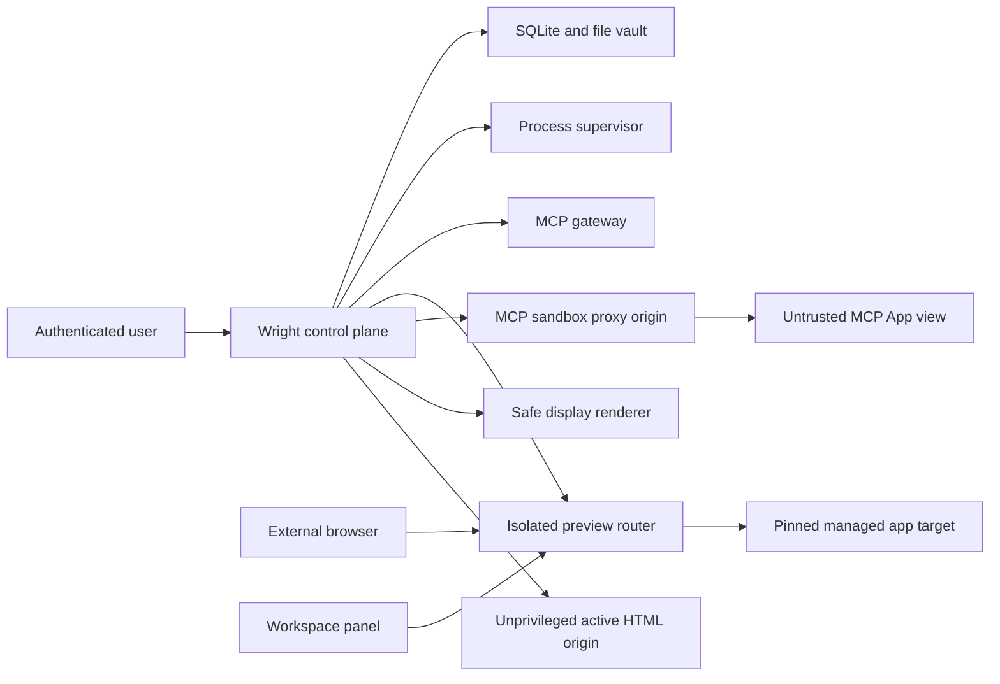

# Workspace Surfaces Threat Model

**Method**: asset/trust-boundary review with STRIDE-style abuse cases  
**Security posture**: active content is untrusted even when it originated in the workspace; declarations constrain possible authority but do not grant it

## Assets

- Wright authentication tokens, sessions, CSRF state, signing material, local credentials, and secret references.
- Workspace files, generated artifacts, source code, user prompts/content, tool results, and data-vault records.
- MCP server/tool/resource authority and user-approved capability grants.
- Host operating system, local network, cloud metadata endpoints, other local applications, devices, browser APIs, clipboard, downloads, and default browser.
- Surface/runtime identity, target pins, preview credentials, process ownership, audit evidence, and trace correlation.
- Availability: process slots, ports, CPU/memory, connections, streams, logs, storage and frontend main thread.

## Trust Boundaries

Crossing a boundary always requires a versioned contract, authenticated/scoped identity, input validation, size/time limits, policy decision, and redacted audit event. The panel's iframe is not an authentication boundary by itself.

## Source Trust Profiles

| Profile | Default authority | Required isolation | Bridge |
|---|---|---|---|
| Safe MIME data | Render only | Wright renderer document; sanitizer/typed schema | Display update events, host-to-renderer only |
| Active Python HTML | Render only | Separate opaque/distinct origin, strict sandbox/CSP | None |
| Managed declared app | Declared capabilities subject to policy/grant | Per-instance preview origin | Versioned surface bridge only if declared |
| MCP App | Protocol operations subject to same-server/policy/grant | Official distinct-origin double iframe | Official App Bridge through gateway |
| WebMCP app | Declared scoped tools subject to policy/grant | Managed app origin | Scoped compatibility adapter; native draft if supported |
| Approved arbitrary URL | Direct view/navigation | Browser iframe controls or browser tab | None; no proxy/credentials |

## Principal Threats and Controls

### Cross-origin escape and credential theft

**Abuse**: active content runs on Wright's origin, removes sandbox, accesses storage/DOM/preload, reads another frame, or tricks a wildcard message handler.

**Controls**: separate effective origins; MCP double iframe; deny-by-default sandbox/CSP/Permissions Policy; no active content on control origin; exact `targetOrigin`; verify `event.origin`, `event.source`, protocol version, surface/instance/generation and correlation; Electron context isolation, renderer sandbox, navigation/window-open denial; no privileged preload object exposed to surface frames.

### Message spoofing, confused deputy and replay

**Abuse**: sibling/stale frame or another workspace reuses an ID, duplicates a response, calls a tool with the same name, or sends an oversized/malformed envelope.

**Controls**: composite binding `(user, workspace, session, surface, instance, document origin, server, operation)`; authenticated active presentation; unique IDs, monotonic sequence, deadline and replay cache; JSON Schema/depth/size/rate validation; exact pending-request map; abort on navigation/teardown; stable denial; structured audit.

### MCP authority escalation

**Abuse**: an app calls a cross-server tool, invokes a model-only tool, substitutes a `ui://` URI from another server, exploits metadata loss, or receives undeclared host context.

**Controls**: server-scoped composite UI binding; canonical metadata projection; same-server `visibility` rules; app-only tools excluded from model list; capability negotiation; per-operation gateway policy/RBAC/grant; resource read validated even when absent from list; content hash/version cache; notification invalidation; meaningful non-UI fallback.

### SSRF, DNS rebinding and target substitution

**Abuse**: proxy URL parameter, alternate IP notation, IPv4-mapped IPv6, A/AAAA transition, redirect, Host/forwarded header, target-controlled DNS change, or WebSocket reconnect reaches Wright/private/metadata services.

**Controls**: no arbitrary proxy URL; immutable numeric target pin from validated manifest/owned launch; address normalization and class policy; resolve all answers; no automatic redirect; only same-pin rewrite; upstream Host derived from target; strip forwarding/identity/hop-by-hop fields; validate every reconnect/upgrade; attach requires explicit approval and ownership/attestation; prohibit unspecified/multicast/link-local/metadata/control-plane destinations.

### Credential/token leakage

**Abuse**: Wright auth, CSRF, preview bearer, secret env, or query data leaks to target, URL/history, Referer, logs, traces, errors or another presentation.

**Controls**: distinct presentation credential; single-use short-lived bootstrap token held in the URL fragment, POSTed in the bootstrap body and exchanged for a host-only HttpOnly SameSite=Strict cookie; clean redirect; audience/user/workspace/instance binding; Wright credentials stripped before upstream; named secret references resolved only at launch; centralized redaction; no raw URLs/query/content in normal telemetry; cookies constrained to an isolated hostname (port separation is insufficient); revocation on close/stop/session/workspace.

### Framing and navigation policy bypass

**Abuse**: Wright strips XFO/CSP, follows a popup/redirect to a prohibited origin, grants arbitrary URLs managed authority, or falsely reports a blocked iframe healthy.

**Controls**: preserve XFO/CSP and all end-to-end security headers; inspect declared/known frame eligibility but rely on browser enforcement; browser fallback always present; same-pin navigation rules; guarded `openExternal`; arbitrary URLs direct/view-only with explicit per-instance approval; negotiated health rather than generic iframe ping; visible timeout/help when frame status is unknowable.

### File and workspace escape

**Abuse**: manifest cwd/path or app request traverses/symlink-escapes workspace, reads another workspace, accesses uploads/downloads broadly, or treats a display payload as executable.

**Controls**: canonical path resolution at workspace service boundary; existing file authorization; symlink/root checks; no target-selected file proxy; capability-scoped file picker/download; content-addressed vault; MIME sniff/schema limits; active formats isolated; user/workspace predicates in every repository operation.

### Process escape and persistence

**Abuse**: shell injection, forked descendant, PID reuse, breakaway child, self-restart, shutdown hang, stale record adoption, fixed-port collision, or malicious readiness response.

**Controls**: argv array only/no shell; workspace cwd/env allowlists; allocated loopback port; POSIX process group or Windows kill-on-close Job Object; PID+creation time+generation+ownership; psutil reconciliation; bounded graceful/escalated stop; health/readiness timeouts and response limits; resource/restart/log limits; unknown process never adopted/killed; cleanup audit and leak tests.

### Denial of service

**Abuse**: decompression/body/header/frame bomb, slow reader/writer, infinite SSE, connection storm, rapid display updates, huge `_repr_mimebundle_`, render main-thread freeze, log flood, restart loop.

**Controls**: pre/post-decompression limits, header/body/frame/JSON/depth/item caps; connection/stream/app quotas; first-byte and idle deadlines; backpressure and cancellation; bounded update history/coalescing; serialization timeout; lazy renderer worker where practical; process/memory/CPU controls; log rotation/rate limits; restart budget/circuit breaker; UI responsiveness budgets.

### Prompt/tool/output injection and intent confusion

**Abuse**: page describes a misleading tool, injects instructions in output, requests excessive parameters, or causes a mutating action without clear user intent.

**Controls**: surface provenance and untrusted-content labeling; schema and declared purpose validation; risk tier; low-risk exact-version remembered grants only; high-risk/mutating per operation/instance by default; confirmation UI states source, operation, parameters and scope; outputs remain data; policy denial cannot be overridden by page text.

### Generated-artifact provenance disclosure

**Abuse**: exact prompts, engineering constraints, or scripts required for artifact verification leak through logs, traces, error bodies, another workspace, or an unprivileged surface.

**Controls**: store provenance as access-controlled vault content linked by workspace-scoped artifact records; show it only in the authorized verification UI; represent direct execution with an explicit no-prompt marker; place only IDs/hashes in telemetry; test engineer/admin/workspace access and redaction independently.

## Security Headers and Browser Policy

- Wright control plane: restrictive application CSP, no framing by untrusted origins, explicit connect/style/script sources for bundled assets only.
- MCP sandbox proxy: specification-derived CSP with restrictive default; objects/plugins blocked; network/resource domains only from validated resource metadata; outer iframe sandbox per stable MCP Apps requirements.
- Managed preview: preserve upstream CSP/XFO; add Wright-owned bootstrap/cookie/referrer controls without weakening target policy; Permissions Policy derived from declaration+grant; popup/top-navigation disabled unless a separately authorized browser action handles it.
- Active HTML: opaque/distinct origin; `default-src 'none'` plus only serialized document needs; no forms/navigation/popups/downloads/network/storage/bridge by default.
- Safe HTML: sanitize and render as inert/sandboxed document; typed renderers receive data, not executable template strings.

## Security Verification Matrix

| Boundary | Required negative tests |
|---|---|
| postMessage/App Bridge | wrong origin/source/window, sibling frame, stale generation, replay, unknown method, malformed/oversized JSON-RPC, teardown race |
| MCP gateway | cross-server URI/tool, model-only/app-only visibility, read-without-list resource, metadata alteration, notification cache invalidation |
| Preview proxy | private/metadata/control target, alternate address, rebinding, hostile Host/Connection/forwarded/auth/cookie headers, cross-target redirects, token replay |
| WebSocket/SSE | invalid Origin, subprotocol mismatch, frame/stream limits, slow peer, disconnect/cancel, close propagation, Last-Event-ID, 204 stop |
| Browser isolation | CSP/XFO preservation, sandbox escape, undeclared fetch/frame/device, storage/cookie cross-instance, popup/navigation attempts |
| Files/display | traversal/symlink, cross-workspace digest, malicious SVG/HTML/Plotly/table, decompression/representation bombs, stale update |
| Lifecycle | PID reuse, descendant/breakaway, crash/restart, port race, failed readiness, sleep/reconnect, shutdown bound, stale database record |
| Grants | wrong user/workspace/source version/instance/operation, expiry/revocation, high-risk persistence attempt, policy override attempt |

## Release Security Gates

- Threat tests run on native Windows/macOS/Linux and Docker where the boundary is platform-specific.
- Dependency lock, provenance/license and vulnerability scans cover new browser packages and Python distributions.
- Static analysis includes Python/TypeScript plus CodeQL paths already hardened by the repository.
- No critical/high unresolved security finding; no successful hostile cross-boundary case; no secrets in captured structured logs/traces/test artifacts.
- Security reviewer explicitly checks the schemas, preview router, process adapters, MCP projection, Electron IPC/navigation policy, and frontend bridge before feature flag default-on.
- Any environment-dependent manual result records OS/browser/build, procedure, trace/correlation IDs, and evidence location.

## Residual Risks

- Arbitrary third-party iframe failure cannot be diagnosed reliably; visible browser fallback and truthful status mitigate it.
- OS process/resource containment differs; adapters must report degraded controls and policy may prohibit launch when a required bound is unavailable.
- WebMCP can change incompatibly; Wright guarantees only its versioned adapter and treats native integration as optional.
- A declared app can exfiltrate data the user explicitly grants it. Confirmation clarity, least privilege, exact source versions, revocation and audit reduce but do not eliminate intentional authority use.
