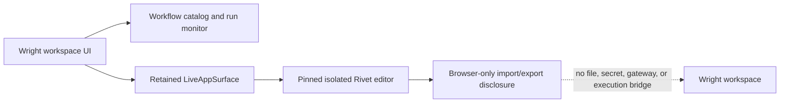
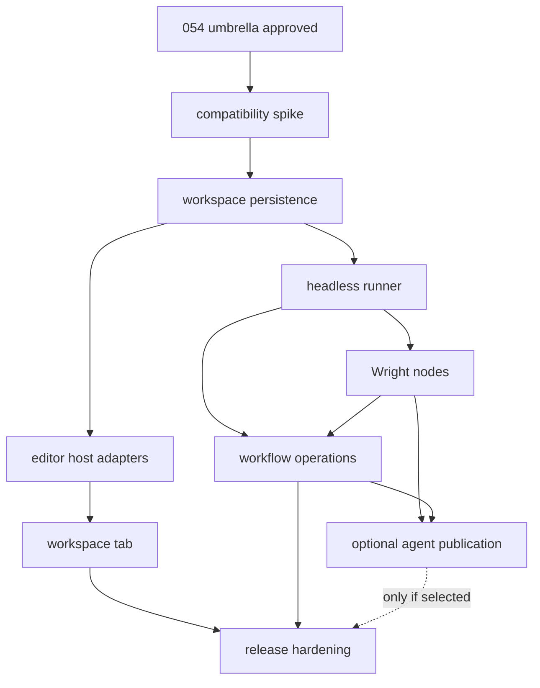

# Implementation Plan: Incremental Rivet Workflow Integration

**Branch**: `054-rivet-workflow-integration` | **Date**: 2026-08-03 | **Spec**: [spec.md](./spec.md)

**Input**: Feature specification from `specs/054-rivet-workflow-integration/spec.md`

**Planning boundary**: This is an umbrella integration plan. It coordinates separately approved Spec Kit slices; it does not authorize implementation on this branch.

## Summary

Integrate Ironclad Rivet as an optional visual editor without making Rivet a second workspace, authorization, execution, or artifact system. Wright hosts a pinned editor build as an isolated retained `LiveAppSurface` in each workspace. For this MVP, Rivet uses ordinary browser import/export and never claims that browser-selected content is saved to, or executed by, Wright.

Delivery is intentionally incremental. The completed compatibility, workspace, tab, and retained-host slices form the MVP. Headless execution, Wright nodes, workflow operations, agent publication, and execution-runtime release hardening are deferred to a separate future program. Each future slice receives a new number and approval; it does not block the editor-tab MVP.

## Scope Amendment — Editor-Tab MVP

This amendment supersedes any conflicting execution, persistence-bridge, runner, gateway, approval, artifact, publication, and Node-runtime language below. The MVP is complete when the pinned Rivet web editor opens as an isolated retained tab in a Wright workspace and visibly discloses that import/export is browser-local and non-authoritative. No graph execution is enabled or claimed.

## Technical Context

**Language/Version**: Python >=3.11; TypeScript ~6.0; React 19 in Wright; a pinned Node 20-compatible Rivet runtime selected by the compatibility spike; upstream Rivet editor currently uses its own React 18/Vite application and remains isolated

**Primary Dependencies**: Existing FastAPI/Pydantic, `workspace_service`, `tool_registry.GatewayService`, `data_vault`, SQLite/file vault, Workspace Surfaces process and preview adapters, React/Vite retained surface deck; optional pinned `@ironclad/rivet-core`, `@ironclad/rivet-node`, Wright host adapters/plugin, and a reproducible Wright-hosted Rivet editor bundle

**Storage**: Workspace filesystem is authoritative for `.rivet-project` definitions and dataset sidecars; existing SQLite repositories index workflow metadata, runs, events, reviews, and publications; existing file vault stores immutable/large artifacts, recordings, and bounded logs; secret provider stores credentials

**Testing**: pytest/pytest-asyncio contract, integration, security, native-runtime, and package suites; Ruff and mypy; Vitest/React Testing Library; mocked and live Playwright; Node contract tests; Windows/macOS/Linux native lifecycle matrices plus Docker and offline package tests

**Target Platform**: Wright browser application, Hermes desktop wrapper, native runtime on Windows/macOS/Linux, Docker appliance, and offline/air-gapped installations

**Project Type**: Modular Python service monorepo with FastAPI composition, React web client, Electron host adapter, optional supervised Node sidecar, and a pinned third-party editor web bundle

**Performance Goals**: Warm Workflows tab interactive within 5 seconds in at least 95/100 trials; retained editor survives 100 tab switches without reload; cancellation visible within 2 seconds; bounded streaming without whole-run buffering; no cross-workspace routing in 100 isolation trials

**Constraints**: No implementation on the umbrella branch; no direct Rivet React imports into Wright; no browser IndexedDB or browser-picked files as authoritative content; no direct Rivet-to-MCP authorization; exact workspace/user/session/revision/runtime binding; optional and offline-capable dependencies; no source checkout in production; full process-tree cleanup; safe failure when Rivet is absent

**Scale/Scope**: Nine delivery slices, one optional; authored projects and datasets per workspace; one retained editor runtime per active workspace within surface limits; multiple concurrent headless runs; bounded node events and artifacts; governed human and optional agent launch paths

## Constitution Check

*GATE: Passed before Phase 0 research and re-checked after Phase 1 design.*

| Principle | Design evidence | Gate |
|---|---|---|
| Strictly typed FastAPI and modular boundaries | Typed storage, editor bootstrap, execution, and event contracts; `workspace_service` orchestrates, `tool_registry` authorizes tools, `data_vault` persists, routes remain thin | PASS |
| Offline-first | Editor, runtime, adapters, approved plugins, schemas, and fonts/assets are pinned and packaged; no CDN or runtime registry install is required | PASS |
| Native runtime and Docker parity | Optional runner uses Workspace Surfaces supervision adapters; the hardening slice proves Windows/macOS/Linux and Docker lifecycle behavior | PASS |
| Embedded storage and file vault | Workspace files, SQLite/WAL, and the existing file vault remain the only durable stores | PASS |
| Local authentication and RBAC | Every editor bootstrap, save, run, approval, tool call, artifact, and publication is rebound server-side to authenticated Wright identity | PASS |
| UI atomic design and test pyramid | Wright adds only catalog, tab chrome, status, approvals, and diagnostics components; the isolated Rivet editor keeps its own UI; unit/component/Playwright/live tests are assigned by slice | PASS |
| Structured observability | Run/node/tool/approval/artifact/lifecycle events carry trace and runtime-generation identifiers and use Wright redaction rules | PASS |
| UI artifact transparency | Run provenance links immutable workflow revision, inputs, constraints, tools, approvals, outputs, and trace without copying protected content into telemetry | PASS |
| Phase isolation and branch discipline | Every production change is owned by a separately approved Spec Kit slice branch targeting `054-rivet-workflow-integration`; the umbrella holds coordination documents only | PASS |

Post-design re-check: research, data model, four boundary contracts, slice dependency rules, rollback requirements, and validation strategy introduce no constitutional exception. Complexity tracking is therefore omitted.

## Architecture Decisions

1. **Use a managed workspace surface, not a component transplant.** Wright serves a pinned Rivet editor build behind the existing `LiveAppSurface` isolation, preview-origin, lifecycle, tab, focus, and diagnostic contracts. Rivet's React application and dependency graph do not enter Wright's React tree.
2. **Make workspace files authoritative.** Projects live under `workflows/<workflow-slug>/workflow.rivet-project`; project datasets and author-owned attachments live below the same workflow directory. Browser IndexedDB, native file pickers, and global Rivet application directories are compatibility mechanisms only and cannot become Wright's source of truth.
3. **Introduce narrow Wright host adapters.** A `WrightIOProvider`, `WrightDatasetProvider`, and constrained `WrightNativeApi` translate editor operations to authenticated, revision-aware Wright APIs. If upstream does not expose all providers, a small, isolated patch or maintained fork injects them; the compatibility slice fixes the exact seam and upstream strategy.
4. **Defer graph execution.** No Node sidecar, debugger bridge, Wright gateway adapter, or run API is enabled by this MVP. Those capabilities require their own approved program because they turn a web editor integration into a governed execution product.
5. **Keep browser content non-authoritative.** The editor has no workspace-file, gateway, secret, or execution bridge. Browser-selected projects may be opened/exported normally but are not Wright data.
8. **Degrade cleanly.** Rivet and Node are optional. When disabled, missing, incompatible, or unhealthy, Wright displays an actionable unavailable state and continues all non-Rivet behavior. No slice may make later slices necessary for startup or existing workflows.
9. **Treat visual graphs as executable code.** Review state, revision pinning, policy profiles, plugin allowlists, network/file controls, approval pauses, audit, and provenance apply before convenience. A graph file alone never grants authority.

## Runtime and Data Flow



Trust direction is one-way: the editor receives no Wright authority. Neither a Rivet project nor browser message can select a workspace or confer privileges.

## Project Structure

### Documentation (this umbrella feature)

```text
specs/054-rivet-workflow-integration/
|-- spec.md
|-- plan.md
|-- research.md
|-- data-model.md
|-- quickstart.md
|-- checklists/
|   `-- requirements.md
`-- contracts/
    |-- editor-bootstrap-contract.md
    |-- slice-delivery-contract.md
    |-- workflow-run-contract.md
    `-- workflow-storage-contract.md
```

Each implementation slice creates its own numbered `specs/<number>-<short-name>/` directory. Its required documents are defined by [slice-delivery-contract.md](./contracts/slice-delivery-contract.md); they are not pre-created here because they must be generated and approved from the slice's actual branch and current prerequisites.

### Expected Source Ownership Across Slices

```text
packages/core/src/core/
`-- workflows/                    # side-effect-neutral IDs, revisions, states, errors

packages/workspace_service/src/workspace_service/
|-- workflows/                    # orchestration, storage, runs, reconciliation
|-- ports/                        # runner/storage/clock/event abstractions
`-- adapters/                     # workspace files, SQLite/vault, Node runner

packages/tool_registry/src/tool_registry/
`-- workflows/                    # provider-neutral external-call gateway projection

packages/data_vault/src/data_vault/
`-- repositories/                 # workflow/run/event/publication indexes

apps/api/src/api/
|-- routers/workflows.py          # thin workflow control-plane API
`-- composition.py                # adapters and optional-feature wiring

apps/web/src/
|-- components/workflows/         # catalog, status, run, approvals, diagnostics
|-- components/workspace/         # Workflows tab and retained surface integration
`-- services/workflows/           # API/bootstrap/event contracts

integrations/rivet/
|-- editor/                       # reproducible upstream build/patch metadata
|-- adapters/                     # editor IO/dataset/native host adapters
|-- runner/                       # optional Node executor and debugger bridge
`-- plugin/                       # approved Wright Rivet nodes if selected by spike

tests/
|-- contract/rivet/
|-- security/rivet/
|-- ui-integration/rivet/
|-- e2e/rivet/
`-- native_runtime/               # optional/runtime/package lifecycle evidence
```

**Structure Decision**: Extend existing owners rather than adding a parallel backend. `core` holds neutral values; `workspace_service` owns workflow/editor/runner orchestration; `tool_registry` remains the only engineering-tool policy boundary; `data_vault` supplies embedded indexes and artifacts; `apps/api` authenticates and delegates; `apps/web` owns Wright chrome. The isolated Rivet distribution and Node code live under `integrations/rivet` so version, patch, license, SBOM, and optional packaging boundaries are visible. A slice may refine exact paths in its approved plan but may not move ownership across these boundaries without an architecture decision.

## Incremental Slice Roadmap

Numeric prefixes below are deliberately written as `<next>`. Spec Kit assigns the next available repository-wide number when a slice starts; numbers are not reserved by this plan.

| Order | Stable branch short name | Outcome | Depends on | MVP |
|---:|---|---|---|---|
| 0 | `rivet-compatibility-spike` | Select and prove the exact upstream commit/version, license/SBOM, editor build, provider-injection seam, Node runner/debugger, offline packaging, and maintenance strategy | Umbrella plan approval | Yes |
| 1 | `rivet-workspace-persistence` | Add workspace-confined project/dataset storage, atomic revision-aware saves, metadata indexes, migration rules, and storage APIs without any Rivet UI/runtime dependency | Spike | Yes |
| 2 | `rivet-headless-runner` | Execute immutable project revisions in a supervised optional Node runtime with events, cancel, resource bounds, reconciliation, and clean absence behavior | Persistence | Yes |
| 3 | `rivet-editor-host-adapters` | Produce the pinned isolated editor build plus Wright IO, dataset, native, bootstrap, and remote-debug adapters | Persistence; spike findings | Yes |
| 4 | `rivet-workspace-tab` | Add the Workflows tab, retained surface lifecycle, restore/focus/accessibility behavior, unsaved-change protection, and diagnostics | Editor adapters; Workspace Surfaces | Yes |
| 5 | `rivet-wright-nodes` | Add governed Wright tool/approval/artifact/display integration through the gateway and policy controls; direct MCP remains off by default | Headless runner; spike choice of external calls vs plugin | Yes |
| 6 | `rivet-workflow-operations` | Add lightweight workflow catalog, review state, inputs, run/cancel/monitor/history, templates, and provenance without loading the editor | Runner; Wright nodes; storage | Yes |
| 7 | `rivet-agent-publication` | Optionally publish an exact reviewed revision as a typed agent-callable Wright tool with the same authorization and audit | Workflow operations; Wright nodes | No, P2 |
| 8 | `rivet-release-hardening` | Close migrations, hostile tests, performance, accessibility, offline/native/Docker packaging, rollback, docs, and full merge evidence | All selected functional slices | Yes |

### Slice 0 - `rivet-compatibility-spike`

**Purpose**: Retire integration uncertainty before production schemas or APIs harden.

**In scope**: Build upstream at an exact commit; inventory licenses and transitive dependencies; prove a static editor can run under Wright's base path and isolated origin; trace open/save/dataset/native API paths; prove a host-injected provider seam or minimal patch; execute a fixture with `@ironclad/rivet-node`; connect the remote debugger; exercise cancel; verify no-CDN packaging; decide External Call versus a Wright plugin for gateway nodes; record upstream/fork/update strategy.

**Excluded**: Production APIs, durable schema, user-facing tab, broad node compatibility.

**Merge evidence**: Reproducible spike commands, fixture project, compatibility matrix, patch diff if any, dependency/SBOM report, risk register, chosen version/commit/checksum, and explicit go/no-go. Experimental assets stay developer-only and feature-disabled.

**Rollback**: Remove spike-only assets and pin metadata; no user data or migration exists.

### Slice 1 - `rivet-workspace-persistence`

**Purpose**: Establish Rivet-independent workspace ownership before either editor or runner consumes it.

**In scope**: Workflow identifiers/slugs/revisions; canonical paths; allowlisted file operations; symlink/traversal/size checks; atomic stage/fsync/replace behavior appropriate to supported platforms; ETag/conflict handling; create/open/save-as/rename/delete/recover; dataset sidecars; metadata indexes; unsupported-version behavior; storage API contracts; backup/migration/rollback tests.

**Excluded**: Node process, graph execution, editor bundle, Workflows tab.

**Merge evidence**: Cross-workspace and concurrent-save contract tests, malformed/oversized file tests, restart/rollback tests, migration evidence, API schema snapshot, no-Rivet startup test.

**Rollback**: Additive schema migration with downgrade/read-disable procedure; authored files remain ordinary workspace files and are never deleted automatically.

### Slice 2 - `rivet-headless-runner`

**Purpose**: Prove safe, observable execution independently of the visual editor.

**In scope**: Optional runtime discovery and compatibility; supervised process tree; immutable input snapshot; typed start/status/event/cancel contracts; bounded logs/events; abort propagation; runtime generations; restart reconciliation; resource/time/output limits; fixture graphs; clean disabled/missing runtime state.

**Excluded**: Engineering tools, direct MCP, approvals beyond a simulated runner wait, user-facing editor/catalog.

**Merge evidence**: Unit/contract/live runner tests; cancel and crash cleanup with zero orphan process/port; stale debugger rejection; concurrent-run limits; installed/offline package smoke; Wright operation with Node absent.

**Rollback**: Disable runner feature flag, stop owned processes, preserve authored projects and terminal run records.

### Slice 3 - `rivet-editor-host-adapters`

**Purpose**: Make the upstream editor a workspace-aware Wright application without weakening isolation.

**In scope**: Reproducible pinned editor bundle; bootstrap handshake; `WrightIOProvider`; `WrightDatasetProvider`; constrained `WrightNativeApi`; autosave/recovery signaling; selected-workflow binding; revision conflicts; base-path/assets/CSP; remote-debugger endpoint injection; version/patch compatibility test.

**Excluded**: Wright workspace tab chrome, gateway tool execution, production workflow catalog.

**Merge evidence**: Adapter contract tests against the real pinned editor; network test proving no unapproved CDN/registry calls; cross-workspace bootstrap rejection; conflict/recovery scenarios; patch reproducibility and upstream tracking note.

**Rollback**: Remove/disable editor distribution and adapter route; storage and headless execution remain usable.

### Slice 4 - `rivet-workspace-tab`

**Purpose**: Deliver the requested visual editor as a first-class retained workspace tab.

**In scope**: Workflows tab entry; `LiveAppSurface` manifest/bootstrap; one workspace-bound retained editor instance; focus/resize/keyboard/accessibility; workspace switch; unsaved close/eviction warning and recovery; stop/restart; actionable missing/incompatible runtime diagnostics; browser and Hermes host behavior.

**Excluded**: New surface proxy framework, direct component embedding, catalog run experience, agent publication.

**Merge evidence**: Component and Playwright flows; 100-switch retention trial; workspace switch isolation; close versus stop semantics; accessibility scan; browser/Electron smoke; five-second warm-interactive measure.

**Rollback**: Hide tab and stop its owned surface; workflow files, runner, and existing Workspace Surfaces remain intact.

### Slice 5 - `rivet-wright-nodes`

**Purpose**: Let graphs use Wright engineering capabilities without bypassing Wright policy.

**In scope**: Narrow external-call/plugin node set for tool discovery/invocation, approval wait, artifact publication, display, and bounded context; server-side binding of run/node/user/workspace/session; gateway policy; approval pause/deny/revoke/timeout; plugin allowlist and direct-MCP/file/network/code controls; audit/provenance.

**Excluded**: Arbitrary third-party plugins, persistent credentials in graphs, client-trusted authorization, agent publication.

**Merge evidence**: Read-only and mutating tool journeys; approval scope/replay/revocation tests; malicious graph/plugin/direct-MCP attempts; artifact provenance; tool-health change during run; no-secret logs and files.

**Rollback**: Disable Wright node/plugin capability; ordinary approved Rivet graphs that do not need it still run.

### Slice 6 - `rivet-workflow-operations`

**Purpose**: Make reviewed workflows useful day-to-day without paying the editor startup cost.

**In scope**: Workflow list/search/detail; review status and exact revision; typed input form; Run/Cancel; streaming node/tool/approval status; recent history; artifacts and provenance; safe starter templates; open-in-editor action; policy-visible disabled states.

**Excluded**: A second graph editor, unrestricted template marketplace, scheduled/background automation, agent publication.

**Merge evidence**: Five-minute create/save/reopen/run journey; run without loading editor; stale-review rejection; cancel/status/history/artifact flows; empty/error/degraded states; UI accessibility and responsiveness.

**Rollback**: Remove catalog route/components; editor and API contracts remain available and data is preserved.

### Slice 7 - `rivet-agent-publication` (optional P2)

**Purpose**: Reuse explicitly reviewed workflows as governed agent tools.

**In scope**: Explicit publish/unpublish; generated typed input/output schema; exact workflow revision pin; catalog/MCP projection through `tool_registry`; workspace/user/session authorization; approval and audit parity; publication invalidation when revision/review/policy changes.

**Excluded**: Automatic publication, arbitrary graph upload by agents, cross-workspace workflow discovery, bypass of ordinary tool policy.

**Merge evidence**: Interactive-versus-agent parity test; stale/unpublished/cross-workspace rejection; schema validation; revocation during use; provenance comparison.

**Rollback**: Unpublish projections and disable feature flag; workflows and interactive runs remain unchanged.

### Slice 8 - `rivet-release-hardening`

**Purpose**: Turn the integrated MVP into a supportable production capability.

**In scope**: Consolidated migrations; upgrade/downgrade and corrupt-data recovery; hostile graphs/files/plugins/debuggers; soak/concurrency/performance; accessibility; dependency/license/security scans; pinned asset checksums; offline installation; native and Docker package contents; operator/user/developer docs; example workflows; feature rollback; complete traceability.

**Excluded**: New product capability or relaxed policy to make a platform pass.

**Merge evidence**: All slice gates, full targeted suites, platform matrix, package/SBOM checks, installed-release examples, documented rollback rehearsal, and `scripts/check-dev-merge.sh` before the requested umbrella merge to `dev`.

**Rollback**: Documented feature-disable and package rollback procedure that preserves workspace-authored files; migration downgrade or forward-compatible disable path proven before merge.

## Dependency and Merge Strategy



- Start exactly one slice branch with Spec Kit from the latest umbrella commit. Parallel development is permitted only after prerequisites are merged: runner and editor adapters may proceed concurrently after persistence.
- Slice pull requests target `054-rivet-workflow-integration`, not `dev`. Rebase or merge the current umbrella into a slice before final validation when prerequisites moved.
- The umbrella branch updates this roadmap and traceability after each slice merge. It does not accumulate unowned implementation commits.
- Slice feature flags default off until that slice's user journey and absence behavior pass. A later slice must consume released contracts from earlier slices instead of reaching into its internals.
- The first user-operable MVP consists of slices 0-6 plus slice 8. Slice 7 is a separately approved P2 option and cannot block the MVP.
- Only the completed umbrella integration is proposed to `dev`; immediately beforehand run the repository-authoritative `scripts/check-dev-merge.sh` or document a specific host limitation as repository policy requires.

## Per-Slice Spec Kit Lifecycle

Every slice follows this sequence and stops at each human gate:

1. Update the umbrella branch and start a new Spec Kit feature using the stable short name in this plan.
2. Write and validate the slice `spec.md`; clarify material ambiguities and generate requirements plus relevant security/runtime/UX/integration checklists.
3. Run Spec Kit planning to create `research.md`, `plan.md`, `data-model.md` where applicable, contracts, and `quickstart.md`.
4. Re-check the Wright constitution, dependencies, exclusions, migration, rollback, packaging, feature-absence behavior, and test evidence.
5. Stop for human plan approval.
6. Generate dependency-ordered `tasks.md`, run Spec Kit analysis, resolve findings, then stop if the approved design materially changed.
7. Implement only the approved slice; record tests, package evidence, and manual/environment limitations.
8. Review the diff against the slice spec and contracts, merge into the umbrella branch, and update umbrella status.

The exact document and evidence requirements are normative in [slice-delivery-contract.md](./contracts/slice-delivery-contract.md).

## Verification Strategy

- **Compatibility**: Exact Rivet commit/package versions, checksums, license/SBOM, build reproducibility, provider seams, remote debugger, base path, CSP, offline assets, and update procedure.
- **Storage contract**: Workspace path confinement, symlink/traversal defense, schema versions, atomic saves, ETags, concurrent edits, malformed/oversized data, restart, read-only/moved/deleted workspace, migration, and rollback.
- **Runner contract**: Immutable revisions, event ordering/idempotency, abort propagation, process-tree cleanup, resource bounds, runtime generations, stale connections, crash/restart reconciliation, and optional-dependency absence.
- **Security**: Cross-workspace/session/user replay; project references; file, code, HTTP, plugin, direct-MCP, graph-upload, redirect, debugger, and artifact paths; approval scope; secret redaction; denial and revocation.
- **UI**: Retained editor, unsaved changes, tab/focus/keyboard/resize, workspace switch, close/stop, diagnostics, catalog/run/approval/history/provenance, browser/Electron, accessibility, and narrow layouts.
- **System**: A reference workflow saves a dataset, calls one read-only Wright tool, pauses for one mutating approval, publishes an artifact, remote-debugs in the editor, cancels cleanly, restarts, and runs from the lightweight catalog.
- **Packaging**: Fresh installed native and Docker artifacts with no checkout; no runtime download; Node/Rivet missing and enabled paths; bundled assets and licenses; Windows/macOS/Linux process cleanup; version/schema compatibility.
- **Final gate**: Aggregate requirement-to-test evidence, full repository checks, and `scripts/check-dev-merge.sh`. Production release after merge follows `docs/release/release-runbook.md`; no slice claims production solely from its merge.

## Documentation and Evidence

Each slice documents only the capability it owns and updates the aggregate integration guide when merged. Final documentation covers workflow locations and source-control guidance, editor use, lightweight runs, review and policy, approvals, artifacts/provenance, optional runtime installation, offline use, diagnostics, backup/migration, administrator controls, security limitations, compatibility pin/update process, and rollback. Examples must run from installed artifacts without a source checkout or network dependency.

## Planning Gate

The umbrella Phase 0 research and Phase 1 design are complete when this plan, `research.md`, `data-model.md`, `quickstart.md`, all contracts, and the requirements checklist contain no placeholders or unresolved clarification; the constitution is re-checked; the branch is proven to descend from current `dev`; and the working diff contains coordination documents only. Stop for human approval before creating `tasks.md`, starting slice 0, or modifying implementation code.
