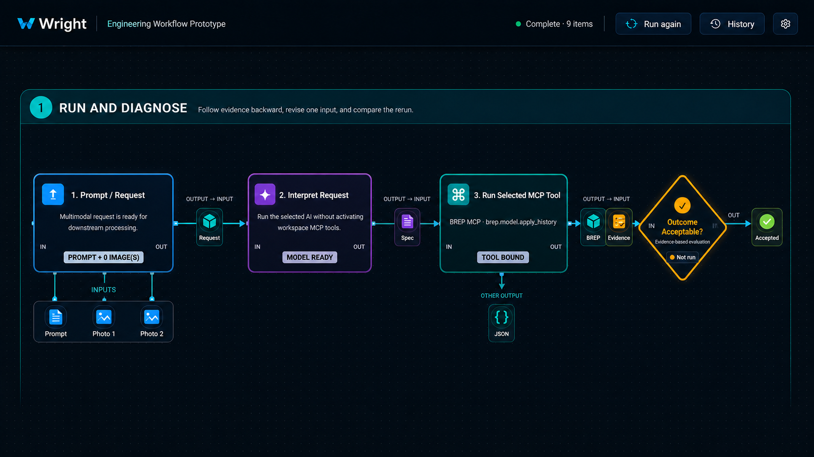
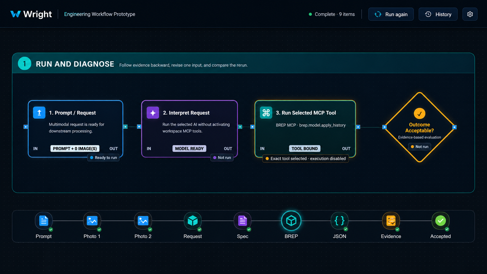
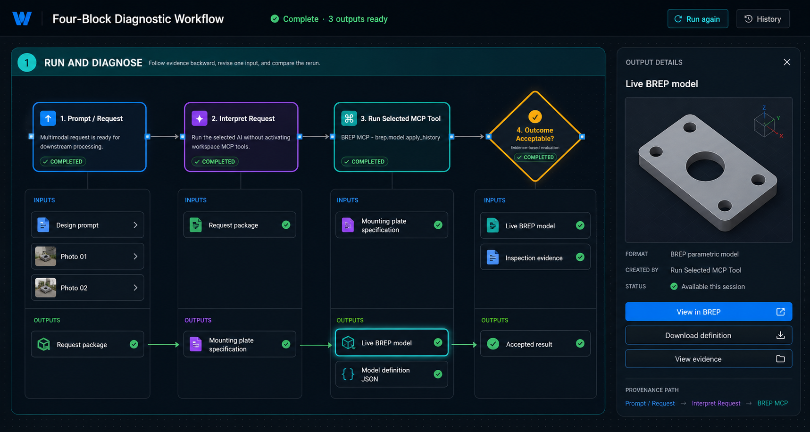

# CP3J Concept — Per-Block Input and Output Rail

## V3 — Integrated artifact ports and connectors

The detached V2 rail still looked like a second, unrelated workflow and did not
make artifact ownership clear. V3 integrates artifacts into the primary graph:

- source inputs attach directly beneath the block that consumes them;
- an output consumed by the next block appears once on their shared connector;
- side outputs attach directly to their producing block without implying a
  downstream dependency; and
- the terminal result appears immediately after the review gate.

This makes the execution path and the artifact lineage the same visual path.
It also avoids duplicating one artifact as both an output tile and an input tile.

## V2 — Compact chronological icon rail

The per-block shelves in the first concept were too visually overwhelming.
The revised concept keeps the workflow dominant and uses one narrow icon rail
under the diagram. Items appear left to right in creation order: source inputs,
intermediate artifacts, tool results, evidence, and the accepted outcome.

The prototype question is now narrower: can small icons provide fast access to
run items without turning the canvas into an output browser? Item details are
deliberately excluded from this concept; selecting an icon can be explored in a
later interaction test.

## V1 — Per-block shelves (rejected for density)

## Question explored

Can engineers see and open what every block consumed and produced without
making the workflow blocks themselves dense or forcing navigation through the
right inspector?

## Concept

Each process block owns a shelf directly below it with two regions:

- **Inputs**: clickable prompt, image, document, model, evidence, or other
  references consumed by that block.
- **Outputs**: clickable artifacts or messages created by that block, appearing
  progressively during execution.

A second horizontal lineage connects produced items to the downstream shelves
that consume them. Selecting an item opens one consistent details panel with a
preview, format, producer, lifetime, provenance, and only the actions the
producing runtime actually supports.

## Useful properties to test

1. The main workflow remains readable while data lineage is visible nearby.
2. Users can inspect intermediate results, not only the terminal result.
3. Thumbnails and type icons make images, documents, models, evidence, JSON,
   and messages distinguishable before opening them.
4. Pending, available, failed, expired, and selected states can appear on the
   item rather than overloading the parent block.
5. The same details panel supports View, Download, Open link, View evidence, or
   Open in application through generic artifact actions.

## Risks for the interactive prototype

- Large workflows could become too tall; shelves need collapse, summary counts,
  and a focused lineage mode.
- Repeating the same artifact as one block's output and the next block's input
  must preserve one artifact identity rather than create visual duplicates with
  ambiguous ownership.
- Output creation order and partial availability need stable animation that does
  not move blocks during a run.
- Sensitive, expired, or not-retained inputs require explicit states and cannot
  show misleading thumbnails.

## Revised next bounded test

Add only the single compact icon rail to the four-block fixture using
deterministic references. Test creation order, progressive arrival, compact
status states, keyboard selection, and whether short labels are necessary.
Do not add a details panel during this increment.
