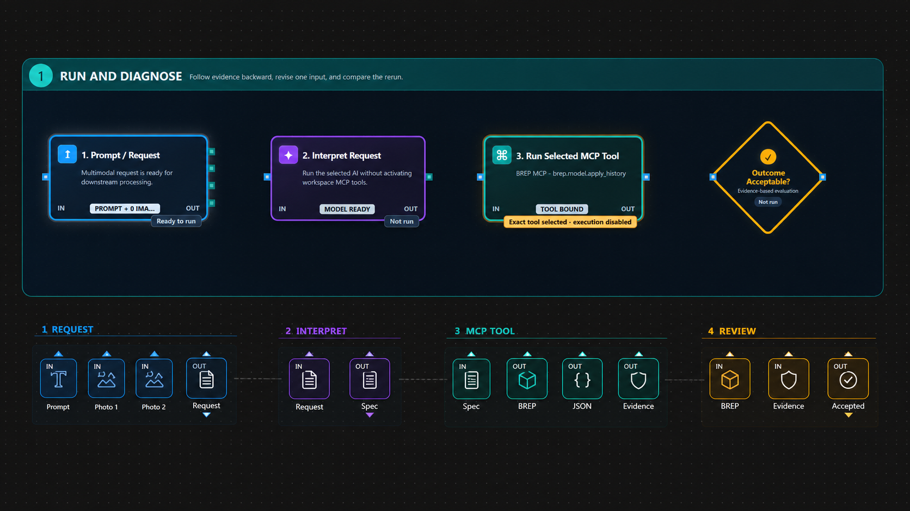
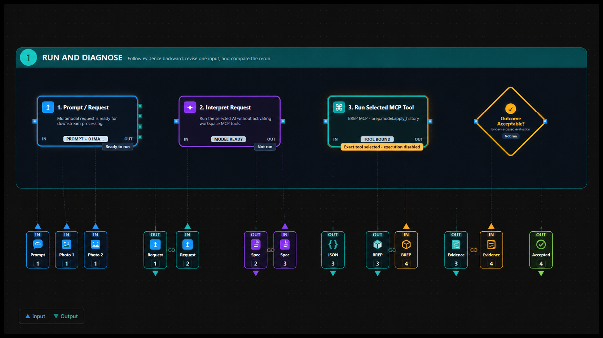
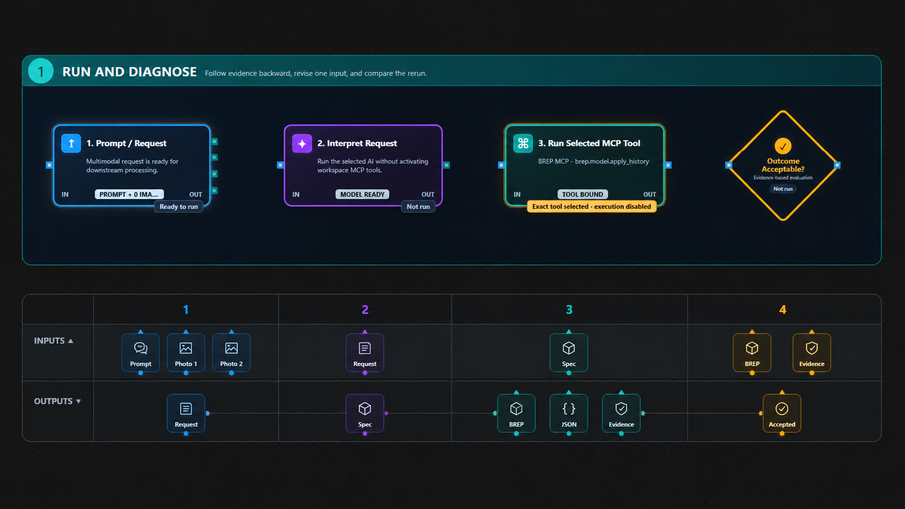

# CP3K Concepts — Compact Input and Output Arrays

These concepts preserve the original four-block flow chart and place a compact
artifact array beneath it. An upward pointer means the item is an input to the
associated block; a downward pointer means it is an output from that block.

## Concept 1 — Block-aligned groups

Each block owns one compact group containing both its inputs and outputs.
Repeated shared artifacts make every block contract explicit. This is the most
literal mapping, but it duplicates handoff artifacts.

## Concept 2 — Paired handoffs

Shared artifacts appear as adjacent producer-output and consumer-input squares.
This makes transfer semantics explicit, but creates the most visual elements.

## Concept 3 — Two-row I/O matrix

Inputs and outputs occupy separate horizontal rows, divided into block-aligned
columns. This is systematic and easy to compare, but uses more vertical space
than a single-row array.

## Questions for the next review

1. Is artifact duplication acceptable when it makes each block contract clear?
2. Does the pointer direction communicate input versus output without labels?
3. Is chronological order more important than strict alignment beneath blocks?
4. Which layout remains understandable when a block has ten or more items?
