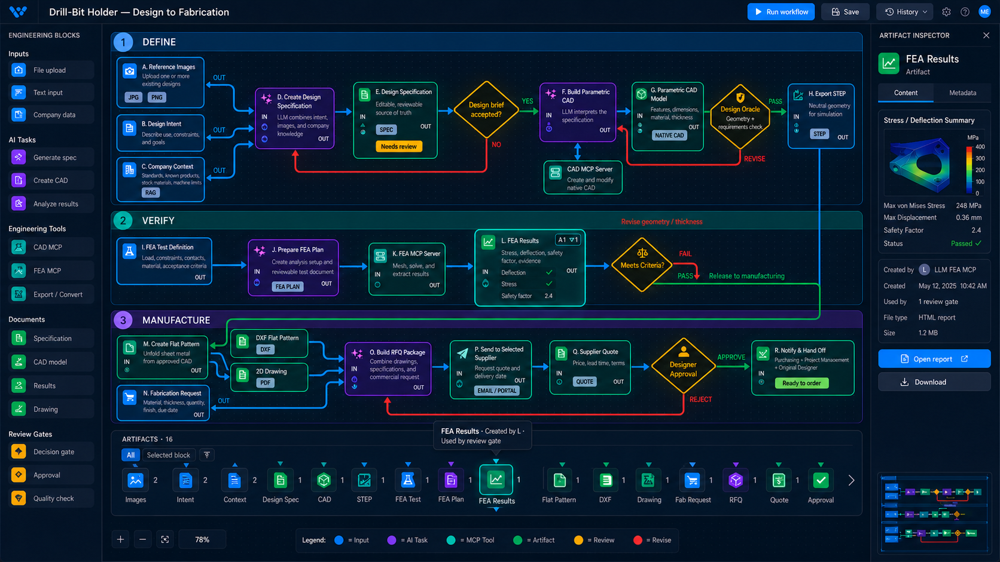

# CP3L Concept — Single Canonical Artifact Dock

## Question explored

Can a complex workflow expose every input and output for inspection without
duplicating shared artifacts or permanently adding lineage clutter to the
canvas?

## Concept

- Keep the process graph visually unchanged and dominant.
- Show each artifact exactly once in a compact bottom dock, ordered by creation.
- Use an upward pointer for an external input and a downward pointer for a
  generated output.
- Use small consumer counts instead of repeating an artifact for every block
  that consumes it.
- Hovering an artifact temporarily highlights its producer, consumers, and
  relevant graph edges.
- Clicking an artifact reuses the existing right inspector for preview and
  available actions.
- Clicking a block changes the dock scope to that block's inputs and outputs;
  it does not create new artifact records.

## Complex-graph behavior to test

1. A feedback loop creates versioned artifacts that stack behind one icon.
2. A fan-in block filters the dock to all of its source artifacts.
3. One artifact consumed by several blocks remains a single dock item with a
   consumer count and interactive lineage highlight.
4. A long artifact history scrolls horizontally without resizing the graph.
5. The inspector remains closed until an artifact is explicitly selected.
