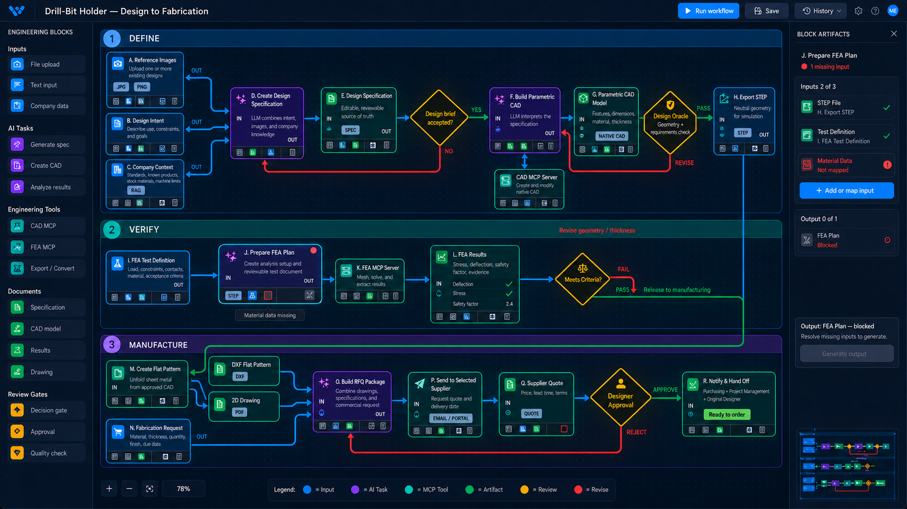
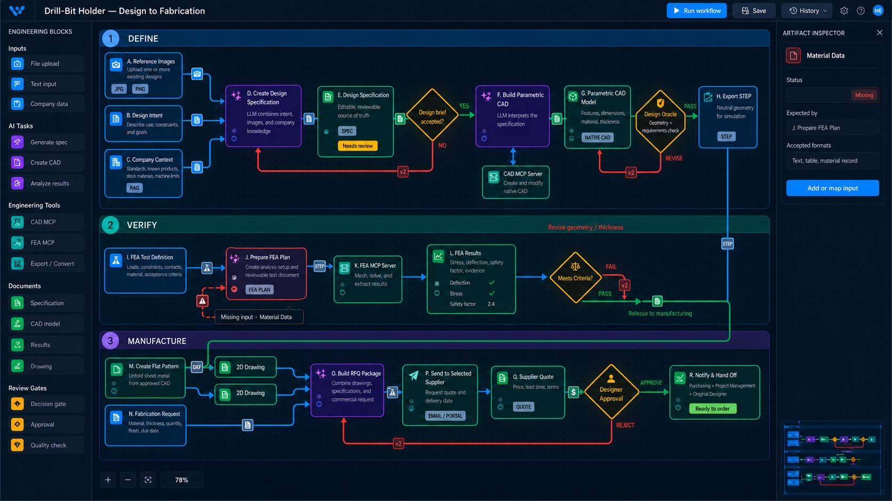

# CP3M Concepts — Per-Block Strips and Inline Tokens

Both concepts use the complex drill-bit-holder workflow and show a missing
Material Data input for the FEA Plan block. The existing right sidebar is reused
for inspection and correction.

## Concept A — Per-block artifact strips

Every block has a very small attached icon strip. Inputs occupy the left side,
outputs occupy the right side, and missing or blocked items appear in red. The
selected block exposes labels and a correction action in the existing sidebar.

This gives the strongest block-to-artifact association but adds persistent
visual texture to every node. Shared artifacts are UI references to one
canonical artifact identity, not separate files.

## Concept B — Inline artifact tokens

Artifacts appear as tiny tokens on the connectors that carry them. Unconnected
required inputs appear as red empty tokens on short dashed stubs. Feedback-loop
tokens can display a version such as `v2`.

This avoids per-node shelves and artifact duplication, but tokens compete with
ports, arrows, and feedback paths in a dense graph.

## Questions to test

1. Can users recognize the per-block strips without opening the inspector?
2. Do the strips remain legible when a block has many inputs or outputs?
3. Can users reliably select inline tokens at normal zoom levels?
4. Does a red missing-input token explain both what is missing and where to fix
   it?
5. Should artifact indicators be always visible, selected-block-only, or
   controlled by an `Artifacts` display toggle?
