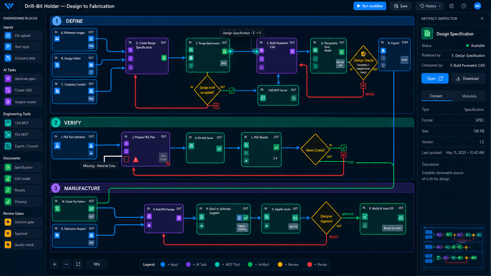

# CP3N Concept — Left Inputs and Right Outputs

## Question explored

Can the graph read as artifact-to-operation-to-artifact while preserving the
familiar block workflow and supporting branches, fan-in, and feedback loops?

## Concept

- Each block has a compact input rail on its left edge and output rail on its
  right edge.
- Filled output tokens represent produced artifacts; input sockets represent
  the bindings that consume those artifacts.
- Connections originate at output tokens and terminate at matching input
  sockets. They do not bypass the artifact ports with an independent
  block-to-block connection.
- Matching tokens and sockets reference one canonical artifact identity.
- Multiple inputs stack vertically on the left, with overflow summarized by a
  small count.
- Feedback outputs connect to input sockets on earlier blocks using the same
  port semantics.
- Missing required inputs appear as empty red sockets; dependent outputs remain
  visible but blocked.
- Selecting either endpoint opens the same artifact in the existing inspector.

## Risks to test

1. Small sockets must remain selectable at normal zoom and by keyboard.
2. A block with many ports needs overflow without hiding critical errors.
3. Input and output rails must remain stable when the graph is automatically
   laid out or a feedback connection is added.
4. Decision branches may carry control state rather than retained artifacts;
   the visual language must distinguish those cases.
5. The UI must make clear that an input socket is a reference to the producer's
   artifact, not a duplicated file.
