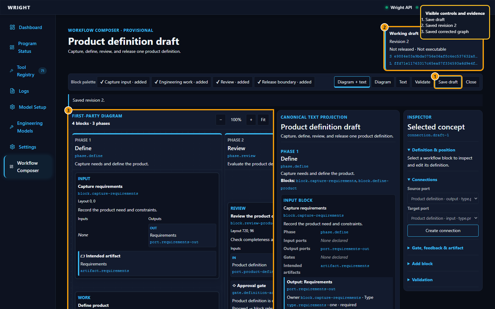

# Frozen Composer versus Canonical Recovery

**Frozen checkpoint-D subject**: `b4a7e996f10ec95f7d24185a43fd1401843db66d`

**Approved recovery concept subject**: `f9237763d6fa6e9748dfb7b713e753a7fc4b4d17`

**Recovery tree**: `aeca6ab8294dd54112d3e9ac10148537af32b0f0`

**Passing walkthrough manifest SHA-256**: `f2b4964ec1f599b55a8a8d53704147d2133674baa5db9a28072d4a2808c57347`

These treatments answer different questions. Checkpoint D is the retained,
closed production foundation after T027. The recovery route is a default-off,
disposable product concept that tests one complete canonical IR and a
canvas-first interaction grammar. Neither screenshot grants production,
execution, merge, release, or customer authority.

## Primary authoring treatment

| Frozen checkpoint D | Canonical recovery |
|---|---|
|  |  |
| Four provisional semantic roles arranged inside phase-dominant lanes; direct connection and execution are absent. | Six mechanical-engineering blocks, phase-secondary grouping, typed handles, palette, input attachment, paired source, inspector, and explicit simulated authority. |

## Capability comparison

| Question | Checkpoint D | Recovery evidence | Result |
|---|---|---|---|
| What owns meaning? | Closed draft model and immutable revision service. | One complete vNext IR feeds diagram, Code, inspector, AI candidate, and run projection. | Retain the foundation; promote the complete IR only after approval. |
| Can engineers manipulate flow directly? | Connection is indirect and movement is bounded/custom. | Real handle disconnect/reconnect advances once; drag changes only the layout digest. | Recovery closes the direct-manipulation evidence gap. |
| Can source and canvas disagree? | Text is a read-only projection. | Split mode is lossless; invalid source keeps the exact last-valid graph and revision. | One mutation/validation boundary is viable. |
| Can AI mutate or execute? | AI is excluded. | Full dashed multi-block candidate, assumptions, warnings, diff, read-only inspection, explicit Reject/Accept. | Host authority remains explicit; automation is simulated. |
| Can a run explain failure and recovery? | Run state is excluded. | Immutable simulated overlay reaches needs-input, blocks dependents, accepts one bounded 6061-T6 input, then succeeds. | Product grammar is reviewable; production runtime remains future. |
| Are outputs recognizable and truthful? | No output experience. | Bracket preview, report, STEP download, producer/revision/digest/lineage, static-fixture disclosure. | Result-first treatment is ready for human review, not a correctness claim. |

## Recovery gallery

| Port treatments | AI review |
|---|---|
|  |  |

| Needs-input recovery | Recognizable output and lineage |
|---|---|
|  |  |

## Evidence chain

- [Frozen checkpoint-D report](../../../artifacts/ui-walkthrough/workflow-composer/20260831T211850Z/report.html)
- [Passing recovery report](../../../artifacts/ui-walkthrough/workflow-recovery/20260901T031913Z-continuation-1/report.html)
- [Passing recovery status](../../../artifacts/ui-walkthrough/workflow-recovery/20260901T031913Z-continuation-1/status.json)
- [Passing recovery manifest](../../../artifacts/ui-walkthrough/workflow-recovery/20260901T031913Z-continuation-1/manifest.json)
- Preserved earlier stopped roots include `20260901T025304Z*`, `20260901T030309Z*`, and `20260901T031913Z`; their status/report/manifest files retain the exact failed expectation or harness authority error that led to the contrast, history-authority, and digest-proof repairs.

The passing continuation records 50 steps, 99 raw and 99 separately
annotated screenshots, a 94,777,058-byte Playwright trace, zero browser
diagnostics, and 204 manifest-bound files. The passing package passes the
walkthrough artifact-structure validator. Red stops are preserved rather than
rewritten and led to real product or proof-harness corrections.

## Approval boundary

Automated behavior and visual evidence are green. The [approval record](product-approval.md)
binds the requesting user's product/visual-direction approval to the exact
commit, tree, and walkthrough manifest after material-equivalence verification.
Representative mechanical-engineer usability, broad accessibility qualification,
production persistence/runtime integration, and qualifying scale remain open;
the approval is not a customer-readiness claim.
